# 思维导图模板库

## 常用逻辑骨架模板

### 1. 概念体系骨架（适合理论著作）
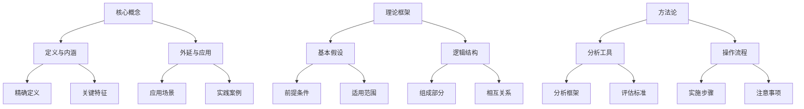

### 2. 问题-解决方案骨架（适合实用指南）
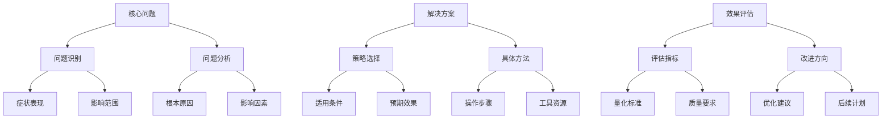

### 3. 成长历程骨架（适合传记回忆录）
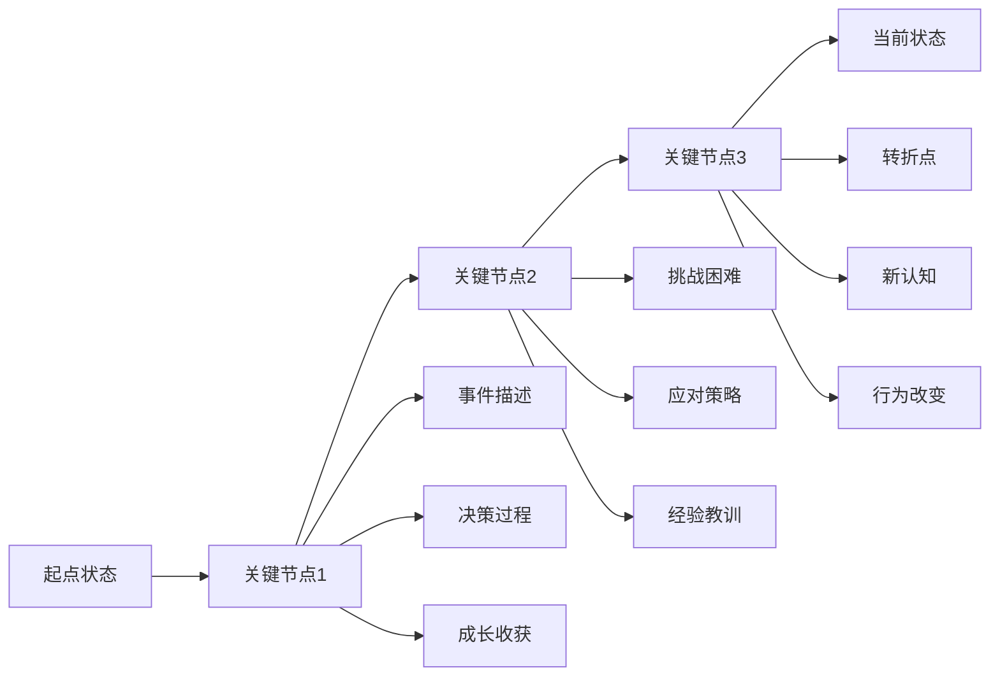

### 4. 现象-原理-应用骨架（适合科普读物）
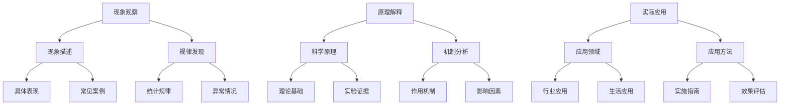

### 5. 主题-手法-意义骨架（适合文学作品）
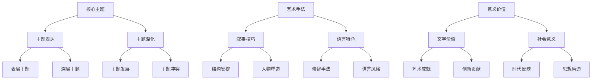

### 6. 树状分类骨架（适合科学分类）
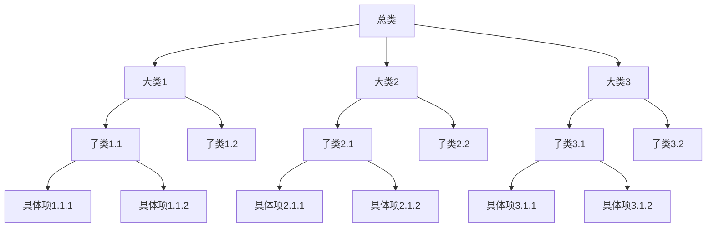

### 7. 因果解释骨架（适合社会科学）
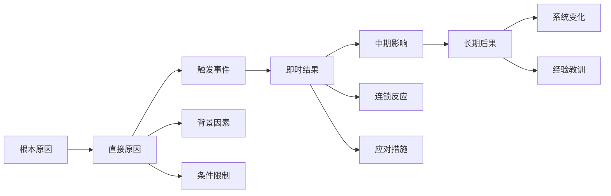

### 8. 流程与序列骨架（适合操作指南）
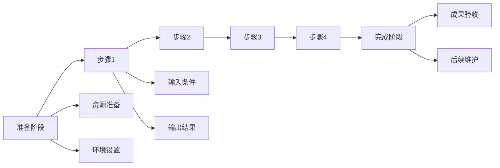

### 9. 论点/案例骨架（适合论说作品）
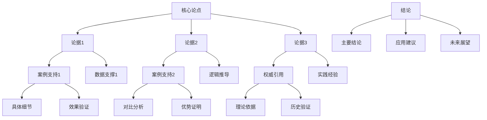

### 10. 道-法-术-器骨架（适合深度技能）
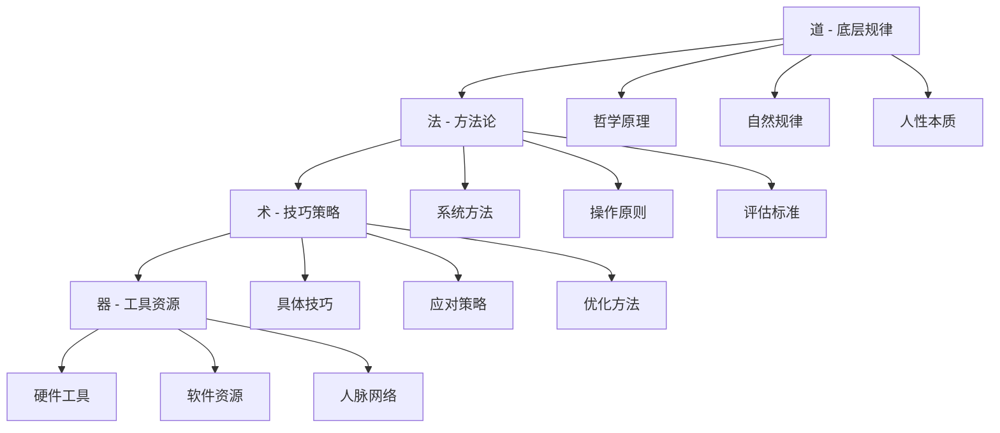

### 11. 5W1H深度分析骨架（适合复杂系统）
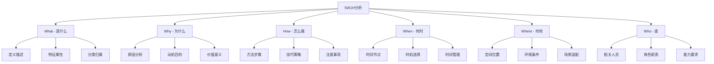

### 12. 2W1H快速理解骨架（适合快速入门）
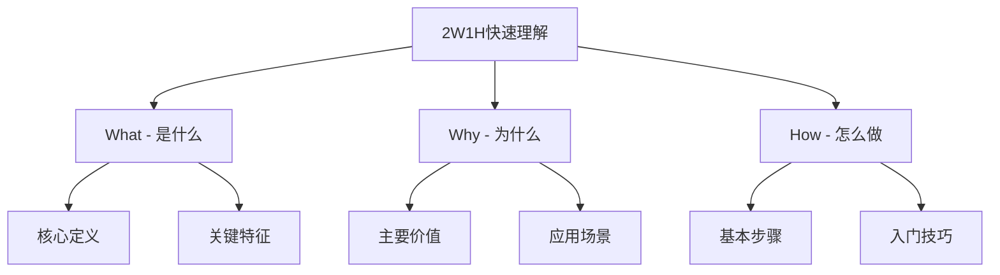

### 13. 增强/调节回路骨架（适合系统分析）
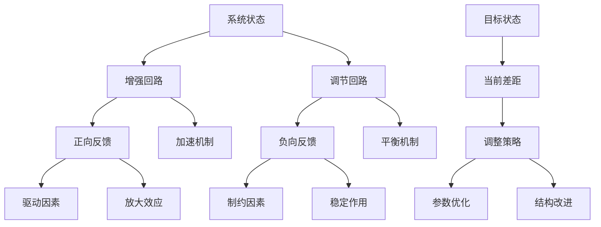

### 14. 比较分析骨架（适合方案选择）
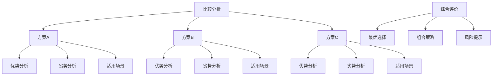

### 15. 时间线骨架（适合历史事件）
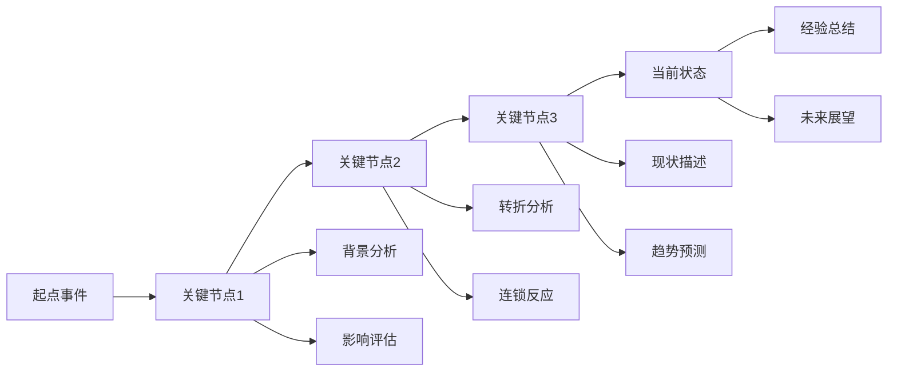

### 16. 空间结构骨架（适合空间描述）
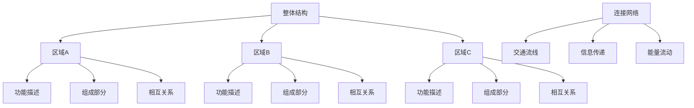

## 辅助模块展示

### 辅助模块在思维导图中的集成方式
辅助模块作为知识点的补充内容，可以以附件、注释或独立分支的形式集成到思维导图中，根据模块类型和内容特点选择最合适的展示方式。

#### 概念模块展示模板
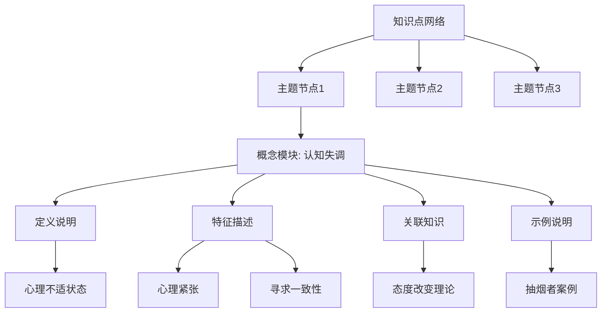

**展示规则**：
1. 概念模块作为主题节点的子分支附加
2. 保持与主知识点的层级关系清晰
3. 使用特殊标记（如"概念模块:"前缀）区分
4. 概念细节作为最末级节点展开

#### 工具模块展示模板
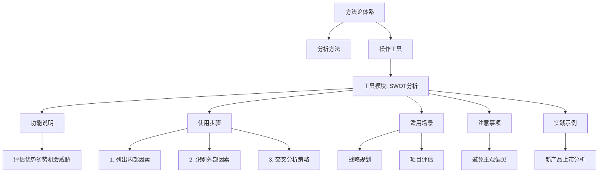

**展示规则**：
1. 工具模块归入"工具"或"方法"分支
2. 操作步骤按顺序展开，便于逐步学习
3. 实践示例作为具体案例独立展示
4. 注意事项作为关键提醒突出显示

#### 思维模型模块展示模板
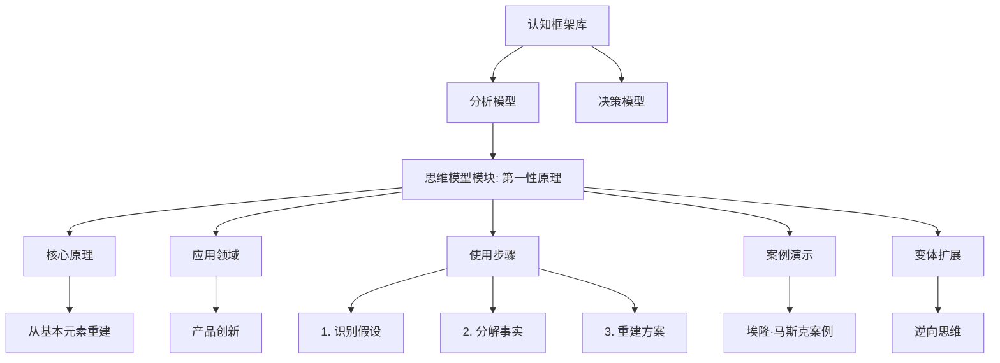

**展示规则**：
1. 思维模型模块归入专门的认知框架分支
2. 核心原理作为模型的基础描述
3. 应用案例作为具体演示独立展示
4. 变体扩展作为模型的衍生产品展示

### 辅助模块集成策略

#### 1. 模块触发与检测
- **自动检测**：系统自动分析知识点内容，识别概念、工具或思维模型特征
- **内容匹配**：根据关键词、结构特征和内容复杂度判断模块类型
- **置信度评估**：评估内容是否足够丰富，需要单独输出模块

#### 2. 展示层级设计
- **主从关系**：辅助模块作为知识点的从属内容，不喧宾夺主
- **层级深度**：一般保持2-3级展示深度，避免过度细化
- **视觉区分**：使用不同的颜色、图标或样式标记辅助模块

#### 3. 内容组织原则
- **模块独立**：每个辅助模块内容自洽，可作为独立学习单元
- **内容关联**：辅助模块与主知识点保持逻辑关联
- **结构统一**：同类模块保持统一的结构和展示方式

#### 4. 交互与使用
- **展开折叠**：支持模块内容的展开和折叠，便于信息管理
- **快速定位**：提供模块索引，便于快速查找特定内容
- **引用链接**：建立辅助模块与相关知识点的双向链接

### 质量检查清单
- [ ] 辅助模块的触发条件是否明确？
- [ ] 模块内容结构是否完整？
- [ ] 展示方式是否符合模块类型特点？
- [ ] 主从关系是否清晰合理？
- [ ] 内容是否便于学习和应用？
- [ ] 是否有具体的示例演示？

## 思维导图使用指南

### 选择逻辑骨架的标准
1. **匹配读物类型**：根据读物类型选择对应骨架
2. **符合知识特征**：知识点的内在逻辑应与骨架一致
3. **便于记忆理解**：骨架应有助于知识的内化和应用
4. **支持双链调用**：骨架结构应便于知识点间的关联

### 构建知识图谱的步骤
1. **识别核心节点**：确定知识体系的核心概念或问题
2. **建立层级关系**：按照逻辑骨架建立父-子节点关系
3. **填充知识点**：将标准化知识点挂载到对应节点
4. **建立关联链接**：在不同节点间建立横向关联
5. **验证结构完整性**：检查知识图谱的逻辑一致性

### 双链调用支持
- **内部链接**：同一骨架内的知识点相互引用
- **跨骨架链接**：不同骨架间的知识点建立关联
- **主题标签**：为知识点添加主题标签便于检索
- **关系标注**：标注知识点间的逻辑关系（如：支持、反对、补充）

## 模板定制建议

### 根据知识复杂度调整
- **简单知识**：使用基础的三级结构
- **复杂知识**：可以扩展到四级或五级结构
- **系统知识**：可以建立多个相互关联的思维导图

### 根据使用场景调整
- **学习记忆**：侧重层级清晰、便于记忆的结构
- **问题解决**：侧重问题导向、解决方案明确的结构
- **创新思考**：侧重发散性强、关联灵活的结构