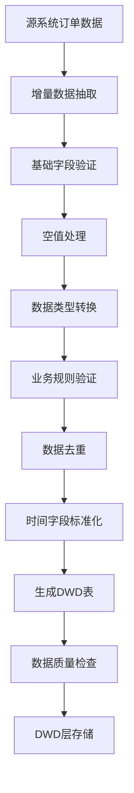
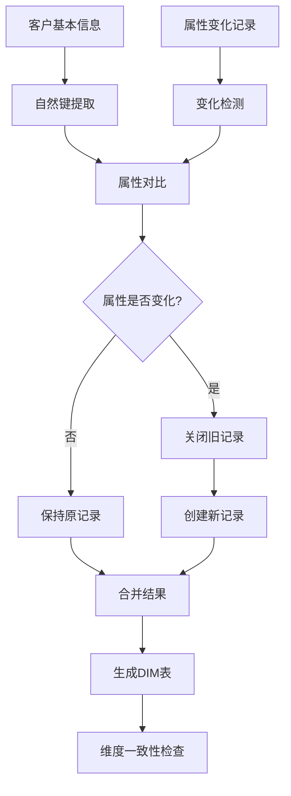
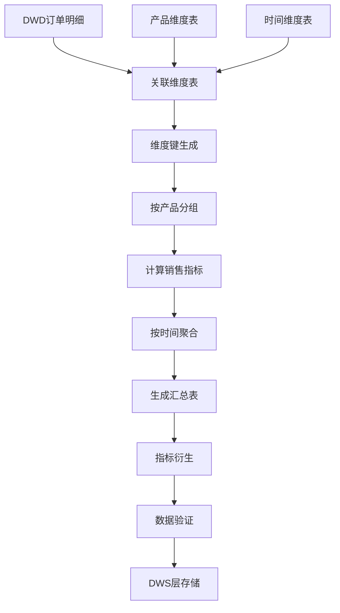
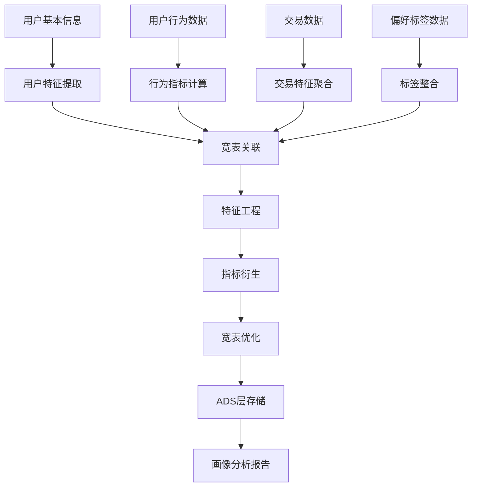

# 工作流示例详解

## 概述

本文档提供数仓数据加工的典型工作流示例，涵盖从数据接入到应用展示的完整流程。每个示例都包含业务场景、处理步骤、代码实现和验证方法。

## 示例1：DWD层数据接入与清洗

### 业务场景
从业务系统接入销售订单数据，进行数据清洗和标准化，生成DWD层订单明细表。

### 输入数据
- 源系统：销售系统数据库
- 数据表：sales_orders（原始订单表）
- 数据特点：包含脏数据、格式不一致、有空值

### 处理步骤



### 代码实现

```python
# 示例：DWD层订单数据清洗工作流

def dwd_order_cleaning_workflow(source_connection, target_path):
    """
    DWD层订单数据清洗完整工作流
    """
    import pandas as pd
    from datetime import datetime
    
    # 步骤1：增量数据抽取
    print("步骤1: 增量数据抽取")
    query = """
    SELECT 
        order_id,
        customer_id,
        product_id,
        order_amount,
        order_quantity,
        order_date,
        order_status,
        create_time,
        update_time
    FROM sales_orders 
    WHERE update_time >= DATE_SUB(NOW(), INTERVAL 1 DAY)
    """
    
    raw_data = pd.read_sql(query, source_connection)
    print(f"抽取到 {len(raw_data)} 条增量数据")
    
    # 步骤2：基础字段验证
    print("步骤2: 基础字段验证")
    required_columns = ['order_id', 'customer_id', 'order_amount', 'order_date']
    missing_columns = [col for col in required_columns if col not in raw_data.columns]
    if missing_columns:
        raise ValueError(f"缺失必要字段: {missing_columns}")
    
    # 步骤3：空值处理
    print("步骤3: 空值处理")
    cleaned_data = raw_data.copy()
    
    # 不同字段采用不同的空值处理策略
    null_handling_strategies = {
        'order_id': 'drop',           # 订单ID为空，删除记录
        'order_amount': 'zero',       # 订单金额为空，设为0
        'order_quantity': 'zero',     # 订单数量为空，设为0
        'order_status': 'default',    # 订单状态为空，设为默认值
        'customer_id': 'unknown'      # 客户ID为空，设为未知
    }
    
    for col, strategy in null_handling_strategies.items():
        if col in cleaned_data.columns:
            null_count = cleaned_data[col].isnull().sum()
            if null_count > 0:
                if strategy == 'drop':
                    cleaned_data = cleaned_data.dropna(subset=[col])
                    print(f"字段 {col}: 删除 {null_count} 条空值记录")
                elif strategy == 'zero':
                    cleaned_data[col] = cleaned_data[col].fillna(0)
                    print(f"字段 {col}: {null_count} 个空值设为0")
                elif strategy == 'default':
                    if col == 'order_status':
                        cleaned_data[col] = cleaned_data[col].fillna('pending')
                        print(f"字段 {col}: {null_count} 个空值设为'pending'")
                elif strategy == 'unknown':
                    cleaned_data[col] = cleaned_data[col].fillna('unknown')
                    print(f"字段 {col}: {null_count} 个空值设为'unknown'")
    
    # 步骤4：数据类型转换
    print("步骤4: 数据类型转换")
    cleaned_data['order_date'] = pd.to_datetime(cleaned_data['order_date'], errors='coerce')
    cleaned_data['create_time'] = pd.to_datetime(cleaned_data['create_time'], errors='coerce')
    cleaned_data['update_time'] = pd.to_datetime(cleaned_data['update_time'], errors='coerce')
    
    cleaned_data['order_amount'] = pd.to_numeric(cleaned_data['order_amount'], errors='coerce')
    cleaned_data['order_quantity'] = pd.to_numeric(cleaned_data['order_quantity'], errors='coerce')
    
    # 步骤5：业务规则验证
    print("步骤5: 业务规则验证")
    business_rules = [
        "order_amount >= 0",           # 订单金额不能为负数
        "order_quantity > 0",          # 订单数量必须大于0
        "order_date <= update_time",   # 订单日期不能晚于更新时间
        "order_date >= '2020-01-01'"   # 订单日期必须在合理范围内
    ]
    
    initial_count = len(cleaned_data)
    for rule in business_rules:
        try:
            cleaned_data = cleaned_data.query(rule)
            print(f"应用规则: {rule}")
        except Exception as e:
            print(f"规则执行失败 {rule}: {e}")
    
    filtered_count = len(cleaned_data)
    print(f"业务规则过滤: {initial_count - filtered_count} 条记录被过滤")
    
    # 步骤6：数据去重
    print("步骤6: 数据去重")
    duplicate_count = cleaned_data.duplicated(subset=['order_id']).sum()
    if duplicate_count > 0:
        cleaned_data = cleaned_data.drop_duplicates(subset=['order_id'], keep='last')
        print(f"删除 {duplicate_count} 条重复记录")
    
    # 步骤7：时间字段标准化
    print("步骤7: 时间字段标准化")
    cleaned_data['data_date'] = cleaned_data['order_date'].dt.date
    cleaned_data['order_year'] = cleaned_data['order_date'].dt.year
    cleaned_data['order_month'] = cleaned_data['order_date'].dt.month
    cleaned_data['order_day'] = cleaned_data['order_date'].dt.day
    
    # 步骤8：生成DWD表
    print("步骤8: 生成DWD表")
    dwd_columns = [
        'order_id', 'customer_id', 'product_id',
        'order_amount', 'order_quantity',
        'order_date', 'order_status',
        'create_time', 'update_time',
        'data_date', 'order_year', 'order_month', 'order_day',
        'process_time'
    ]
    
    # 添加处理时间戳
    cleaned_data['process_time'] = datetime.now()
    
    # 选择需要的字段
    dwd_table = cleaned_data[dwd_columns].copy()
    
    # 步骤9：数据质量检查
    print("步骤9: 数据质量检查")
    quality_report = {
        'total_records': len(dwd_table),
        'null_order_id': dwd_table['order_id'].isnull().sum(),
        'negative_amount': (dwd_table['order_amount'] < 0).sum(),
        'zero_quantity': (dwd_table['order_quantity'] == 0).sum(),
        'future_dates': (dwd_table['order_date'] > datetime.now()).sum()
    }
    
    print("数据质量报告:")
    for metric, value in quality_report.items():
        print(f"  {metric}: {value}")
    
    # 步骤10：DWD层存储
    print("步骤10: DWD层存储")
    # 按日期分区存储
    for date_value in dwd_table['data_date'].unique():
        date_str = date_value.strftime('%Y%m%d')
        partition_data = dwd_table[dwd_table['data_date'] == date_value]
        
        if not partition_data.empty:
            partition_path = f"{target_path}/data_date={date_str}/dwd_orders.parquet"
            partition_data.to_parquet(partition_path, index=False)
            print(f"存储分区: {date_str}, 记录数: {len(partition_data)}")
    
    print(f"工作流完成，共处理 {len(dwd_table)} 条记录")
    return dwd_table, quality_report
```

### 验证方法
1. **数据完整性验证**：检查必需字段是否完整
2. **业务规则验证**：验证所有业务规则是否满足
3. **数据质量指标**：监控关键质量指标
4. **前后数据对比**：对比清洗前后的数据差异

## 示例2：DIM层客户维度处理

### 业务场景
处理客户维度数据，支持缓慢变化维度（SCD Type 2），跟踪客户属性变化历史。

### 输入数据
- 源数据：客户基本信息表
- 变化数据：客户属性更新记录
- 历史维度：现有客户维度表

### 处理步骤



### 代码实现

```python
# 示例：DIM层客户维度处理工作流

def dim_customer_processing_workflow(current_dim, new_customers, change_records):
    """
    DIM层客户维度处理工作流（SCD Type 2）
    """
    import pandas as pd
    from datetime import datetime, date
    
    print("开始DIM层客户维度处理工作流")
    
    # 步骤1：准备现有维度表
    print("步骤1: 准备现有维度表")
    if current_dim.empty:
        # 初始化维度表结构
        current_dim = pd.DataFrame(columns=[
            'customer_sk', 'customer_id', 'customer_name',
            'customer_type', 'registration_date', 'customer_level',
            'valid_from', 'valid_to', 'is_current', 'create_time'
        ])
        next_sk = 1
    else:
        # 获取下一个代理键值
        next_sk = current_dim['customer_sk'].max() + 1 if not current_dim.empty else 1
    
    # 步骤2：处理新增客户
    print("步骤2: 处理新增客户")
    result_dim = current_dim.copy()
    
    if not new_customers.empty:
        for idx, customer in new_customers.iterrows():
            customer_id = customer['customer_id']
            
            # 检查是否已存在
            existing = result_dim[
                (result_dim['customer_id'] == customer_id) & 
                (result_dim['is_current'] == 1)
            ]
            
            if existing.empty:
                # 新增维度记录
                new_record = {
                    'customer_sk': next_sk,
                    'customer_id': customer_id,
                    'customer_name': customer.get('customer_name', ''),
                    'customer_type': customer.get('customer_type', '普通'),
                    'registration_date': customer.get('registration_date', date.today()),
                    'customer_level': customer.get('customer_level', '青铜'),
                    'valid_from': date.today(),
                    'valid_to': date(9999, 12, 31),
                    'is_current': 1,
                    'create_time': datetime.now()
                }
                
                result_dim = pd.concat([result_dim, pd.DataFrame([new_record])], ignore_index=True)
                next_sk += 1
                print(f"新增客户维度: {customer_id}")
            else:
                print(f"客户已存在，跳过新增: {customer_id}")
    
    # 步骤3：处理属性变化
    print("步骤3: 处理属性变化")
    if not change_records.empty:
        attribute_columns = ['customer_name', 'customer_type', 'customer_level']
        
        for idx, change in change_records.iterrows():
            customer_id = change['customer_id']
            
            # 查找当前记录
            current_record = result_dim[
                (result_dim['customer_id'] == customer_id) & 
                (result_dim['is_current'] == 1)
            ]
            
            if not current_record.empty:
                record_idx = current_record.index[0]
                old_record = current_record.iloc[0]
                
                # 检查属性是否有变化
                attribute_changed = False
                changed_attributes = []
                
                for attr in attribute_columns:
                    if attr in change:
                        old_value = old_record[attr]
                        new_value = change[attr]
                        
                        # 判断是否变化
                        if pd.isna(old_value) and not pd.isna(new_value):
                            attribute_changed = True
                            changed_attributes.append(attr)
                        elif not pd.isna(old_value) and pd.isna(new_value):
                            attribute_changed = True
                            changed_attributes.append(attr)
                        elif not pd.isna(old_value) and not pd.isna(new_value):
                            if attr == 'customer_name' and old_value != new_value:
                                attribute_changed = True
                                changed_attributes.append(attr)
                            elif attr in ['customer_type', 'customer_level'] and old_value != new_value:
                                attribute_changed = True
                                changed_attributes.append(attr)
                
                if attribute_changed:
                    # 步骤3.1：关闭旧记录
                    result_dim.loc[record_idx, 'valid_to'] = date.today() - pd.Timedelta(days=1)
                    result_dim.loc[record_idx, 'is_current'] = 0
                    
                    # 步骤3.2：创建新记录
                    new_record = old_record.to_dict()
                    
                    # 更新变化的属性
                    for attr in changed_attributes:
                        if attr in change:
                            new_record[attr] = change[attr]
                    
                    # 设置新记录属性
                    new_record['customer_sk'] = next_sk
                    new_record['valid_from'] = date.today()
                    new_record['valid_to'] = date(9999, 12, 31)
                    new_record['is_current'] = 1
                    new_record['create_time'] = datetime.now()
                    
                    result_dim = pd.concat([result_dim, pd.DataFrame([new_record])], ignore_index=True)
                    next_sk += 1
                    
                    print(f"客户属性更新: {customer_id}, 变化属性: {changed_attributes}")
                else:
                    print(f"客户属性无变化: {customer_id}")
            else:
                print(f"警告: 找不到当前客户记录: {customer_id}")
    
    # 步骤4：维度一致性检查
    print("步骤4: 维度一致性检查")
    consistency_checks = {
        '每个客户有且只有一个当前版本': (
            result_dim.groupby('customer_id')['is_current'].sum().max() == 1
        ),
        '代理键唯一': (
            result_dim['customer_sk'].nunique() == len(result_dim)
        ),
        '时间有效性正确': (
            (result_dim['valid_from'] <= result_dim['valid_to']).all()
        ),
        '没有重叠的有效期': False  # 需要复杂检查
    }
    
    print("维度一致性检查结果:")
    for check_name, check_result in consistency_checks.items():
        if isinstance(check_result, bool):
            status = "通过" if check_result else "失败"
            print(f"  {check_name}: {status}")
        else:
            print(f"  {check_name}: 待检查")
    
    # 步骤5：生成维度统计
    print("步骤5: 生成维度统计")
    dim_stats = {
        '总记录数': len(result_dim),
        '当前版本数': result_dim['is_current'].sum(),
        '历史版本数': len(result_dim) - result_dim['is_current'].sum(),
        '唯一客户数': result_dim['customer_id'].nunique(),
        '平均版本数': len(result_dim) / result_dim['customer_id'].nunique() if result_dim['customer_id'].nunique() > 0 else 0
    }
    
    print("维度统计:")
    for stat_name, stat_value in dim_stats.items():
        print(f"  {stat_name}: {stat_value}")
    
    print(f"工作流完成，维度表记录数: {len(result_dim)}")
    return result_dim, consistency_checks, dim_stats
```

### 验证方法
1. **维度一致性**：检查每个业务键是否有且只有一个当前版本
2. **时间有效性**：验证有效时间范围的正确性
3. **历史完整性**：确保属性变化历史完整记录
4. **数据关联性**：验证与事实表的关联完整性

## 示例3：DWS层销售主题汇总

### 业务场景
基于DWD层订单明细数据，按产品、时间等维度进行汇总，生成DWS层销售主题汇总表。

### 输入数据
- DWD层：订单明细表
- 维度表：产品维度表、时间维度表
- 业务需求：日/周/月销售汇总

### 处理步骤



### 代码实现

```python
# 示例：DWS层销售主题汇总工作流

def dws_sales_aggregation_workflow(dwd_orders, dim_products, aggregation_period='day'):
    """
    DWS层销售主题汇总工作流
    """
    import pandas as pd
    import numpy as np
    from datetime import datetime, timedelta
    
    print(f"开始DWS层销售汇总工作流，聚合周期: {aggregation_period}")
    
    # 步骤1：数据准备与关联
    print("步骤1: 数据准备与关联")
    # 确保有必要的字段
    required_dwd_columns = ['order_id', 'product_id', 'order_amount', 'order_quantity', 'order_date']
    missing_columns = [col for col in required_dwd_columns if col not in dwd_orders.columns]
    if missing_columns:
        raise ValueError(f"DWD表缺失必要字段: {missing_columns}")
    
    # 关联产品维度
    if not dim_products.empty:
        # 只关联当前版本的产品维度
        current_products = dim_products[dim_products['is_current'] == 1]
        if not current_products.empty:
            dwd_enriched = pd.merge(
                dwd_orders,
                current_products[['product_id', 'product_name', 'product_category', 'product_brand']],
                on='product_id',
                how='left'
            )
            print(f"关联产品维度，记录数: {len(dwd_enriched)}")
        else:
            dwd_enriched = dwd_orders.copy()
            print("警告: 没有当前版本的产品维度")
    else:
        dwd_enriched = dwd_orders.copy()
        print("警告: 产品维度表为空")
    
    # 步骤2：时间维度处理
    print("步骤2: 时间维度处理")
    dwd_enriched['order_date'] = pd.to_datetime(dwd_enriched['order_date'])
    
    # 根据聚合周期生成时间键
    if aggregation_period == 'day':
        dwd_enriched['time_key'] = dwd_enriched['order_date'].dt.strftime('%Y%m%d')
        dwd_enriched['time_label'] = dwd_enriched['order_date'].dt.strftime('%Y-%m-%d')
    elif aggregation_period == 'week':
        dwd_enriched['time_key'] = dwd_enriched['order_date'].dt.strftime('%Y%W')
        dwd_enriched['time_label'] = dwd_enriched['order_date'].dt.strftime('%Y-第%W周')
    elif aggregation_period == 'month':
        dwd_enriched['time_key'] = dwd_enriched['order_date'].dt.strftime('%Y%m')
        dwd_enriched['time_label'] = dwd_enriched['order_date'].dt.strftime('%Y-%m')
    elif aggregation_period == 'quarter':
        dwd_enriched['time_key'] = dwd_enriched['order_date'].dt.year.astype(str) + 'Q' + dwd_enriched['order_date'].dt.quarter.astype(str)
        dwd_enriched['time_label'] = dwd_enriched['order_date'].dt.year.astype(str) + '年第' + dwd_enriched['order_date'].dt.quarter.astype(str) + '季度'
    elif aggregation_period == 'year':
        dwd_enriched['time_key'] = dwd_enriched['order_date'].dt.strftime('%Y')
        dwd_enriched['time_label'] = dwd_enriched['order_date'].dt.strftime('%Y年')
    else:
        raise ValueError(f"不支持的聚合周期: {aggregation_period}")
    
    # 步骤3：分组聚合
    print("步骤3: 分组聚合")
    
    # 定义分组字段
    group_columns = ['time_key', 'product_id']
    if 'product_category' in dwd_enriched.columns:
        group_columns.append('product_category')
    if 'product_brand' in dwd_enriched.columns:
        group_columns.append('product_brand')
    
    # 定义聚合指标
    aggregation_config = {
        'order_amount': ['sum', 'mean', 'count', 'max', 'min', 'std'],
        'order_quantity': ['sum', 'mean', 'count']
    }
    
    # 执行聚合
    aggregated_results = []
    
    for measure_col, agg_funcs in aggregation_config.items():
        if measure_col in dwd_enriched.columns:
            for agg_func in agg_funcs:
                agg_result = dwd_enriched.groupby(group_columns)[measure_col].agg(agg_func)
                agg_result.name = f"{measure_col}_{agg_func}"
                aggregated_results.append(agg_result)
    
    # 合并所有聚合结果
    if aggregated_results:
        dws_table = pd.concat(aggregated_results, axis=1).reset_index()
        print(f"聚合完成，生成 {len(dws_table)} 条汇总记录")
    else:
        dws_table = pd.DataFrame()
        print("警告: 没有生成聚合结果")
    
    # 步骤4：指标衍生
    print("步骤4: 指标衍生")
    if not dws_table.empty:
        # 计算平均订单金额
        if 'order_amount_sum' in dws_table.columns and 'order_quantity_sum' in dws_table.columns:
            dws_table['avg_order_amount_per_unit'] = dws_table['order_amount_sum'] / dws_table['order_quantity_sum']
            dws_table['avg_order_amount_per_unit'] = dws_table['avg_order_amount_per_unit'].replace([np.inf, -np.inf], np.nan)
        
        # 计算销售占比（需要总体数据）
        if 'order_amount_sum' in dws_table.columns:
            total_sales = dws_table['order_amount_sum'].sum()
            if total_sales > 0:
                dws_table['sales_percentage'] = dws_table['order_amount_sum'] / total_sales * 100
        
        # 添加时间标签
        time_mapping = dwd_enriched[['time_key', 'time_label']].drop_duplicates()
        dws_table = pd.merge(dws_table, time_mapping, on='time_key', how='left')
        
        # 添加产品名称（如果可用）
        if 'product_name' in dwd_enriched.columns:
            product_mapping = dwd_enriched[['product_id', 'product_name']].drop_duplicates()
            dws_table = pd.merge(dws_table, product_mapping, on='product_id', how='left')
        
        print(f"衍生指标计算完成")
    
    # 步骤5：数据验证
    print("步骤5: 数据验证")
    validation_results = {
        '记录完整性': not dws_table.empty,
        '指标非负性': True,
        '时间连续性': True,
        '聚合一致性': True
    }
    
    if not dws_table.empty:
        # 检查指标非负性
        amount_columns = [col for col in dws_table.columns if 'amount' in col]
        for col in amount_columns:
            if col in dws_table.columns:
                negative_count = (dws_table[col] < 0).sum()
                if negative_count > 0:
                    validation_results['指标非负性'] = False
                    print(f"警告: 字段 {col} 有 {negative_count} 个负值")
        
        # 检查聚合一致性（总和应等于DWD层总和）
        if 'order_amount_sum' in dws_table.columns:
            dws_total = dws_table['order_amount_sum'].sum()
            dwd_total = dwd_orders['order_amount'].sum()
            diff_percentage = abs(dws_total - dwd_total) / dwd_total * 100 if dwd_total > 0 else 0
            
            if diff_percentage > 1:  # 允许1%的差异
                validation_results['聚合一致性'] = False
                print(f"警告: 聚合金额差异较大，DWD: {dwd_total}, DWS: {dws_total}, 差异: {diff_percentage:.2f}%")
            else:
                print(f"聚合一致性检查通过，差异: {diff_percentage:.2f}%")
    
    # 步骤6：生成汇总报告
    print("步骤6: 生成汇总报告")
    summary_report = {
        '聚合周期': aggregation_period,
        '汇总记录数': len(dws_table),
        '时间范围': {
            '最早时间': dwd_enriched['order_date'].min() if not dwd_enriched.empty else None,
            '最晚时间': dwd_enriched['order_date'].max() if not dwd_enriched.empty else None
        },
        '销售指标': {},
        '验证结果': validation_results
    }
    
    if not dws_table.empty:
        # 计算关键销售指标
        if 'order_amount_sum' in dws_table.columns:
            summary_report['销售指标']['总销售额'] = dws_table['order_amount_sum'].sum()
            summary_report['销售指标']['平均销售额'] = dws_table['order_amount_sum'].mean()
            summary_report['销售指标']['最大销售额'] = dws_table['order_amount_sum'].max()
            
        if 'order_quantity_sum' in dws_table.columns:
            summary_report['销售指标']['总销售量'] = dws_table['order_quantity_sum'].sum()
            summary_report['销售指标']['平均销售量'] = dws_table['order_quantity_sum'].mean()
    
    print("汇总报告:")
    for category, info in summary_report.items():
        if isinstance(info, dict):
            print(f"  {category}:")
            for key, value in info.items():
                print(f"    {key}: {value}")
        else:
            print(f"  {category}: {info}")
    
    print(f"工作流完成，DWS表记录数: {len(dws_table)}")
    return dws_table, summary_report
```

### 验证方法
1. **聚合一致性**：验证汇总数据与明细数据的一致性
2. **指标合理性**：检查关键业务指标的合理性
3. **时间连续性**：验证时间维度的连续性
4. **数据完整性**：检查维度关联的完整性

## 示例4：ADS层用户画像宽表构建

### 业务场景
整合多个数据源，构建用户画像宽表，支持个性化推荐和精准营销。

### 输入数据
- 用户基本信息
- 用户行为数据
- 交易数据
- 偏好标签数据

### 处理步骤



### 代码实现

```python
# 示例：ADS层用户画像宽表构建工作流

def ads_user_profile_workflow(user_base, user_behavior, transactions, user_tags):
    """
    ADS层用户画像宽表构建工作流
    """
    import pandas as pd
    import numpy as np
    from datetime import datetime, timedelta
    
    print("开始ADS层用户画像宽表构建工作流")
    
    # 步骤1：用户特征提取
    print("步骤1: 用户特征提取")
    user_features = user_base.copy()
    
    # 基础特征增强
    if 'registration_date' in user_features.columns:
        user_features['registration_date'] = pd.to_datetime(user_features['registration_date'])
        user_features['days_since_registration'] = (datetime.now() - user_features['registration_date']).dt.days
        user_features['registration_year'] = user_features['registration_date'].dt.year
        user_features['registration_month'] = user_features['registration_date'].dt.month
    
    # 人口统计特征
    if 'birth_date' in user_features.columns:
        user_features['birth_date'] = pd.to_datetime(user_features['birth_date'], errors='coerce')
        user_features['age'] = (datetime.now() - user_features['birth_date']).dt.days // 365
        user_features['age_group'] = pd.cut(
            user_features['age'],
            bins=[0, 18, 25, 35, 45, 55, 100],
            labels=['未成年', '18-25', '26-35', '36-45', '46-55', '56+']
        )
    
    print(f"用户特征提取完成，记录数: {len(user_features)}")
    
    # 步骤2：行为指标计算
    print("步骤2: 行为指标计算")
    behavior_metrics = pd.DataFrame()
    
    if not user_behavior.empty:
        # 确保有时间字段
        if 'behavior_time' in user_behavior.columns:
            user_behavior['behavior_time'] = pd.to_datetime(user_behavior['behavior_time'])
            
            # 按用户计算行为指标
            behavior_metrics = user_behavior.groupby('user_id').agg({
                'behavior_time': ['count', 'min', 'max'],
                'behavior_type': ['nunique']
            }).reset_index()
            
            # 扁平化列名
            behavior_metrics.columns = ['user_id', 'behavior_count', 'first_behavior_time', 'last_behavior_time', 'behavior_type_count']
            
            # 计算行为频率
            behavior_metrics['days_since_first_behavior'] = (datetime.now() - behavior_metrics['first_behavior_time']).dt.days
            behavior_metrics['days_since_last_behavior'] = (datetime.now() - behavior_metrics['last_behavior_time']).dt.days
            behavior_metrics['behavior_frequency'] = behavior_metrics['behavior_count'] / behavior_metrics['days_since_first_behavior'].clip(lower=1)
            
            print(f"行为指标计算完成，用户数: {len(behavior_metrics)}")
    
    # 步骤3：交易特征聚合
    print("步骤3: 交易特征聚合")
    transaction_features = pd.DataFrame()
    
    if not transactions.empty:
        # 确保有必要的字段
        required_txn_columns = ['user_id', 'transaction_amount', 'transaction_date']
        if all(col in transactions.columns for col in required_txn_columns):
            transactions['transaction_date'] = pd.to_datetime(transactions['transaction_date'])
            
            # 按用户聚合交易特征
            transaction_features = transactions.groupby('user_id').agg({
                'transaction_amount': ['sum', 'mean', 'count', 'max', 'min', 'std'],
                'transaction_date': ['min', 'max']
            }).reset_index()
            
            # 扁平化列名
            transaction_features.columns = [
                'user_id',
                'total_transaction_amount', 'avg_transaction_amount', 'transaction_count',
                'max_transaction_amount', 'min_transaction_amount', 'transaction_amount_std',
                'first_transaction_date', 'last_transaction_date'
            ]
            
            # 计算衍生特征
            transaction_features['days_since_first_transaction'] = (datetime.now() - transaction_features['first_transaction_date']).dt.days
            transaction_features['days_since_last_transaction'] = (datetime.now() - transaction_features['last_transaction_date']).dt.days
            transaction_features['transaction_frequency'] = transaction_features['transaction_count'] / transaction_features['days_since_first_transaction'].clip(lower=1)
            
            # 计算价值分层
            transaction_features['value_segment'] = pd.qcut(
                transaction_features['total_transaction_amount'],
                q=4,
                labels=['低价值', '中低价值', '中高价值', '高价值']
            )
            
            print(f"交易特征聚合完成，用户数: {len(transaction_features)}")
    
    # 步骤4：标签整合
    print("步骤4: 标签整合")
    user_tag_features = pd.DataFrame()
    
    if not user_tags.empty:
        # 确保有必要的字段
        if 'user_id' in user_tags.columns and 'tag_name' in user_tags.columns:
            # 标签数量统计
            tag_counts = user_tags.groupby('user_id')['tag_name'].count().reset_index()
            tag_counts.columns = ['user_id', 'tag_count']
            
            # 热门标签标记
            popular_tags = user_tags['tag_name'].value_counts().head(10).index.tolist()
            
            # 为每个用户标记是否有关注热门标签
            for tag in popular_tags:
                users_with_tag = user_tags[user_tags['tag_name'] == tag]['user_id'].unique()
                tag_counts[f'has_tag_{tag}'] = tag_counts['user_id'].isin(users_with_tag).astype(int)
            
            user_tag_features = tag_counts
            print(f"标签整合完成，用户数: {len(user_tag_features)}")
    
    # 步骤5：宽表关联
    print("步骤5: 宽表关联")
    # 从用户特征开始
    user_profile = user_features.copy()
    
    # 关联行为指标
    if not behavior_metrics.empty:
        user_profile = pd.merge(user_profile, behavior_metrics, on='user_id', how='left')
        print(f"关联行为指标，记录数: {len(user_profile)}")
    
    # 关联交易特征
    if not transaction_features.empty:
        user_profile = pd.merge(user_profile, transaction_features, on='user_id', how='left')
        print(f"关联交易特征，记录数: {len(user_profile)}")
    
    # 关联标签特征
    if not user_tag_features.empty:
        user_profile = pd.merge(user_profile, user_tag_features, on='user_id', how='left')
        print(f"关联标签特征，记录数: {len(user_profile)}")
    
    # 步骤6：特征工程
    print("步骤6: 特征工程")
    
    # 创建复合特征
    if 'transaction_count' in user_profile.columns and 'days_since_registration' in user_profile.columns:
        user_profile['purchase_intensity'] = user_profile['transaction_count'] / user_profile['days_since_registration'].clip(lower=1)
    
    if 'total_transaction_amount' in user_profile.columns and 'transaction_count' in user_profile.columns:
        user_profile['avg_purchase_value'] = user_profile['total_transaction_amount'] / user_profile['transaction_count'].replace(0, np.nan)
    
    # 创建行为-交易关联特征
    if 'behavior_count' in user_profile.columns and 'transaction_count' in user_profile.columns:
        user_profile['conversion_rate'] = user_profile['transaction_count'] / user_profile['behavior_count'].replace(0, np.nan)
    
    # 步骤7：宽表优化
    print("步骤7: 宽表优化")
    
    # 处理空值
    numeric_columns = user_profile.select_dtypes(include=[np.number]).columns
    for col in numeric_columns:
        if user_profile[col].isnull().sum() > 0:
            user_profile[col] = user_profile[col].fillna(0)
    
    # 处理无限值
    for col in numeric_columns:
        if col in user_profile.columns:
            user_profile[col] = user_profile[col].replace([np.inf, -np.inf], np.nan)
            user_profile[col] = user_profile[col].fillna(0)
    
    # 删除重复列
    user_profile = user_profile.loc[:, ~user_profile.columns.duplicated()]
    
    # 步骤8：画像分析报告
    print("步骤8: 画像分析报告")
    profile_report = {
        '总体统计': {
            '总用户数': len(user_profile),
            '有行为记录用户': user_profile['behavior_count'].notnull().sum() if 'behavior_count' in user_profile.columns else 0,
            '有交易记录用户': user_profile['transaction_count'].notnull().sum() if 'transaction_count' in user_profile.columns else 0,
            '有标签用户': user_profile['tag_count'].notnull().sum() if 'tag_count' in user_profile.columns else 0
        },
        '价值分层分布': {},
        '特征完整性': {}
    }
    
    # 价值分层分布
    if 'value_segment' in user_profile.columns:
        segment_dist = user_profile['value_segment'].value_counts().to_dict()
        profile_report['价值分层分布'] = segment_dist
    
    # 特征完整性
    for col in ['age', 'total_transaction_amount', 'behavior_count', 'tag_count']:
        if col in user_profile.columns:
            completeness = user_profile[col].notnull().sum() / len(user_profile)
            profile_report['特征完整性'][col] = f"{completeness:.2%}"
    
    print("用户画像分析报告:")
    for category, info in profile_report.items():
        if isinstance(info, dict):
            print(f"  {category}:")
            for key, value in info.items():
                print(f"    {key}: {value}")
        else:
            print(f"  {category}: {info}")
    
    # 步骤9：ADS层存储
    print("步骤9: ADS层存储")
    # 可以存储为Parquet、CSV等格式
    storage_info = {
        '文件格式': 'parquet',
        '记录数': len(user_profile),
        '字段数': len(user_profile.columns),
        '存储时间': datetime.now().strftime('%Y-%m-%d %H:%M:%S')
    }
    
    print(f"宽表存储信息: {storage_info}")
    
    print(f"工作流完成，用户画像宽表记录数: {len(user_profile)}, 字段数: {len(user_profile.columns)}")
    return user_profile, profile_report, storage_info
```

### 验证方法
1. **数据完整性**：检查关键特征字段的完整性
2. **关联正确性**：验证多表关联的正确性
3. **特征合理性**：检查衍生特征的业务合理性
4. **宽表性能**：评估宽表的查询性能

## 工作流选择指南

### 根据需求选择工作流

1. **数据接入与清洗** → 选择**示例1：DWD层数据接入与清洗**
   - 当需要从源系统接入原始数据时
   - 当数据质量较差需要清洗时
   - 当需要建立基础数据层时

2. **维度管理** → 选择**示例2：DIM层客户维度处理**
   - 当需要跟踪实体属性变化时
   - 当需要支持缓慢变化维度时
   - 当需要建立一致性维度时

3. **主题分析** → 选择**示例3：DWS层销售主题汇总**
   - 当需要按主题进行数据分析时
   - 当需要预计算常用指标时
   - 当需要支持多维分析时

4. **应用集成** → 选择**示例4：ADS层用户画像宽表构建**
   - 当需要整合多个数据源时
   - 当需要支持复杂业务应用时
   - 当需要优化查询性能时

### 工作流组合使用

对于完整的数据加工流水线，可以组合多个工作流：


### 工作流定制建议

1. **参数化配置**：将业务规则、质量阈值等参数化
2. **模块化设计**：每个步骤设计为独立模块，便于复用
3. **监控与日志**：添加详细的监控指标和日志记录
4. **错误处理**：设计完善的错误处理和恢复机制
5. **性能优化**：针对大数据量进行性能优化