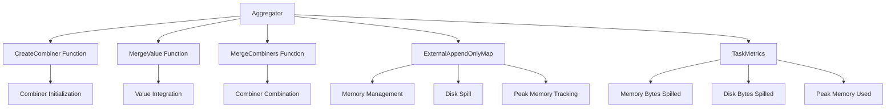

# Aggregator 源码分析

## 类的概述和定义

`Aggregator` 是 Apache Spark 中负责数据聚合操作的核心组件，它定义了数据聚合的三个基本函数：创建组合器、合并值和合并组合器。作为Spark聚合操作的基础设施，它为`reduceByKey`、`aggregateByKey`等转换操作提供统一的聚合框架。

### 组件定位

- **功能定位**：Spark数据聚合操作的核心处理器
- **设计目标**：提供统一、可扩展的聚合操作接口
- **应用场景**：键值对RDD的聚合操作，如reduceByKey、aggregateByKey等

## 整体架构设计

### 核心组件关系图



### 聚合流程架构

#### 两阶段聚合模式
```scala
// 第一阶段：值到组合器的聚合
combineValuesByKey: Iterator[Product2[K, V]] => Iterator[(K, C)]

// 第二阶段：组合器之间的聚合
combineCombinersByKey: Iterator[Product2[K, C]] => Iterator[(K, C)]
```

**设计优势**：
- **分阶段处理**：支持Map端和Reduce端聚合
- **内存优化**：通过ExternalAppendOnlyMap管理内存使用
- **度量跟踪**：实时监控资源使用情况

## 构造函数参数说明

### Aggregator 主构造函数
```scala
case class Aggregator[K, V, C] (
    createCombiner: V => C,
    mergeValue: (C, V) => C,
    mergeCombiners: (C, C) => C)
```

#### 类型参数说明

1. **K**: `类型参数`
   - 键的类型，通常是数据分组的依据
   - 必须实现hashCode和equals方法

2. **V**: `类型参数`
   - 值的类型，需要被聚合的原始数据
   - 支持任意可序列化类型

3. **C**: `类型参数`
   - 组合器的类型，聚合结果的中间表示
   - 通常是累加器或聚合状态

#### 函数参数详细说明

##### createCombiner: `V => C`
**功能**：为每个键创建初始的组合器

**应用场景**：
- 遇到新键时初始化聚合状态
- 设置聚合操作的初始值
- 定义组合器的初始结构

**示例**：
```scala
// 计数聚合：初始化为1
createCombiner = (v: V) => 1

// 求和聚合：初始化为值本身
createCombiner = (v: V) => v

// 列表聚合：初始化为单元素列表
createCombiner = (v: V) => List(v)
```

##### mergeValue: `(C, V) => C`
**功能**：将新值合并到现有的组合器中

**应用场景**：
- 在Map端进行局部聚合
- 将新数据整合到聚合状态中
- 支持增量更新聚合结果

**示例**：
```scala
// 计数聚合：增加计数
mergeValue = (c: C, v: V) => c + 1

// 求和聚合：累加值
mergeValue = (c: C, v: V) => c + v

// 列表聚合：追加到列表
mergeValue = (c: C, v: V) => c :+ v
```

##### mergeCombiners: `(C, C) => C`
**功能**：合并两个组合器

**应用场景**：
- 在Reduce端进行全局聚合
- 合并来自不同分区的聚合结果
- 支持分布式聚合操作

**示例**：
```scala
// 计数聚合：合并计数
mergeCombiners = (c1: C, c2: C) => c1 + c2

// 求和聚合：合并和值
mergeCombiners = (c1: C, c2: C) => c1 + c2

// 列表聚合：合并列表
mergeCombiners = (c1: C, c2: C) => c1 ++ c2
```

## 核心属性分析

### 函数属性

#### 不可变函数引用
```scala
val createCombiner: V => C
val mergeValue: (C, V) => C
val mergeCombiners: (C, C) => C
```

**设计特点**：
- **函数式设计**：纯函数，无副作用
- **线程安全**：不可变函数引用
- **序列化支持**：支持分布式执行

#### 类型安全保证
- **编译时检查**：类型参数确保函数签名正确
- **运行时安全**：避免类型转换错误
- **泛型约束**：支持多种数据类型

### 聚合状态管理

#### ExternalAppendOnlyMap
```scala
val combiners = new ExternalAppendOnlyMap[K, V, C](createCombiner, mergeValue, mergeCombiners)
```

**内存管理特性**：
- **外部排序**：支持内存不足时的磁盘溢出
- **追加优化**：针对聚合操作的优化数据结构
- **内存监控**：实时跟踪内存使用情况

## 主要方法分类和说明

### 聚合操作方法

#### combineValuesByKey 方法
```scala
def combineValuesByKey(
    iter: Iterator[_ <: Product2[K, V]],
    context: TaskContext): Iterator[(K, C)]
```

**功能**：将键值对聚合为键组合器对

**执行流程**：
1. **创建聚合器**：初始化ExternalAppendOnlyMap
2. **插入数据**：遍历迭代器插入所有键值对
3. **更新度量**：记录内存和磁盘使用情况
4. **返回结果**：返回聚合后的迭代器

**算法复杂度**：
- **时间复杂度**：O(n)，线性遍历
- **空间复杂度**：O(unique keys)，与唯一键数量相关
- **内存优化**：支持磁盘溢出，避免OOM

#### combineCombinersByKey 方法
```scala
def combineCombinersByKey(
    iter: Iterator[_ <: Product2[K, C]],
    context: TaskContext): Iterator[(K, C)]
```

**功能**：将键组合器对进一步聚合

**特殊处理**：
- **身份函数**：使用`identity`作为createCombiner
- **双重合并**：mergeValue和mergeCombiners使用相同函数
- **组合器优化**：直接合并已聚合的结果

**应用场景**：
- Reduce端聚合
- 多阶段聚合的第二阶段
- 组合器重分配后的再聚合

### 度量更新方法

#### updateMetrics 方法
```scala
private def updateMetrics(context: TaskContext, map: ExternalAppendOnlyMap[_, _, _]): Unit
```

**度量项目**：
```scala
c.taskMetrics().incMemoryBytesSpilled(map.memoryBytesSpilled)    // 内存溢出字节数
c.taskMetrics().incDiskBytesSpilled(map.diskBytesSpilled)        // 磁盘溢出字节数
c.taskMetrics().incPeakExecutionMemory(map.peakMemoryUsedBytes)  // 峰值内存使用
```

**监控意义**：
- **性能分析**：识别内存瓶颈
- **调优指导**：优化内存配置
- **故障诊断**：检测内存不足问题

**安全设计**：
- **空值检查**：`Option(context)`避免空指针
- **类型擦除**：使用通配符类型`[_, _, _]`
- **异常安全**：不会影响主聚合流程

## 核心算法实现

### 聚合算法流程

#### 值聚合算法（combineValuesByKey）
```scala
val combiners = new ExternalAppendOnlyMap[K, V, C](createCombiner, mergeValue, mergeCombiners)
combiners.insertAll(iter)
```

**算法步骤**：
1. **键提取**：从Product2[K, V]中提取键和值
2. **组合器查找**：在映射中查找对应键的组合器
3. **初始创建**：如果键不存在，调用createCombiner创建新组合器
4. **值合并**：如果键存在，调用mergeValue合并新值
5. **内存管理**：根据内存压力决定是否溢出到磁盘

#### 组合器聚合算法（combineCombinersByKey）
```scala
val combiners = new ExternalAppendOnlyMap[K, C, C](identity, mergeCombiners, mergeCombiners)
```

**算法优化**：
- **跳过创建**：使用identity函数，直接使用现有组合器
- **统一合并**：mergeValue和mergeCombiners使用相同逻辑
- **效率提升**：减少函数调用开销

### 内存管理算法

#### ExternalAppendOnlyMap 内部机制

**插入算法**：
```scala
def insertAll(iter: Iterator[_ <: Product2[K, V]]): Unit
```

**内存管理策略**：
1. **内存优先**：优先在内存中完成聚合
2. **磁盘溢出**：内存不足时溢出到磁盘文件
3. **合并排序**：溢出文件进行外部排序合并
4. **最终聚合**：合并所有内存和磁盘中的结果

**溢出检测**：
- **内存阈值**：根据配置的内存限制
- **实时监控**：跟踪当前内存使用
- **优雅降级**：平滑过渡到磁盘操作

## 设计特点总结

### 1. 函数式设计

#### 纯函数特性
```scala
createCombiner: V => C      // 无状态创建
mergeValue: (C, V) => C     // 无副作用合并
mergeCombiners: (C, C) => C // 可重复执行
```

**优势**：
- **确定性**：相同输入总是产生相同输出
- **可测试性**：易于单元测试和验证
- **可组合性**：支持函数组合和重用

#### 高阶函数应用
- **函数作为参数**：聚合逻辑由用户提供
- **类型参数化**：支持多种数据类型
- **行为定制**：允许自定义聚合策略

### 2. 内存优化设计

#### 外部排序支持
```scala
new ExternalAppendOnlyMap[K, V, C](...)
```

**优化特性**：
- **磁盘溢出**：处理大数据集，避免OOM
- **内存效率**：优化内存使用模式
- **延迟计算**：惰性迭代器减少内存占用

#### 度量集成
```scala
updateMetrics(context, combiners)
```

**监控能力**：
- **资源跟踪**：实时监控内存和磁盘使用
- **性能分析**：提供调优数据支持
- **容量规划**：指导集群资源配置

### 3. 类型安全设计

#### 泛型类型系统
```scala
class Aggregator[K, V, C]
```

**类型安全**：
- **编译时检查**：避免运行时类型错误
- **灵活扩展**：支持任意数据类型
- **接口一致**：确保函数签名匹配

#### Case类特性
```scala
case class Aggregator[K, V, C](...)
```

**便利功能**：
- **不可变性**：线程安全，无状态冲突
- **模式匹配**：支持解构和模式匹配
- **自动方法**：equals、hashCode、toString

### 4. 分布式友好设计

#### 序列化支持
- **函数序列化**：支持分布式执行
- **结果序列化**：聚合结果可网络传输
- **兼容性**：与Spark序列化框架集成

#### 两阶段聚合
```scala
// Map端聚合
combineValuesByKey

// Reduce端聚合
combineCombinersByKey
```

**分布式优化**：
- **数据本地性**：在数据所在节点进行初步聚合
- **网络优化**：减少Shuffle数据传输量
- **负载均衡**：平衡各阶段计算负载

## 使用场景分析

### 1. 基本聚合操作

#### 计数聚合
```scala
val wordCountAggregator = new Aggregator[String, String, Int](
  createCombiner = _ => 1,
  mergeValue = (count, _) => count + 1,
  mergeCombiners = (count1, count2) => count1 + count2
)
```

**应用**：单词计数、事件统计等

#### 求和聚合
```scala
val sumAggregator = new Aggregator[String, Double, Double](
  createCombiner = value => value,
  mergeValue = (sum, value) => sum + value,
  mergeCombiners = (sum1, sum2) => sum1 + sum2
)
```

**应用**：数值统计、金额汇总等

### 2. 复杂聚合操作

#### 平均值聚合
```scala
case class AvgResult(sum: Double, count: Long)

val avgAggregator = new Aggregator[String, Double, AvgResult](
  createCombiner = value => AvgResult(value, 1),
  mergeValue = (avg, value) => AvgResult(avg.sum + value, avg.count + 1),
  mergeCombiners = (avg1, avg2) => 
    AvgResult(avg1.sum + avg2.sum, avg1.count + avg2.count)
)
```

**应用**：统计平均值，避免精度问题

#### 列表收集聚合
```scala
val listAggregator = new Aggregator[String, String, List[String]](
  createCombiner = value => List(value),
  mergeValue = (list, value) => value :: list,
  mergeCombiners = (list1, list2) => list1 ::: list2
)
```

**应用**：数据收集、样本保留等

### 3. 自定义业务聚合

#### 最大值聚合
```scala
val maxAggregator = new Aggregator[String, Int, Int](
  createCombiner = value => value,
  mergeValue = (max, value) => math.max(max, value),
  mergeCombiners = (max1, max2) => math.max(max1, max2)
)
```

**应用**：极值统计、排名计算等

#### 唯一值聚合
```scala
val distinctAggregator = new Aggregator[String, String, Set[String]](
  createCombiner = value => Set(value),
  mergeValue = (set, value) => set + value,
  mergeCombiners = (set1, set2) => set1 ++ set2
)
```

**应用**：去重统计、唯一值计算等

## 性能优化策略

### 1. 内存使用优化

#### 组合器设计优化
```scala
// 好的设计：使用可变数据结构
class MutableSum(var value: Double)

// 避免：使用不可变大型对象
case class LargeImmutableObject(...)
```

**优化建议**：
- **使用可变对象**：减少对象创建开销
- **避免装箱**：使用原生类型避免包装类
- **紧凑存储**：优化数据结构内存占用

#### 溢出策略调优
```scala
// 调整内存阈值
spark.shuffle.spill.initialMemoryThreshold
spark.shuffle.spill.batchSize
```

**配置优化**：
- **内存分配**：根据数据特征调整内存限制
- **批量大小**：优化磁盘I/O效率
- **压缩设置**：启用数据压缩减少磁盘占用

### 2. 计算效率优化

#### 函数性能优化
```scala
// 内联函数：避免函数调用开销
@inline def mergeValue(c: C, v: V): C = ...

// 避免闭包：减少闭包捕获开销
val localVar = ... // 在函数外定义
```

**性能技巧**：
- **函数内联**：使用@inline注解
- **避免捕获**：减少闭包环境引用
- **局部变量**：使用局部变量缓存

#### 算法复杂度优化
- **选择高效算法**：根据数据特征选择合适算法
- **提前终止**：支持短路计算优化
- **并行处理**：利用多核并行计算

## 错误处理和调试

### 1. 常见问题处理

#### 内存不足错误
**症状**：`java.lang.OutOfMemoryError`
**原因**：聚合数据量过大，内存配置不足
**解决**：
- 增加执行器内存：`spark.executor.memory`
- 调整溢出阈值：`spark.shuffle.spill.initialMemoryThreshold`
- 优化聚合函数：减少中间结果大小

#### 序列化错误
**症状**：`java.io.NotSerializableException`
**原因**：聚合函数或数据类型不可序列化
**解决**：
- 确保函数和数据类型实现Serializable
- 使用可序列化的数据结构
- 避免捕获不可序列化的外部变量

#### 类型转换错误
**症状**：`java.lang.ClassCastException`
**原因**：类型参数不匹配或函数签名错误
**解决**：
- 检查类型参数一致性
- 验证函数输入输出类型
- 使用类型安全的编程模式

### 2. 调试技巧

#### 度量监控调试
```scala
val context = TaskContext.get()
val metrics = context.taskMetrics()
println(s"Memory spilled: ${metrics.memoryBytesSpilled}")
println(s"Disk spilled: ${metrics.diskBytesSpilled}")
println(s"Peak memory: ${metrics.peakExecutionMemory}")
```

**调试信息**：
- 内存使用情况分析
- 磁盘溢出情况监控
- 性能瓶颈识别

#### 函数调试
```scala
// 添加调试日志
val debugAggregator = new Aggregator[K, V, C](
  createCombiner = { v => 
    println(s"Creating combiner for value: $v")
    createCombiner(v)
  },
  mergeValue = { (c, v) =>
    println(s"Merging value: $v into combiner: $c")
    mergeValue(c, v)
  },
  mergeCombiners = { (c1, c2) =>
    println(s"Merging combiners: $c1 and $c2")
    mergeCombiners(c1, c2)
  }
)
```

**调试策略**：
- 函数执行跟踪
- 中间结果检查
- 数据流验证

## 扩展和自定义

### 1. 自定义聚合器

#### 实现复杂业务逻辑
```scala
class CustomAggregator[K, V, C](
    createCombiner: V => C,
    mergeValue: (C, V) => C,
    mergeCombiners: (C, C) => C) 
  extends Aggregator[K, V, C](createCombiner, mergeValue, mergeCombiners) {
  
  // 添加自定义方法
  def customAggregate(iter: Iterator[Product2[K, V]]): Map[K, C] = {
    combineValuesByKey(iter, TaskContext.get()).toMap
  }
}
```

**扩展功能**：
- 添加业务特定方法
- 支持不同的聚合模式
- 提供便捷的API封装

#### 集成外部算法
```scala
class StatisticalAggregator[K] extends Aggregator[K, Double, Statistics](
  createCombiner = value => new Statistics().add(value),
  mergeValue = (stats, value) => stats.add(value),
  mergeCombiners = (stats1, stats2) => stats1.merge(stats2)
)
```

**集成优势**：
- 复用现有统计库
- 支持复杂统计算法
- 提供专业分析功能

### 2. 性能监控扩展

#### 自定义度量收集
```scala
trait MonitoredAggregator[K, V, C] extends Aggregator[K, V, C] {
  def getAggregationMetrics: AggregationMetrics
  
  override def combineValuesByKey(iter: Iterator[Product2[K, V]], 
                                 context: TaskContext): Iterator[(K, C)] = {
    val startTime = System.nanoTime()
    val result = super.combineValuesByKey(iter, context)
    val endTime = System.nanoTime()
    
    // 记录自定义度量
    recordMetrics(endTime - startTime, result.size)
    result
  }
}
```

**监控扩展**：
- 自定义性能指标
- 业务特定监控
- 实时性能分析

## 最佳实践指南

### 1. 聚合器设计最佳实践

#### 函数设计原则
```scala
// 好的实践：纯函数，无副作用
val goodAggregator = new Aggregator[String, Int, Int](
  createCombiner = v => v,
  mergeValue = (c, v) => c + v,      // 无副作用
  mergeCombiners = (c1, c2) => c1 + c2
)

// 避免：有副作用的函数
val badAggregator = new Aggregator[String, Int, Int](
  createCombiner = v => { 
    println(s"Creating: $v")  // 副作用：控制台输出
    v 
  },
  mergeValue = (c, v) => c + v,
  mergeCombiners = (c1, c2) => c1 + c2
)
```

**设计原则**：
- **纯函数性**：避免副作用
- **确定性**：相同输入产生相同输出
- **可组合性**：支持函数组合

#### 性能优化实践
```scala
// 使用可变数据结构提高性能
class MutableCounter(var count: Int)

val efficientAggregator = new Aggregator[String, Int, MutableCounter](
  createCombiner = v => new MutableCounter(v),
  mergeValue = (counter, v) => { counter.count += v; counter },
  mergeCombiners = (c1, c2) => { c1.count += c2.count; c1 }
)
```

**性能优化**：
- 减少对象创建
- 使用可变状态
- 优化内存访问

### 2. 内存管理最佳实践

#### 内存配置优化
```properties
# 根据数据特征调整内存配置
spark.executor.memory=4g
spark.memory.fraction=0.6
spark.shuffle.spill.initialMemoryThreshold=5m
```

**配置建议**：
- 根据数据量调整内存分配
- 监控溢出情况优化阈值
- 平衡内存和磁盘使用

#### 数据结构选择
```scala
// 对于小数据集：使用不可变结构
case class SimpleStats(count: Int, sum: Double)

// 对于大数据集：使用可变结构优化性能
class MutableStats {
  var count: Int = 0
  var sum: Double = 0.0
  
  def add(value: Double): Unit = {
    count += 1
    sum += value
  }
}
```

**选择策略**：
- 小数据：优先使用不可变结构
- 大数据：考虑可变结构优化
- 平衡：在安全性和性能间权衡

## 总结

`Aggregator` 是Spark聚合操作的核心组件，通过精心的设计实现了：

1. **统一性**：提供一致的聚合操作接口
2. **灵活性**：支持自定义聚合函数
3. **性能优化**：集成内存管理和溢出机制
4. **类型安全**：编译时类型检查保障
5. **可扩展性**：支持复杂业务逻辑扩展

该组件的设计体现了Spark在分布式数据聚合方面的成熟考虑，是学习函数式编程和分布式计算设计的优秀案例。