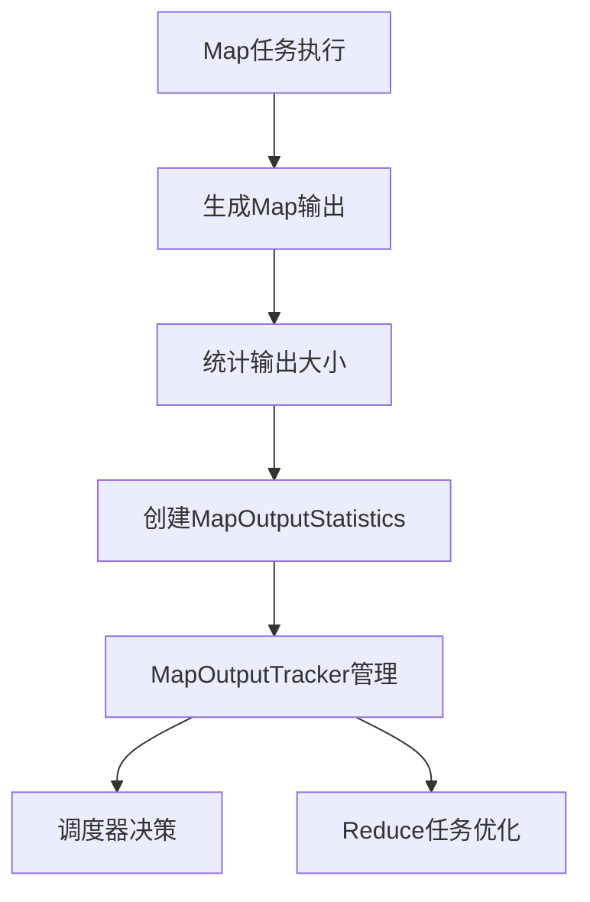

# MapOutputStatistics 类分析

## 类的概述和定义

`MapOutputStatistics` 是Spark框架中用于**存储Map阶段输出统计信息**的数据容器类。它专门用于记录Shuffle过程中Map任务输出的数据量统计，为后续的调度和优化决策提供关键数据支持。

**类定义：**
```scala
private[spark] class MapOutputStatistics(val shuffleId: Int, val bytesByPartitionId: Array[Long])
```

- **可见性**：`private[spark]` 表示这是一个Spark内部使用的类，不对外公开
- **访问级别**：包级私有，只能在`org.apache.spark`包内访问
- **设计目的**：纯粹的数据承载类，不包含业务逻辑

## 构造函数参数说明

构造函数接收两个核心参数，用于完整描述Map阶段的输出统计：

| 参数名 | 类型 | 说明 |
|--------|------|------|
| `shuffleId` | `Int` | Shuffle操作的唯一标识符，用于关联对应的Shuffle过程 |
| `bytesByPartitionId` | `Array[Long]` | 每个Map输出分区的大致字节数数组，索引对应分区ID |

两个参数都是`val`类型，确保实例创建后不可变，保证线程安全。

## 核心属性分析

### 1. Shuffle ID (`shuffleId`)
- **作用**：唯一标识一个Shuffle操作
- **重要性**：用于关联Map阶段和Reduce阶段的数据
- **使用场景**：在Shuffle管理器中进行数据定位和检索

### 2. 分区字节数数组 (`bytesByPartitionId`)
- **结构**：`Array[Long]`，数组索引对应分区ID，值对应该分区的数据大小
- **数据特点**：
  - **近似值**：由于使用压缩的Map状态，数值可能是近似值
  - **字节单位**：所有值都以字节为单位
  - **分区映射**：数组索引与分区ID一一对应

## 主要方法分类和说明

### 无显式方法实现

`MapOutputStatistics` 是一个**纯数据类**，不包含任何自定义方法。它依赖于Scala的case类特性自动提供：

1. **属性访问**：通过val属性自动生成getter方法
2. **相等性比较**：基于属性值的相等性判断
3. **字符串表示**：包含属性信息的toString方法

这种设计体现了**单一职责原则**，专注于数据存储而不涉及业务逻辑。

## 设计特点总结

### 1. 不可变性设计
- **所有属性val**：确保实例创建后不可修改
- **线程安全**：不可变对象天然线程安全
- **数据一致性**：防止在传输过程中被意外修改

### 2. 数据容器模式
- **纯粹数据承载**：不包含任何业务逻辑方法
- **序列化友好**：简单结构便于序列化传输
- **性能优化**：减少方法调用开销

### 3. 内部使用限制
- **private[spark]修饰**：限制为Spark内部使用
- **API稳定性**：不对外暴露，允许内部重构
- **注释说明**：明确标注未来可能成为DeveloperApi

## 配置参数说明

该类本身不涉及配置参数，但其数据内容受以下因素影响：

### 1. Shuffle配置
- `spark.shuffle.compress`：是否压缩Map输出，影响字节数统计精度
- `spark.shuffle.spill.compress`：溢出压缩设置
- `spark.shuffle.file.buffer`：文件缓冲区大小

### 2. 数据统计精度
- **压缩影响**：使用压缩时，统计值为近似值
- **溢出影响**：数据溢出到磁盘时的统计精度
- **内存估算**：用于内存管理和调度决策

## 使用场景和最佳实践

### 主要应用场景

1. **Shuffle调度优化**
   - 为Reduce任务调度提供数据分布信息
   - 帮助选择最优的数据读取策略

2. **资源预估**
   - 预估Reduce阶段需要的内存资源
   - 动态调整Executor资源分配

3. **性能监控**
   - 监控Shuffle数据倾斜情况
   - 分析Map阶段的数据分布特征

### 数据特点说明

**字节统计的近似性：**
```scala
// 注释说明："approximate number of output bytes for each map output partition
// (may be inexact due to use of compressed map statuses)"
```

- **压缩影响**：使用压缩时，实际字节数与统计值可能存在差异
- **估算用途**：主要用于相对大小比较和调度决策，不要求绝对精确
- **性能权衡**：近似统计减少了精确计算的开销

## 相关类和接口

### 关联组件

1. **MapOutputTracker**
   - 负责管理和传递Map输出统计信息
   - 在Driver和Executor之间同步统计数据

2. **ShuffleManager**
   - 使用统计信息进行Shuffle优化
   - 根据数据分布制定读取策略

3. **Scheduler**
   - 利用统计信息进行任务调度决策
   - 检测数据倾斜并采取相应措施

### 数据流关系



## 设计模式应用

### 值对象模式（Value Object Pattern）
- **不可变性**：对象创建后状态不变
- **相等性基于值**：根据属性值判断相等性
- **无副作用**：不修改外部状态

### 数据传输对象模式（DTO Pattern）
- **数据容器**：纯粹用于数据传输
- **序列化支持**：便于网络传输
- **跨进程通信**：在Driver和Executor间传递

## 性能考虑

### 内存占用优化
- **Long数组**：使用基本类型数组减少内存开销
- **无包装对象**：避免自动装箱带来的性能损失
- **紧凑存储**：简单数据结构减少内存占用

### 序列化效率
- **简单结构**：便于高效序列化
- **数据量小**：统计信息数据量有限
- **传输频繁**：在集群中频繁传输，需要高效序列化

## 未来演进方向

根据代码注释，该类"May become a DeveloperApi in the future"，表明：

1. **API公开化**：未来可能作为公开API供开发者使用
2. **功能扩展**：可能增加更多统计维度和方法
3. **监控集成**：可能与Spark监控系统更深度集成

## 总结

`MapOutputStatistics` 是Spark Shuffle机制中的**关键数据载体**，它以简洁高效的方式记录了Map阶段的输出统计信息。通过不可变设计和纯粹的数据容器模式，为Spark的调度优化和资源管理提供了重要依据。虽然当前是内部类，但其设计体现了良好的软件工程原则，为未来的功能扩展奠定了基础。