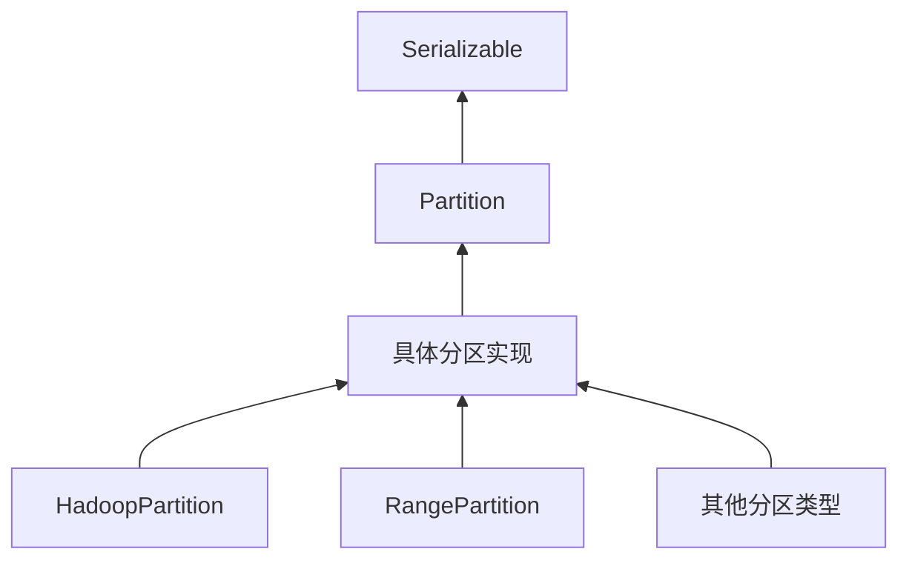

# Partition 特质分析

## 特质概述和定义

`Partition` 是Spark框架中**分区体系的基石抽象**，定义了所有分区实现的通用接口。作为RDD（弹性分布式数据集）的核心组成部分，Partition特质为Spark的分布式数据划分提供了统一的标准。

**特质定义：**
```scala
trait Partition extends Serializable
```

- **抽象类型**：`trait`（特质），相当于Java中的接口
- **序列化支持**：继承`Serializable`，支持网络传输和持久化
- **最小化设计**：只定义最核心的分区标识功能

## 核心属性说明

### 1. 分区索引 (`index: Int`)

**定义：**
```scala
def index: Int
```

**核心作用：**
- **唯一标识**：在父RDD中唯一标识一个分区
- **顺序性**：索引通常从0开始连续递增
- **位置信息**：反映分区在数据分布中的顺序位置

**设计意义：**
- **抽象约束**：所有具体分区实现必须提供index属性
- **简化比较**：基于index实现hashCode，简化相等性判断
- **调度基础**：为任务调度提供分区定位信息

## 主要方法实现分析

### 1. `hashCode(): Int` 方法

**实现代码：**
```scala
override def hashCode(): Int = index
```

**设计分析：**
- **基于索引**：直接使用分区索引作为哈希值
- **性能优化**：避免复杂的哈希计算，提高效率
- **一致性**：确保相同索引的分区具有相同哈希值
- **集合操作**：便于在HashSet、HashMap等集合中使用

### 2. `equals(other: Any): Boolean` 方法

**实现代码：**
```scala
override def equals(other: Any): Boolean = super.equals(other)
```

**设计选择：**
- **保留默认**：使用Object类的默认equals实现（引用相等）
- **设计意图**：强调分区对象的唯一性，即使索引相同也可能是不同实例
- **实际应用**：在Spark中，分区通常通过索引来识别，而不是对象相等性

## 设计特点总结

### 1. 最小抽象原则
- **单一职责**：只关注分区的核心标识功能
- **接口隔离**：不包含具体的数据存储或处理逻辑
- **扩展性**：为具体实现留出充分的扩展空间

### 2. 序列化支持
- **网络传输**：支持在Driver和Executor间传输
- **持久化能力**：可序列化到磁盘或外部存储
- **分布式基础**：为Spark的分布式计算提供基础

### 3. 标识重于相等
- **索引核心**：以index作为主要标识符
- **引用相等**：equals方法强调对象身份而非值相等
- **实际应用**：符合Spark分区管理的实际需求

## 继承体系分析

### 特质层次结构



### 实现要求
所有实现Partition特质的类必须：
1. 提供`index: Int`属性的具体实现
2. 支持序列化（自动继承自Serializable）
3. 可以重写hashCode和equals方法（非强制）

## 使用场景和最佳实践

### 主要应用场景

1. **RDD分区管理**
   - 为每个RDD的分区提供统一标识
   - 支持分区的创建、传输和销毁

2. **任务调度**
   - 基于分区索引进行任务分配
   - 实现数据本地性优化

3. **数据分布**
   - 记录数据在集群中的分布情况
   - 支持数据重分区和平衡

### 实现模式

**基本实现示例：**
```scala
class SimplePartition(override val index: Int) extends Partition
```

**最佳实践：**
- 保持实现的简洁性
- 确保index的唯一性和连续性
- 考虑序列化性能

## 相关类和接口

### 核心关联

1. **RDD（弹性分布式数据集）**
   - Partition是RDD的基本组成单元
   - 每个RDD由多个Partition组成

2. **TaskContext（任务上下文）**
   - 包含当前任务处理的分区信息
   - 为任务执行提供分区上下文

3. **Partitioner（分区器）**
   - 负责将数据划分到不同的Partition
   - 实现具体的数据分布策略

### 扩展体系

Spark中有多种具体的Partition实现：
- `HadoopPartition`：用于Hadoop输入格式的分区
- `RangePartition`：基于范围的分区
- `CoalescedPartition`：合并后的分区
- 各种自定义分区实现

## 设计模式应用

### 模板方法模式（Template Method Pattern）
- **抽象定义**：Partition特质定义基本接口
- **具体实现**：子类提供index的具体实现
- **扩展点**：允许子类重写hashCode等方法

### 标识接口模式（Marker Interface Pattern）
- **Serializable标记**：通过继承表明支持序列化
- **类型安全**：编译时检查序列化能力
- **框架集成**：与Spark的序列化框架无缝集成

## 性能考虑

### 哈希优化
- **简单计算**：hashCode直接返回index，计算开销极小
- **缓存友好**：整数哈希值便于缓存
- **分布均匀**：连续索引提供良好的哈希分布

### 序列化效率
- **最小数据**：只包含必要的索引信息
- **快速序列化**：简单结构序列化速度快
- **网络传输**：小数据量减少网络开销

## 扩展性和演进

### 设计扩展点

1. **属性扩展**
   - 可以添加更多分区元数据属性
   - 如数据位置、大小统计等信息

2. **方法扩展**
   - 增加分区管理相关方法
   - 如生命周期管理、状态跟踪等

3. **类型扩展**
   - 支持更多 specialized 的分区类型
   - 如压缩分区、加密分区等

### 兼容性保证

由于Partition是抽象特质，其演进可以：
- **向后兼容**：新增方法可以提供默认实现
- **渐进增强**：不影响现有实现
- **平滑迁移**：允许逐步采用新特性

## 实际应用示例

### 在Spark源码中的使用

**RDD中的分区访问：**
```scala
// 获取RDD的所有分区
val partitions = rdd.partitions

// 遍历分区
partitions.foreach { partition =>
  println(s"Partition index: ${partition.index}")
}
```

**任务执行上下文：**
```scala
// 在任务中获取当前分区
val partitionIndex = context.partitionId
```

## 总结

`Partition` 特质是Spark分布式计算体系的**基础构建块**，它以最小化的设计为整个分区体系提供了统一的抽象接口。通过专注于核心的索引标识功能，并支持序列化传输，Partition为Spark的高效数据分布和任务调度奠定了坚实基础。

其简洁而强大的设计体现了**面向抽象编程**的理念，通过定义稳定的接口契约，允许各种具体实现灵活扩展，同时保持系统的整体一致性和可维护性。作为Spark架构中的基础组件，Partition的成功设计对整个框架的性能和扩展性都产生了深远影响。