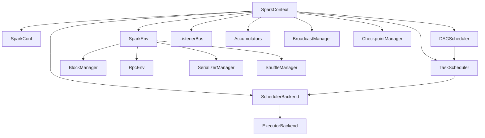

# SparkContext 源码分析

## 类的概述和定义

`SparkContext` 是 Apache Spark 的核心组件和应用程序入口点，负责协调和管理 Spark 应用程序的所有方面。它是 Spark 分布式计算引擎的中央控制器，提供了创建 RDD、调度任务、管理资源、处理数据等核心功能。

### 组件定位

- **功能定位**：Spark 应用程序的主入口点和核心控制器
- **设计目标**：提供统一的分布式计算框架接口
- **应用场景**：所有 Spark 应用程序的初始化和执行

## 整体架构设计

### 核心组件关系图



### 生命周期管理

#### 初始化阶段
```scala
class SparkContext(config: SparkConf) extends Logging
```
**初始化流程**：
1. 配置验证和准备
2. 创建 SparkEnv 环境
3. 初始化调度器组件
4. 启动监听器总线
5. 注册应用程序

#### 运行阶段
- RDD 创建和转换
- 任务调度和执行
- 资源管理和分配
- 数据持久化和缓存

#### 关闭阶段
```scala
def stop(): Unit
```
**清理流程**：
1. 停止所有调度器
2. 关闭环境组件
3. 清理资源
4. 注销应用程序

## 构造函数参数说明

### 主构造函数
```scala
class SparkContext(config: SparkConf) extends Logging
```

#### 参数详细说明

1. **config**: `SparkConf`
   - Spark 配置对象，包含所有运行时参数
   - 必需参数，驱动应用程序行为

#### 辅助构造函数
```scala
def this(master: String, appName: String) = this({
  val conf = new SparkConf().setMaster(master).setAppName(appName)
  conf
})
```

**简化构造**：
- 提供便捷的构造方式
- 自动创建默认配置
- 支持快速原型开发

## 核心属性分析

### 环境相关属性

#### SparkEnv 环境
```scala
@transient private var _env: SparkEnv = _
```
**功能**：
- RPC 环境管理
- 序列化器配置
- 存储管理器
- 网络通信组件

#### 配置管理
```scala
private var _conf: SparkConf = _
```
**配置层次**：
- 系统默认配置
- 用户指定配置
- 运行时动态配置

### 调度器组件

#### DAG 调度器
```scala
@transient private var _dagScheduler: DAGScheduler = _
```
**职责**：
- 阶段划分和依赖分析
- 任务集生成和优化
- 容错和重试机制

#### 任务调度器
```scala
@transient private var _taskScheduler: TaskScheduler = _
```
**功能**：
- 任务分配和执行
- 资源调度和负载均衡
- 任务状态监控

#### 调度器后端
```scala
@transient private var _schedulerBackend: SchedulerBackend = _
```
**适配器模式**：
- 支持多种集群管理器
- 资源请求和释放
- 执行器生命周期管理

### 资源管理属性

#### 执行器分配管理器
```scala
@transient private var _executorAllocationManager: Option[ExecutorAllocationManager] = None
```
**动态分配**：
- 根据负载动态调整执行器数量
- 资源利用优化
- 成本控制机制

#### 资源配置文件管理器
```scala
@transient private val resourceProfileManager = new ResourceProfileManager
```
**资源隔离**：
- 多租户资源管理
- 任务资源需求配置
- 资源限制和配额

### 状态管理属性

#### 应用程序状态
```scala
private val stopped = new AtomicBoolean(false)
private val _applicationId: String = _
private val _applicationAttemptId: Option[String] = None
```
**状态跟踪**：
- 应用程序生命周期
- 运行状态监控
- 故障恢复支持

#### 持久化 RDD 管理
```scala
private val persistentRdds = new mutable.HashMap[Int, RDD[_]]()
```
**缓存管理**：
- RDD 持久化跟踪
- 内存和磁盘存储
- 缓存清理策略

## 主要方法分类和说明

### 应用程序初始化方法

#### 环境准备方法
```scala
private def createSparkEnv(
    conf: SparkConf,
    isLocal: Boolean,
    listenerBus: LiveListenerBus): SparkEnv
```

**环境创建流程**：
1. **安全配置**：初始化 SecurityManager
2. **RPC 系统**：创建通信环境
3. **序列化器**：配置数据序列化
4. **块管理器**：初始化存储系统
5. **度量系统**：设置性能监控

#### 调度器初始化
```scala
private def createTaskScheduler(sc: SparkContext, master: String): (SchedulerBackend, TaskScheduler)
```

**调度器选择策略**：
```scala
master match {
  case "local" => // 本地模式
  case LOCAL_N_REGEX(threads) => // 本地多线程
  case SPARK_REGEX(sparkUrl) => // Standalone 集群
  case "yarn" => // YARN 集群
  case KUBERNETES_REGEX(_) => // Kubernetes 集群
  case _ => // 其他集群管理器
}
```

### RDD 创建方法

#### 基础 RDD 创建
```scala
def parallelize[T: ClassTag](seq: Seq[T], numSlices: Int = defaultParallelism): RDD[T]
```

**并行化算法**：
- 数据分片策略
- 分区计算优化
- 负载均衡处理

#### 文件系统 RDD
```scala
def textFile(path: String, minPartitions: Int = defaultMinPartitions): RDD[String]
def wholeTextFiles(path: String, minPartitions: Int = defaultMinPartitions): RDD[(String, String)]
def binaryFiles(path: String, minPartitions: Int = defaultMinPartitions): RDD[(String, PortableDataStream)]
```

**文件读取优化**：
- 分块大小自适应
- 数据本地性优化
- 格式兼容性处理

#### Hadoop 集成 RDD
```scala
def hadoopFile[K, V](path: String, inputFormatClass: Class[_ <: InputFormat[K, V]], 
                     keyClass: Class[K], valueClass: Class[V], minPartitions: Int): RDD[(K, V)]
def sequenceFile[K, V](path: String, keyClass: Class[K], valueClass: Class[V]): RDD[(K, V)]
```

**Hadoop 兼容性**：
- 输入格式支持
- 序列化格式处理
- 配置继承机制

### 任务执行方法

#### 作业执行框架
```scala
def runJob[T, U: ClassTag](rdd: RDD[T], func: (TaskContext, Iterator[T]) => U, 
                          partitions: Seq[Int], resultHandler: (Int, U) => Unit): Unit
```

**执行流程**：
1. **DAG 构建**：分析 RDD 依赖关系
2. **阶段划分**：创建执行阶段
3. **任务提交**：生成并提交任务
4. **结果收集**：处理任务执行结果

#### 异步作业执行
```scala
def submitJob[T, U, R](rdd: RDD[T], processPartition: Iterator[T] => U, 
                      partitions: Seq[Int], resultHandler: (Int, U) => Unit, 
                      resultFunc: => R): SimpleFutureAction[R]
```

**异步特性**：
- 非阻塞执行
- Future 模式支持
- 进度跟踪和取消

### 资源管理方法

#### 执行器动态分配
```scala
def requestTotalExecutors(numExecutors: Int, localityAwareTasks: Int, 
                         hostToLocalTaskCount: Map[String, Int]): Boolean
def requestExecutors(numAdditionalExecutors: Int): Boolean
def killExecutors(executorIds: Seq[String]): Boolean
```

**资源调整策略**：
- 基于负载的动态伸缩
- 位置感知的任务分配
- 优雅的资源释放

#### 内存和存储管理
```scala
def getExecutorMemoryStatus: Map[String, (Long, Long)]
def getRDDStorageInfo: Array[RDDInfo]
def getPersistentRDDs: Map[Int, RDD[_]]
```

**资源监控**：
- 内存使用统计
- 存储状态查询
- 缓存效率分析

### 配置和状态方法

#### 环境配置管理
```scala
def setLocalProperty(key: String, value: String): Unit
def getLocalProperty(key: String): String
def setJobGroup(groupId: String, description: String, interruptOnCancel: Boolean = false): Unit
```

**线程局部配置**：
- 作业分组管理
- 调试信息设置
- 资源池分配

#### 应用程序状态查询
```scala
def getApplicationId: String
def getConf: SparkConf
def version: String
def isLocal: Boolean
```

**状态信息**：
- 应用程序标识
- 运行环境信息
- 版本兼容性检查

## 核心算法实现

### DAG 调度算法

#### 阶段划分算法
```scala
private[scheduler] def newResultStage(rdd: RDD[_], func: (TaskContext, Iterator[_]) => _, 
                                    partitions: Seq[Int], callSite: CallSite, 
                                    resultHandler: (Int, _) => Unit, properties: Properties): ResultStage
```

**阶段创建逻辑**：
1. **依赖分析**：识别窄依赖和宽依赖
2. **阶段边界**：在宽依赖处划分阶段
3. **任务生成**：为每个分区创建任务
4. **优化策略**：阶段合并和任务聚合

#### 容错恢复机制
```scala
def handleTaskCompletion(event: CompletionEvent): Unit
def handleExecutorLost(execId: String, reason: ExecutorLossReason): Unit
```

**故障处理**：
- 任务重试策略
- 阶段重新计算
- 数据重新生成

### 任务调度算法

#### 资源分配策略
```scala
def resourceOffers(offers: Seq[WorkerOffer]): Seq[TaskDescription]
```

**调度决策**：
1. **资源匹配**：任务需求与可用资源匹配
2. **位置偏好**：考虑数据本地性
3. **公平调度**：多作业间的资源公平分配
4. **负载均衡**：避免资源热点

#### 任务执行优化
```scala
def speculativeExecution(task: Task[_], taskInfo: TaskInfo): Boolean
```

**推测执行**：
- 慢任务检测
- 备份任务启动
- 结果选择策略

### 内存管理算法

#### 存储内存分配
```scala
def acquireStorageMemory(blockId: BlockId, numBytes: Long, memoryMode: MemoryMode): Boolean
```

**内存分配策略**：
- LRU 缓存淘汰
- 内存压力检测
- 存储级别选择

#### 执行内存管理
```scala
def acquireExecutionMemory(numBytes: Long, taskAttemptId: Long, memoryMode: MemoryMode): Long
```

**执行内存控制**：
- 任务内存配额
- 内存借用机制
- OOM 防护策略

## 设计特点总结

### 1. 模块化架构设计

#### 清晰的职责分离
- **SparkContext**：应用程序入口和协调中心
- **DAGScheduler**：作业调度和阶段管理
- **TaskScheduler**：任务调度和执行管理
- **SchedulerBackend**：集群资源适配器

#### 插件化扩展
```scala
private def getClusterManager(url: String): Option[ExternalClusterManager]
```
**扩展机制**：
- SPI 服务发现
- 动态加载机制
- 接口标准化

### 2. 容错性设计

#### 数据容错
- RDD 血统记录
- 阶段重新计算
- 检查点机制

#### 执行容错
- 任务重试策略
- 执行器故障恢复
- 驱动程序高可用

### 3. 性能优化设计

#### 数据本地性
```scala
def getPreferredLocs(rdd: RDD[_], partition: Int): Seq[TaskLocation]
```
**优化策略**：
- 位置感知调度
- 数据预取机制
- 网络传输优化

#### 内存优化
- 序列化压缩
- 内存池管理
- 垃圾回收优化

### 4. 可扩展性设计

#### 配置驱动
```scala
private def supplementJavaModuleOptions(conf: SparkConf): Unit
private def supplementJavaIPv6Options(conf: SparkConf): Unit
```
**配置扩展**：
- 模块化配置管理
- 运行时配置调整
- 环境自适应

#### API 扩展
- RDD 转换操作链
- 用户自定义函数
- 数据源插件支持

## 配置参数说明

### 核心配置参数

#### 应用程序配置
```properties
# 应用程序名称
spark.app.name = MySparkApp

# 集群管理器地址
spark.master = local[*]

# 驱动程序内存
spark.driver.memory = 1g

# 执行器内存
spark.executor.memory = 2g
```

#### 调度配置
```properties
# 默认并行度
spark.default.parallelism = 200

# 动态分配开关
spark.dynamicAllocation.enabled = true

# 调度模式
spark.scheduler.mode = FIFO
```

#### 序列化配置
```properties
# 序列化器选择
spark.serializer = org.apache.spark.serializer.KryoSerializer

# Kryo 注册类
spark.kryo.registrator = com.example.MyRegistrator
```

### 性能调优参数

#### 内存优化参数
```properties
# 存储内存比例
spark.memory.storageFraction = 0.5

# 堆外内存启用
spark.memory.offHeap.enabled = true

# 堆外内存大小
spark.memory.offHeap.size = 1g
```

#### 网络优化参数
```properties
# 网络超时设置
spark.network.timeout = 120s

# RPC 消息大小
spark.rpc.message.maxSize = 128
```

## 使用场景分析

### 批处理场景

#### 大数据 ETL
```scala
val sc = new SparkContext(conf)
val data = sc.textFile("hdfs://data/input")
val result = data.filter(_.contains("error"))
                 .map(line => (line.split(",")(0), 1))
                 .reduceByKey(_ + _)
result.saveAsTextFile("hdfs://data/output")
```

**优化要点**：
- 数据分区策略
-  shuffle 优化
- 存储格式选择

### 机器学习场景

#### 分布式训练
```scala
val points = sc.parallelize(trainingData)
val model = points.mapPartitions { iter =>
  // 本地模型训练
  localTrain(iter)
}.reduce { (model1, model2) =>
  // 模型聚合
  mergeModels(model1, model2)
}
```

**特性支持**：
- 数据并行处理
- 模型参数同步
- 容错训练保证

### 流处理场景

#### 微批处理
```scala
val ssc = new StreamingContext(sc, Seconds(1))
val lines = ssc.socketTextStream("localhost", 9999)
val words = lines.flatMap(_.split(" "))
val wordCounts = words.map(x => (x, 1)).reduceByKey(_ + _)
wordCounts.print()
ssc.start()
```

**集成优势**：
- 统一的编程模型
- 共享的资源管理
- 一致的数据处理

## 错误处理和调试

### 常见问题处理

#### 内存不足错误
**症状**：`java.lang.OutOfMemoryError`
**解决**：
- 调整内存配置参数
- 优化数据分区策略
- 使用堆外内存

#### 任务失败错误
**症状**：任务反复失败
**解决**：
- 检查数据序列化
- 优化用户代码
- 调整重试策略

#### 网络通信错误
**症状**：连接超时或断开
**解决**：
- 调整超时参数
- 检查网络配置
- 优化数据传输

### 调试技巧

#### 日志分析
```scala
// 启用详细日志
conf.set("spark.logLineage", "true")

// 查看 RDD 依赖关系
rdd.toDebugString

// 监控任务执行
sc.uiWebUrl
```

#### 性能分析
```scala
// 获取存储信息
sc.getRDDStorageInfo.foreach { info =>
  println(s"RDD ${info.id}: ${info.memSize} bytes in memory")
}

// 查看执行器状态
sc.getExecutorMemoryStatus.foreach { case (executor, (used, total)) =>
  println(s"$executor: $used/$total")
}
```

## 最佳实践指南

### 应用程序设计

#### 资源规划
- 合理估计内存需求
- 优化并行度设置
- 考虑数据倾斜问题

#### 代码优化
- 避免不必要的 shuffle
- 使用广播变量减少数据传输
- 合理使用缓存和持久化

### 集群配置

#### 资源分配
```properties
# 根据集群规模调整
spark.executor.instances = 10
spark.executor.cores = 4
spark.executor.memory = 8g

# 动态分配参数
spark.dynamicAllocation.minExecutors = 2
spark.dynamicAllocation.maxExecutors = 50
```

#### 性能调优
- 选择合适的序列化器
- 优化数据存储格式
- 调整垃圾回收参数

### 监控和维护

#### 健康检查
- 定期监控应用程序状态
- 分析任务执行时间
- 检查资源使用情况

#### 故障恢复
- 设置检查点机制
- 实现应用程序重启策略
- 建立日志分析流程

## 总结

`SparkContext` 是 Spark 生态系统的核心枢纽，通过精心的设计实现了：

1. **统一性**：提供一致的分布式计算编程接口
2. **高性能**：优化的任务调度和执行机制
3. **容错性**：完善的故障检测和恢复机制
4. **可扩展性**：模块化架构支持功能扩展
5. **易用性**：简洁的 API 和丰富的工具支持

该组件的设计体现了 Spark 在大规模分布式计算方面的成熟考虑，是学习分布式系统设计的优秀案例。