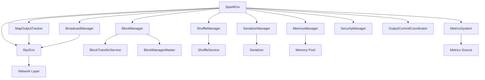

# SparkEnv 源码分析

## 类的概述和定义

`SparkEnv` 是 Apache Spark 中负责运行时环境管理的核心组件，它封装了 Spark 应用程序运行所需的所有基础设施组件，包括 RPC 系统、序列化器、内存管理、存储系统、调度器等。作为 Spark 的运行时容器，它确保各个组件能够协同工作，为分布式计算提供统一的环境支持。

### 组件定位

- **功能定位**：Spark 运行时环境容器和协调器
- **设计目标**：统一管理所有运行时组件，提供一致的执行环境
- **应用场景**：Driver 和 Executor 的运行时环境创建和管理

## 整体架构设计

### 核心组件关系图



### 环境层次结构

#### Driver 环境
```scala
createDriverEnv(conf, isLocal, listenerBus, numCores)
```
**组件特性**：
- 包含完整的调度器组件
- 支持事件监听总线
- 提供应用程序管理功能

#### Executor 环境
```scala
createExecutorEnv(conf, executorId, hostname, numCores, ioEncryptionKey, isLocal)
```
**组件特性**：
- 专注于任务执行
- 简化的事件处理
- 本地资源管理

## 构造函数参数说明

### SparkEnv 主构造函数
```scala
class SparkEnv (
    val executorId: String,
    private[spark] val rpcEnv: RpcEnv,
    val serializer: Serializer,
    val closureSerializer: Serializer,
    val serializerManager: SerializerManager,
    val mapOutputTracker: MapOutputTracker,
    val shuffleManager: ShuffleManager,
    val broadcastManager: BroadcastManager,
    val blockManager: BlockManager,
    val securityManager: SecurityManager,
    val metricsSystem: MetricsSystem,
    val memoryManager: MemoryManager,
    val outputCommitCoordinator: OutputCommitCoordinator,
    val conf: SparkConf) extends Logging
```

#### 参数详细说明

1. **executorId**: `String`
   - 执行器标识符
   - Driver 使用 `SparkContext.DRIVER_IDENTIFIER`
   - Executor 使用唯一标识符

2. **rpcEnv**: `RpcEnv`
   - RPC 通信环境
   - 负责进程间通信
   - 支持消息路由和序列化

3. **serializer**: `Serializer`
   - 数据序列化器
   - 用于任务数据传输
   - 支持多种序列化格式

4. **closureSerializer**: `Serializer`
   - 闭包序列化器
   - 专门处理函数闭包
   - 使用 Java 序列化确保兼容性

5. **serializerManager**: `SerializerManager`
   - 序列化管理器
   - 协调多个序列化器
   - 提供加密和压缩功能

6. **mapOutputTracker**: `MapOutputTracker`
   - Map 输出跟踪器
   - 管理 Shuffle 数据位置
   - 支持 Master/Worker 模式

7. **shuffleManager**: `ShuffleManager`
   - Shuffle 管理器
   - 控制数据重分布
   - 支持多种 Shuffle 实现

8. **broadcastManager**: `BroadcastManager`
   - 广播变量管理器
   - 管理只读变量分发
   - 支持多种广播机制

9. **blockManager**: `BlockManager`
   - 块管理器
   - 管理内存和磁盘存储
   - 提供数据缓存和持久化

10. **securityManager**: `SecurityManager`
    - 安全管理器
    - 处理认证和授权
    - 支持 SSL/TLS 加密

11. **metricsSystem**: `MetricsSystem`
    - 度量系统
    - 收集性能指标
    - 支持监控和调优

12. **memoryManager**: `MemoryManager`
    - 内存管理器
    - 分配执行和存储内存
    - 实现统一内存管理

13. **outputCommitCoordinator**: `OutputCommitCoordinator`
    - 输出提交协调器
    - 确保输出原子性
    - 防止重复写入

14. **conf**: `SparkConf`
    - Spark 配置对象
    - 包含所有运行时参数
    - 支持动态配置

## 核心属性分析

### 运行时状态属性

#### 停止状态标记
```scala
@volatile private[spark] var isStopped = false
```
**功能**：
- 原子性状态管理
- 防止重复关闭
- 支持并发访问

#### Python 工作器工厂
```scala
private val pythonWorkers = mutable.HashMap[(String, Map[String, String]), PythonWorkerFactory]()
```
**Python 集成**：
- 支持多版本 Python
- 环境变量隔离
- 连接池管理

#### Hadoop 作业元数据缓存
```scala
private[spark] val hadoopJobMetadata = CacheBuilder.newBuilder()
  .maximumSize(1000)
  .softValues()
  .build[String, AnyRef]().asMap()
```
**缓存策略**：
- LRU 淘汰算法
- 软引用避免内存泄漏
- 支持大文件处理

#### 临时目录管理
```scala
private[spark] var driverTmpDir: Option[String] = None
```
**临时文件管理**：
- Driver 专用临时目录
- 自动清理机制
- 避免文件积累

#### 执行器后端引用
```scala
private[spark] var executorBackend: Option[ExecutorBackend] = None
```
**后端集成**：
- 支持多种集群管理器
- 任务执行协调
- 资源回收通知

### 组件生命周期管理

#### 环境停止方法
```scala
def stop(): Unit
```
**清理流程**：
1. **状态标记**：设置 `isStopped = true`
2. **Python 清理**：停止所有 Python 工作器
3. **组件停止**：按依赖顺序关闭组件
4. **RPC 关闭**：停止通信环境
5. **临时文件清理**：删除 Driver 临时目录

**停止顺序**：
```scala
pythonWorkers.values.foreach(_.stop())  // Python 工作器
mapOutputTracker.stop()                 // Map 输出跟踪器
shuffleManager.stop()                  // Shuffle 管理器
broadcastManager.stop()                // 广播管理器
blockManager.stop()                    // 块管理器
blockManager.master.stop()             // 块管理器主节点
metricsSystem.stop()                   // 度量系统
outputCommitCoordinator.stop()         // 输出提交协调器
rpcEnv.shutdown()                      // RPC 环境
rpcEnv.awaitTermination()              // 等待终止
```

#### Python 工作器管理

##### 创建工作器
```scala
def createPythonWorker(pythonExec: String, envVars: Map[String, String]): (Socket, Option[Int])
```
**连接管理**：
- 基于 Python 版本和环境变量缓存
- 支持连接复用
- 返回 Socket 连接和端口

##### 销毁工作器
```scala
def destroyPythonWorker(pythonExec: String, envVars: Map[String, String], worker: Socket): Unit
```
**资源释放**：
- 停止特定工作器
- 清理连接资源
- 保持工厂缓存

##### 释放工作器
```scala
def releasePythonWorker(pythonExec: String, envVars: Map[String, String], worker: Socket): Unit
```
**连接复用**：
- 归还工作器到池中
- 支持后续重用
- 减少创建开销

## 伴生对象功能分析

### 全局环境管理

#### 环境实例存储
```scala
@volatile private var env: SparkEnv = _
```
**单例模式**：
- 全局唯一环境实例
- 线程安全访问
- 支持动态替换

#### 系统名称常量
```scala
private[spark] val driverSystemName = "sparkDriver"
private[spark] val executorSystemName = "sparkExecutor"
```
**命名规范**：
- 区分 Driver 和 Executor
- 支持集群识别
- 便于日志跟踪

### 环境创建方法

#### Driver 环境创建
```scala
def createDriverEnv(conf: SparkConf, isLocal: Boolean, listenerBus: LiveListenerBus, numCores: Int): SparkEnv
```

**Driver 特定配置**：
```scala
assert(conf.contains(DRIVER_HOST_ADDRESS), "Driver host address not set")
assert(conf.contains(DRIVER_PORT), "Driver port not set")
```

**网络配置**：
- 绑定地址和广告地址分离
- 端口自动分配支持
- 本地模式特殊处理

#### Executor 环境创建
```scala
def createExecutorEnv(conf: SparkConf, executorId: String, hostname: String, numCores: Int, 
                    ioEncryptionKey: Option[Array[Byte]], isLocal: Boolean): SparkEnv
```

**Executor 特性**：
- 简化的事件处理
- 自动设置执行器 ID
- 立即启动度量系统

### 核心创建逻辑

#### 统一创建方法
```scala
private def create(conf: SparkConf, executorId: String, bindAddress: String, 
                 advertiseAddress: String, port: Option[Int], isLocal: Boolean, 
                 numUsableCores: Int, ioEncryptionKey: Option[Array[Byte]], 
                 listenerBus: LiveListenerBus = null, 
                 mockOutputCommitCoordinator: Option[OutputCommitCoordinator] = None): SparkEnv
```

**创建流程**：
1. **身份识别**：判断是否为 Driver
2. **安全管理器**：初始化安全组件
3. **RPC 环境**：创建通信基础
4. **序列化器**：配置数据序列化
5. **组件初始化**：按依赖顺序创建
6. **环境组装**：构建完整环境

#### 身份识别逻辑
```scala
val isDriver = executorId == SparkContext.DRIVER_IDENTIFIER
```

**Driver 特殊处理**：
- 必须提供监听器总线
- 支持应用程序管理
- 包含完整调度功能

#### 安全初始化
```scala
val securityManager = new SecurityManager(conf, ioEncryptionKey, authSecretFileConf)
if (isDriver) {
  securityManager.initializeAuth()
}
```

**加密支持**：
- I/O 加密密钥配置
- RPC 加密验证
- 认证机制初始化

#### RPC 环境创建
```scala
val rpcEnv = RpcEnv.create(systemName, bindAddress, advertiseAddress, 
                          port.getOrElse(-1), conf, securityManager, 
                          numUsableCores, !isDriver)
```

**网络配置**：
- 系统名称区分角色
- 端口动态绑定
- 核心数优化

#### 序列化器配置
```scala
val serializer = Utils.instantiateSerializerFromConf[SERIALIZER](conf, isDriver)
val serializerManager = new SerializerManager(serializer, conf, ioEncryptionKey)
val closureSerializer = new JavaSerializer(conf)
```

**序列化策略**：
- 主序列化器可配置
- 闭包使用 Java 序列化确保兼容性
- 支持加密序列化

### 组件注册机制

#### 端点注册方法
```scala
def registerOrLookupEndpoint(name: String, endpointCreator: => RpcEndpoint): RpcEndpointRef
```

**注册策略**：
```scala
if (isDriver) {
  logInfo("Registering " + name)
  rpcEnv.setupEndpoint(name, endpointCreator)
} else {
  RpcUtils.makeDriverRef(name, conf, rpcEnv)
}
```

**Driver/Executor 差异**：
- Driver：创建并注册端点
- Executor：查找并连接现有端点

#### 关键组件注册

##### MapOutputTracker 端点
```scala
mapOutputTracker.trackerEndpoint = registerOrLookupEndpoint(
  MapOutputTracker.ENDPOINT_NAME,
  new MapOutputTrackerMasterEndpoint(rpcEnv, mapOutputTracker, conf))
```

**Master/Worker 模式**：
- Driver 端作为 Master
- Executor 端作为 Worker
- 支持动态发现

##### BlockManager 主节点
```scala
val blockManagerMaster = new BlockManagerMaster(
  registerOrLookupEndpoint(DRIVER_ENDPOINT_NAME, endpoint),
  registerOrLookupEndpoint(DRIVER_HEARTBEAT_ENDPOINT_NAME, heartbeatEndpoint),
  conf, isDriver)
```

**双重端点**：
- 主端点处理操作请求
- 心跳端点监控健康状态

##### OutputCommitCoordinator
```scala
val outputCommitCoordinatorRef = registerOrLookupEndpoint("OutputCommitCoordinator",
  new OutputCommitCoordinatorEndpoint(rpcEnv, outputCommitCoordinator))
```

**输出协调**：
- 确保输出原子性
- 防止任务重复提交
- 支持故障恢复

### Shuffle 管理器配置

#### 管理器名称映射
```scala
val shortShuffleMgrNames = Map(
  "sort" -> classOf[SortShuffleManager].getName,
  "tungsten-sort" -> classOf[SortShuffleManager].getName
)
```

**别名支持**：
- 简化配置名称
- 向后兼容性
- 实现类映射

#### 动态实例化
```scala
val shuffleMgrClass = shortShuffleMgrNames.getOrElse(
  shuffleMgrName.toLowerCase, shuffleMgrName)
val shuffleManager = Utils.instantiateSerializerOrShuffleManager[ShuffleManager](
  shuffleMgrClass, conf, isDriver)
```

**插件化架构**：
- 支持自定义 Shuffle 实现
- 配置驱动实例化
- 类加载器隔离

### 内存管理器配置

#### 统一内存管理
```scala
val memoryManager: MemoryManager = UnifiedMemoryManager(conf, numUsableCores)
```

**内存分配**：
- 执行内存和存储内存共享池
- 动态调整比例
- 溢出到磁盘机制

### 块传输服务

#### Netty 传输服务
```scala
val blockTransferService = new NettyBlockTransferService(
  conf, securityManager, bindAddress, advertiseAddress, 
  blockManagerPort, numUsableCores, blockManagerMaster.driverEndpoint)
```

**网络优化**：
- 基于 Netty 的高性能传输
- 连接池管理
- 流量控制

### 度量系统配置

#### Driver 度量系统
```scala
val metricsSystem = if (isDriver) {
  MetricsSystem.createMetricsSystem(DRIVER, conf)
} else {
  conf.set(EXECUTOR_ID, executorId)
  val ms = MetricsSystem.createMetricsSystem(EXECUTOR, conf)
  ms.start(conf.get(METRICS_STATIC_SOURCES_ENABLED))
  ms
}
```

**差异化配置**：
- Driver：延迟启动，等待应用 ID
- Executor：立即启动，设置执行器 ID
- 静态源可配置

### 环境详细信息收集

#### 系统环境分析
```scala
def environmentDetails(conf: SparkConf, hadoopConf: Configuration, 
                      schedulingMode: String, addedJars: Seq[String], 
                      addedFiles: Seq[String], addedArchives: Seq[String],
                      metricsProperties: Map[String, String]): Map[String, Seq[(String, String)]]
```

**信息分类**：
1. **JVM 信息**：版本、厂商、Home 目录
2. **Spark 属性**：所有配置参数
3. **Hadoop 属性**：Hadoop 配置信息
4. **系统属性**：非 Spark 相关系统属性
5. **类路径条目**：JAR 文件和类路径
6. **度量属性**：性能监控配置

## 设计特点总结

### 1. 模块化架构设计

#### 组件解耦
- 每个组件职责单一
- 清晰的接口定义
- 松耦合的依赖关系

#### 插件化扩展
- Shuffle 管理器可替换
- 序列化器可配置
- 传输服务可扩展

### 2. 生命周期管理

#### 有序初始化
```scala
// 1. 安全组件
val securityManager = new SecurityManager(...)

// 2. 通信基础
val rpcEnv = RpcEnv.create(...)

// 3. 序列化组件
val serializer = Utils.instantiateSerializerFromConf(...)

// 4. 核心组件
val broadcastManager = new BroadcastManager(...)
val mapOutputTracker = createMapOutputTracker(...)

// 5. 存储组件
val blockManager = new BlockManager(...)
```

#### 优雅关闭
- 依赖感知的关闭顺序
- 资源泄漏防护
- 超时处理机制

### 3. 配置驱动设计

#### 统一配置管理
```scala
val shuffleMgrName = conf.get(SHUFFLE_MANAGER)
val serializerName = conf.get(SERIALIZER)
val memoryFraction = conf.get(MEMORY_FRACTION)
```

#### 环境自适应
- 本地模式优化
- 集群模式扩展
- 资源限制处理

### 4. 容错性设计

#### 组件隔离
- 单个组件故障不影响整体
- 支持组件级重启
- 故障检测和恢复

#### 状态一致性
- 原子操作保证
- 事务性状态更新
- 恢复点支持

### 5. 性能优化设计

#### 资源复用
- 连接池管理
- 缓存机制
- 懒加载策略

#### 并行初始化
- 组件并行创建
- 异步资源准备
- 启动时间优化

## 使用场景分析

### Driver 环境场景

#### 应用程序管理
```scala
val driverEnv = SparkEnv.createDriverEnv(conf, false, listenerBus, 4)
SparkEnv.set(driverEnv)
```

**应用场景**：
- Spark 应用程序启动
- 作业调度和监控
- 资源分配管理

#### 集群协调
- 任务调度协调
- 执行器生命周期管理
- 故障恢复处理

### Executor 环境场景

#### 任务执行环境
```scala
val executorEnv = SparkEnv.createExecutorEnv(conf, "executor-1", "host1", 2, None, false)
SparkEnv.set(executorEnv)
```

**执行特性**：
- 专注于任务执行
- 本地资源管理
- 数据传输优化

#### 资源隔离
- 内存配额管理
- CPU 核心分配
- 网络带宽控制

### 测试和模拟场景

#### Mock 环境支持
```scala
val mockEnv = SparkEnv.create(conf, "driver", "localhost", "localhost", 
                             Some(7077), true, 1, None, listenerBus, 
                             Some(mockOutputCommitCoordinator))
```

**测试优势**：
- 组件模拟替换
- 可控测试环境
- 单元测试支持

## 配置参数说明

### 核心配置参数

#### 网络配置
```properties
# Driver 主机地址
spark.driver.host=localhost

# Driver 端口
spark.driver.port=7077

# 绑定地址
spark.driver.bindAddress=0.0.0.0
```

#### 序列化配置
```properties
# 主序列化器
spark.serializer=org.apache.spark.serializer.KryoSerializer

# 序列化缓冲区大小
spark.serializer.objectStreamReset=100
```

#### 内存配置
```properties
# 执行内存比例
spark.memory.fraction=0.6

# 存储内存比例
spark.memory.storageFraction=0.5
```

#### Shuffle 配置
```properties
# Shuffle 管理器
spark.shuffle.manager=sort

# Shuffle 服务端口
spark.shuffle.service.port=7337
```

### 性能调优参数

#### 网络优化
```properties
# 传输缓冲区大小
spark.network.timeout=120s

# RPC 消息大小限制
spark.rpc.message.maxSize=128
```

#### 内存优化
```properties
# 堆外内存启用
spark.memory.offHeap.enabled=true

# 堆外内存大小
spark.memory.offHeap.size=1g
```

#### 序列化优化
```properties
# Kryo 注册类
spark.kryo.registrator=com.example.MyRegistrator

# 序列化引用跟踪
spark.kryo.referenceTracking=true
```

## 错误处理和调试

### 常见问题处理

#### 环境初始化失败
**症状**：SparkContext 创建失败
**原因**：端口冲突、资源不足、配置错误
**解决**：检查端口占用、调整资源配额、验证配置

#### 组件通信失败
**症状**：Executor 无法连接 Driver
**原因**：网络隔离、防火墙阻止、地址配置错误
**解决**：检查网络连通性、验证主机地址、调整防火墙规则

#### 内存分配失败
**症状**：OOM 错误或任务失败
**原因**：内存配置不合理、数据倾斜、内存泄漏
**解决**：调整内存参数、优化数据分布、检查代码内存使用

### 调试技巧

#### 环境信息收集
```scala
val envDetails = SparkEnv.environmentDetails(conf, hadoopConf, 
  "FIFO", addedJars, addedFiles, addedArchives, metricsProperties)
envDetails.foreach { case (category, props) =>
  println(s"$category:")
  props.foreach { case (k, v) => println(s"  $k=$v") }
}
```

#### 组件状态监控
```scala
// 检查块管理器状态
blockManager.getStorageStatus.foreach { status =>
  println(s"${status.blockManagerId}: ${status.memUsed}MB used")
}

// 检查内存使用情况
memoryManager.getExecutionMemoryUsage
memoryManager.getStorageMemoryUsage
```

#### 网络诊断
```scala
// RPC 端点状态
rpcEnv.endpoints.foreach { endpoint =>
  println(s"Endpoint: ${endpoint.name}, Ref: ${endpoint.ref}")
}

// 网络连接统计
blockTransferService.getConnectionStats
```

## 最佳实践指南

### 环境配置最佳实践

#### 资源规划
- 根据集群规模调整内存配置
- 合理设置并行度参数
- 考虑数据本地性优化

#### 网络优化
- 使用高速网络基础设施
- 调整缓冲区大小匹配网络特性
- 启用压缩减少数据传输量

### 组件使用最佳实践

#### 序列化优化
- 选择高效的序列化器
- 注册自定义类的 Kryo 序列化
- 避免序列化大对象

#### 内存管理
- 监控内存使用情况
- 合理设置缓存策略
- 及时释放不再需要的 RDD

### 故障恢复最佳实践

#### 环境稳定性
- 实现优雅关闭逻辑
- 设置合理的超时参数
- 定期健康检查

#### 数据安全
- 启用加密传输
- 配置访问控制
- 定期备份关键数据

## 总结

`SparkEnv` 是 Spark 运行时环境的核心容器，通过精心的设计实现了：

1. **统一性**：提供一致的运行时环境接口
2. **模块化**：清晰的组件边界和职责分离
3. **可扩展性**：支持插件化组件替换
4. **容错性**：完善的错误处理和恢复机制
5. **性能优化**：资源复用和并行初始化策略

该组件的设计体现了 Spark 在分布式计算环境管理方面的成熟考虑，是学习大型系统运行时环境设计的优秀案例。