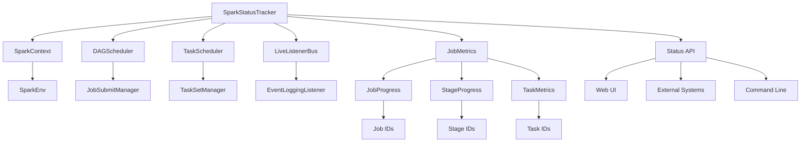

# SparkStatusTracker 源码分析

## 类的概述和定义

`SparkStatusTracker` 是 Apache Spark 中负责应用程序状态监控和跟踪的核心组件，它提供了对 Spark 作业、阶段和任务执行状态的实时监控接口。作为 Spark UI 和外部监控系统的基础设施，它支持对分布式计算过程的全面状态跟踪。

### 组件定位

- **功能定位**：Spark 应用程序状态监控和跟踪器
- **设计目标**：提供统一的状态查询接口，支持实时监控
- **应用场景**：Spark UI 状态显示、外部监控系统集成、作业进度跟踪

## 整体架构设计

### 核心组件关系图



### 状态层次结构

#### 应用程序级别状态
- **作业状态**：整个应用程序的作业执行情况
- **阶段状态**：各个阶段的进度和状态
- **任务状态**：具体任务的执行状态

#### 监控粒度层次
```scala
// 作业级别监控
getJobIdsForGroup(jobGroup: String): Array[Int]
getJobInfo(jobId: Int): SparkJobInfo

// 阶段级别监控  
getStageInfo(stageId: Int): SparkStageInfo
getStageInfos: Array[SparkStageInfo]

// 任务级别监控
getExecutorInfos: Array[SparkExecutorInfo]
```

## 构造函数参数说明

### SparkStatusTracker 主构造函数
```scala
class SparkStatusTracker(sc: SparkContext, store: AppStatusStore)
```

#### 参数详细说明

1. **sc**: `SparkContext`
   - Spark 应用程序上下文，提供核心组件访问
   - 用于获取调度器、监听器等关键组件
   - 支持环境配置和运行时信息获取

2. **store**: `AppStatusStore`
   - 应用程序状态存储后端
   - 负责状态数据的持久化和查询
   - 支持历史状态记录和实时状态更新

#### 构造函数逻辑
```scala
private[spark] val jobProgressListener = sc.jobProgressListener
private[spark] val listenerBus = sc.listenerBus
private[spark] val dagScheduler = sc.dagScheduler
private[spark] val taskScheduler = sc.taskScheduler
```

**组件初始化**：
- **监听器注册**：确保状态更新事件被正确捕获
- **调度器引用**：获取作业和任务调度信息
- **事件总线**：监听状态变更事件

## 核心属性分析

### 组件引用属性

#### 调度器引用
```scala
@transient private val dagScheduler: DAGScheduler
@transient private val taskScheduler: TaskScheduler
```

**功能作用**：
- **DAG调度器**：获取阶段和作业的依赖关系信息
- **任务调度器**：获取任务执行状态和资源分配信息
- **实时状态**：提供最新的调度和执行状态

#### 监听器系统
```scala
@transient private val jobProgressListener: JobProgressListener
@transient private val listenerBus: LiveListenerBus
```

**事件处理**：
- **进度监听器**：专门处理作业进度相关事件
- **事件总线**：统一的事件分发和处理机制
- **状态同步**：确保状态信息实时更新

### 状态存储属性

#### 应用状态存储
```scala
private val store: AppStatusStore
```

**存储特性**：
- **内存存储**：支持快速的状态查询和更新
- **历史记录**：保留历史状态信息用于分析
- **并发安全**：支持多线程并发访问

#### 缓存机制
```scala
@transient private var _executorInfos: Array[SparkExecutorInfo] = _
@transient private var _stageInfos: Array[SparkStageInfo] = _
```

**缓存策略**：
- **懒加载**：按需加载状态信息，减少初始化开销
- **缓存失效**：状态变更时自动更新缓存
- **性能优化**：避免重复查询提高响应速度

## 主要方法分类和说明

### 作业状态查询方法

#### getActiveJobsIds 方法
```scala
def getActiveJobIds(): Array[Int]
```

**功能**：获取当前活跃作业的ID列表

**实现逻辑**：
1. **安全检查**：验证调度器是否可用
2. **状态过滤**：筛选处于活跃状态的作业
3. **ID提取**：返回作业ID数组

**状态判断**：
```scala
jobProgressListener.activeJobs.values
  .filter(_.status == JobExecutionStatus.RUNNING)
  .map(_.jobId).toArray
```

#### getJobInfo 方法
```scala
def getJobInfo(jobId: Int): Option[SparkJobInfo]
```

**功能**：获取指定作业的详细信息

**信息内容**：
- **作业ID**：唯一标识符
- **阶段ID**：包含的阶段列表
- **状态信息**：运行状态、开始时间、完成时间
- **任务统计**：任务总数、完成数、失败数

**错误处理**：
```scala
if (jobProgressListener.synchronized {
  jobProgressListener.jobIdToData.contains(jobId)
}) {
  // 返回作业信息
} else {
  None // 作业不存在
}
```

### 阶段状态查询方法

#### getActiveStageIds 方法
```scala
def getActiveStageIds(): Array[Int]
```

**功能**：获取当前活跃阶段的ID列表

**阶段状态**：
- **运行中**：正在执行的阶段
- **等待中**：等待调度的阶段
- **已完成**：执行完成的阶段

#### getStageInfo 方法
```scala
def getStageInfo(stageId: Int): Option[SparkStageInfo]
```

**功能**：获取指定阶段的详细信息

**阶段信息结构**：
```scala
case class SparkStageInfo(
  stageId: Int,
  currentAttemptId: Int,
  name: String,
  numTasks: Int,
  numActiveTasks: Int,
  numCompletedTasks: Int,
  numFailedTasks: Int)
```

**进度计算**：
- **任务总数**：阶段包含的总任务数
- **活跃任务**：当前正在执行的任务数
- **完成进度**：已完成任务占总任务的比例

### 执行器状态查询方法

#### getExecutorInfos 方法
```scala
def getExecutorInfos(): Array[SparkExecutorInfo]
```

**功能**：获取所有执行器的状态信息

**执行器信息**：
- **执行器ID**：唯一标识符
- **主机地址**：执行器运行的主机
- **核心数**：分配的计算核心数量
- **内存使用**：当前内存使用情况
- **任务数**：当前执行的任务数量

**缓存机制**：
```scala
if (_executorInfos == null) {
  _executorInfos = computeExecutorInfos()
}
_executorInfos
```

### 任务状态查询方法

#### getTaskInfo 方法
```scala
def getTaskInfo(stageId: Int, stageAttemptId: Int, taskId: Int): Option[SparkTaskInfo]
```

**功能**：获取指定任务的详细信息

**任务信息**：
- **任务ID**：在阶段内的唯一标识
- **执行器ID**：运行该任务的执行器
- **启动时间**：任务开始执行的时间
- **完成时间**：任务完成的时间（如果已完成）
- **状态**：运行、完成、失败等状态

## 状态信息数据结构

### SparkJobInfo 类

#### 作业信息结构
```scala
case class SparkJobInfo(
  jobId: Int,
  name: String,
  status: JobExecutionStatus,
  stageIds: Seq[Int],
  activeStages: Seq[SparkStageInfo],
  completedStages: Seq[SparkStageInfo],
  failedStages: Seq[SparkStageInfo])
```

**状态枚举**：
```scala
object JobExecutionStatus {
  val RUNNING = "RUNNING"
  val SUCCEEDED = "SUCCEEDED" 
  val FAILED = "FAILED"
  val UNKNOWN = "UNKNOWN"
}
```

### SparkStageInfo 类

#### 阶段信息结构
```scala
case class SparkStageInfo(
  stageId: Int,
  currentAttemptId: Int,
  name: String,
  numTasks: Int,
  numActiveTasks: Int,
  numCompletedTasks: Int,
  numFailedTasks: Int,
  submissionTime: Option[Long],
  completionTime: Option[Long])
```

**进度计算属性**：
- **完成率**：`numCompletedTasks.toDouble / numTasks`
- **失败率**：`numFailedTasks.toDouble / numTasks`
- **活跃率**：`numActiveTasks.toDouble / numTasks`

### SparkExecutorInfo 类

#### 执行器信息结构
```scala
case class SparkExecutorInfo(
  executorId: String,
  host: String,
  port: Int,
  isActive: Boolean,
  totalCores: Int,
  tasksRunning: Int,
  tasksCompleted: Int,
  totalTasks: Int,
  totalDuration: Long,
  totalGCTime: Long,
  totalInputBytes: Long,
  totalShuffleRead: Long,
  totalShuffleWrite: Long,
  maxMemory: Long,
  memoryUsed: Long,
  diskUsed: Long)
```

**资源使用指标**：
- **CPU使用**：运行任务数与总核心数的比例
- **内存使用**：已使用内存与最大内存的比例
- **磁盘使用**：磁盘空间使用情况
- **网络IO**：Shuffle读写数据量

## 事件监听机制

### 监听器注册

#### 进度监听器集成
```scala
private[spark] val jobProgressListener: JobProgressListener
```

**监听事件类型**：
- **作业事件**：作业开始、完成、失败
- **阶段事件**：阶段提交、开始、完成
- **任务事件**：任务启动、完成、失败
- **执行器事件**：执行器添加、移除

#### 事件处理流程
```scala
listenerBus.addListener(jobProgressListener)
```

**事件传播**：
1. **事件产生**：调度器产生状态变更事件
2. **事件发布**：通过LiveListenerBus发布事件
3. **事件处理**：JobProgressListener处理事件并更新状态
4. **状态同步**：SparkStatusTracker同步最新状态

### 状态更新策略

#### 实时更新机制
```scala
def updateExecutorMetrics(executorId: String, metrics: ExecutorMetrics): Unit
```

**更新触发条件**：
- **定时更新**：定期收集执行器指标
- **事件驱动**：状态变更事件触发更新
- **手动刷新**：外部调用触发强制更新

#### 缓存失效策略
```scala
private def invalidateCache(): Unit = {
  _executorInfos = null
  _stageInfos = null
}
```

**失效时机**：
- **执行器变更**：执行器添加或移除时
- **阶段完成**：阶段状态发生变化时
- **作业完成**：作业执行完成时

## 性能优化设计

### 缓存策略优化

#### 懒加载缓存
```scala
@transient private var _executorInfos: Array[SparkExecutorInfo] = _

if (_executorInfos == null) {
  _executorInfos = computeExecutorInfos()
}
```

**优化效果**：
- **减少计算**：避免重复的状态计算
- **内存优化**：按需加载，减少内存占用
- **响应速度**：缓存命中时快速返回结果

#### 缓存失效控制
```scala
private def shouldInvalidateCache(event: SparkListenerEvent): Boolean
```

**失效条件**：
- **执行器事件**：执行器状态变更
- **任务事件**：任务状态大规模变更
- **阶段事件**：阶段进度显著变化

### 查询优化

#### 批量查询优化
```scala
def getStageInfos: Array[SparkStageInfo] = {
  if (_stageInfos == null) {
    _stageInfos = computeStageInfos()
  }
  _stageInfos
}
```

**批量处理优势**：
- **减少锁竞争**：批量获取减少同步开销
- **数据局部性**：连续内存访问提高性能
- **网络优化**：减少RPC调用次数

#### 索引优化
```scala
private val jobIdToData = new mutable.HashMap[Int, JobData]
private val stageIdToData = new mutable.HashMap[Int, StageData]
```

**快速查找**：
- **哈希索引**：O(1)时间复杂度的查找
- **类型安全**：强类型键值对避免错误
- **内存效率**：紧凑的数据结构存储

## 错误处理和容错

### 空值安全处理

#### Option类型包装
```scala
def getJobInfo(jobId: Int): Option[SparkJobInfo]
```

**安全特性**：
- **避免空指针**：使用Option避免NullPointerException
- **明确语义**：Some表示存在，None表示不存在
- **链式调用**：支持map、flatMap等函数式操作

#### 默认值处理
```scala
val jobIds = getActiveJobIds().getOrElse(Array.empty)
```

**容错策略**：
- **空数组默认值**：返回空数组而非null
- **异常捕获**：捕获可能的异常并返回安全值
- **日志记录**：记录错误信息便于调试

### 组件可用性检查

#### 调度器状态验证
```scala
if (dagScheduler == null || taskScheduler == null) {
  return Array.empty
}
```

**检查时机**：
- **初始化阶段**：组件未完全初始化时
- **关闭阶段**：应用程序正在关闭时
- **异常状态**：组件出现异常时

#### 监听器状态检查
```scala
if (!listenerBus.hasListener(jobProgressListener)) {
  logWarning("JobProgressListener not registered")
  return None
}
```

**状态监控**：
- **监听器注册**：确保事件监听正常
- **连接状态**：检查与存储后端的连接
- **数据一致性**：验证状态数据的完整性

## 使用场景分析

### Spark Web UI 集成

#### 状态显示
```scala
// Web UI 获取作业状态
val activeJobs = statusTracker.getActiveJobIds()
val jobInfos = activeJobs.flatMap(id => statusTracker.getJobInfo(id))
```

**UI组件**：
- **作业列表**：显示所有作业的执行状态
- **阶段进度**：展示各个阶段的完成情况
- **执行器状态**：监控集群资源使用情况

#### 实时更新
```scala
// 定时刷新状态
scheduler.scheduleAtFixedRate(new Runnable {
  def run(): Unit = {
    updateStatusDisplay()
  }
}, 0, 1, TimeUnit.SECONDS)
```

**更新策略**：
- **定时轮询**：定期查询状态变化
- **事件驱动**：状态变更时主动推送
- **增量更新**：只更新发生变化的部分

### 外部监控系统集成

#### REST API 提供
```scala
@GET
@Path("/jobs")
def getJobs(): List[JobInfo] = {
  statusTracker.getActiveJobIds()
    .flatMap(id => statusTracker.getJobInfo(id))
    .toList
}
```

**API特性**：
- **JSON格式**：便于外部系统解析
- **实时数据**：提供最新的状态信息
- **过滤支持**：支持按条件筛选数据

#### 监控告警
```scala
def checkJobHealth(jobId: Int): HealthStatus = {
  statusTracker.getJobInfo(jobId) match {
    case Some(info) =>
      if (info.status == JobExecutionStatus.FAILED) {
        HealthStatus.CRITICAL
      } else {
        HealthStatus.HEALTHY
      }
    case None => HealthStatus.UNKNOWN
  }
}
```

**告警规则**：
- **失败检测**：作业失败时触发告警
- **超时检测**：长时间运行未完成告警
- **资源异常**：资源使用异常告警

### 调试和诊断支持

#### 性能分析
```scala
def analyzeJobPerformance(jobId: Int): PerformanceReport = {
  val jobInfo = statusTracker.getJobInfo(jobId)
  val stageInfos = jobInfo.map(_.stageIds.flatMap(statusTracker.getStageInfo))
  
  // 计算各阶段执行时间
  val stageDurations = stageInfos.get.map { stage =>
    (stage.stageId, stage.completionTime.get - stage.submissionTime.get)
  }
  
  PerformanceReport(stageDurations)
}
```

**分析指标**：
- **阶段耗时**：各阶段执行时间分析
- **任务分布**：任务在不同执行器的分布
- **资源效率**：资源使用效率分析

#### 故障诊断
```scala
def diagnoseJobFailure(jobId: Int): FailureAnalysis = {
  val jobInfo = statusTracker.getJobInfo(jobId)
  val failedStages = jobInfo.map(_.failedStages).getOrElse(Seq.empty)
  
  failedStages.map { stage =>
    val taskFailures = statusTracker.getTaskFailures(stage.stageId)
    FailureAnalysis(stage, taskFailures)
  }
}
```

**诊断信息**：
- **失败阶段**：识别具体的失败阶段
- **失败任务**：分析失败的任务信息
- **错误原因**：收集错误日志和异常信息

## 配置参数说明

### 状态跟踪配置

#### 状态更新频率
```properties
# 状态更新间隔（毫秒）
spark.ui.liveUpdate.interval=1000

# 历史状态保留时间
spark.history.retainedApplications=50
```

**性能调优**：
- **更新频率**：平衡实时性和性能开销
- **历史数据**：控制历史状态数据量
- **内存配置**：根据集群规模调整内存分配

#### 缓存配置
```properties
# 执行器信息缓存时间（秒）
spark.statusTracker.executorInfoCacheTimeout=30

# 阶段信息缓存时间（秒）  
spark.statusTracker.stageInfoCacheTimeout=10
```

**缓存策略**：
- **超时时间**：控制缓存数据的有效期
- **刷新策略**：定时刷新或事件驱动刷新
- **内存限制**：设置缓存大小上限

## 扩展性设计

### 插件化架构

#### 自定义状态监听器
```scala
trait CustomStatusListener {
  def onJobStatusChange(jobInfo: SparkJobInfo): Unit
  def onStageStatusChange(stageInfo: SparkStageInfo): Unit
  def onExecutorStatusChange(executorInfo: SparkExecutorInfo): Unit
}
```

**扩展接口**：
- **事件回调**：状态变更时的回调接口
- **数据过滤**：支持自定义数据过滤逻辑
- **格式转换**：支持自定义数据格式输出

#### 存储后端扩展
```scala
trait StatusStore {
  def saveJobInfo(jobInfo: SparkJobInfo): Unit
  def getJobInfo(jobId: Int): Option[SparkJobInfo]
  def queryJobs(filter: JobFilter): Seq[SparkJobInfo]
}
```

**存储适配器**：
- **数据库存储**：支持关系型数据库
- **NoSQL存储**：支持分布式键值存储
- **文件存储**：支持本地文件系统

### 监控指标扩展

#### 自定义指标收集
```scala
trait CustomMetricsCollector {
  def collectExecutorMetrics(executorId: String): ExecutorMetrics
  def collectTaskMetrics(taskId: Long): TaskMetrics
  def collectStageMetrics(stageId: Int): StageMetrics
}
```

**指标类型**：
- **业务指标**：应用特定的业务指标
- **性能指标**：系统性能相关指标
- **资源指标**：资源使用情况指标

## 总结

`SparkStatusTracker` 是Spark状态监控体系的核心组件，通过精心的设计实现了：

1. **全面性**：覆盖作业、阶段、任务、执行器全维度状态监控
2. **实时性**：基于事件驱动的实时状态更新机制
3. **性能优化**：智能缓存和懒加载策略减少性能开销
4. **可扩展性**：插件化架构支持功能扩展
5. **可靠性**：完善的错误处理和容错机制

该组件的设计体现了Spark在分布式系统监控方面的成熟考虑，是学习大规模分布式系统状态管理设计的优秀案例。