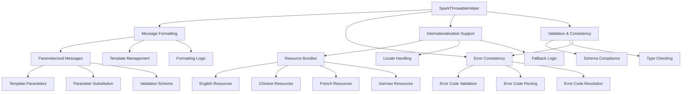

# SparkThrowableHelper 源码分析

## 类的概述和定义

`SparkThrowableHelper` 是 Apache Spark 中异常处理系统的核心辅助工具类，它提供了统一的异常消息格式化、错误分类解析和国际化支持功能。作为 Spark 异常处理框架的基础设施，它确保所有 Spark 异常都能以一致、可读的方式呈现给用户。

### 组件定位

- **功能定位**：Spark 异常处理辅助工具类
- **设计目标**：提供统一的异常消息格式化和错误分类机制
- **应用场景**：所有 Spark 异常类的消息格式化、错误码解析、国际化支持

## 整体架构设计

### 核心功能模块图



### 消息处理流程

#### 异常消息格式化流程
```scala
// 输入：错误分类、消息参数、查询上下文
// 处理：消息模板查找、参数替换、格式验证
// 输出：格式化的异常消息

def getMessage(errorClass: String, messageParameters: Map[String, String], context: Array[QueryContext]): String
```

**处理步骤**：
1. **模板查找**：根据错误分类查找对应的消息模板
2. **参数验证**：验证消息参数与模板的匹配性
3. **参数替换**：将参数值替换到模板中
4. **格式检查**：确保最终消息格式正确
5. **上下文集成**：集成查询上下文信息

## 构造函数和静态方法

### 单例模式设计

`SparkThrowableHelper` 采用工具类的设计模式，不提供公共构造函数，所有方法都是静态方法：

```scala
object SparkThrowableHelper
```

**设计特点**：
- **无状态性**：所有方法都是纯函数，无副作用
- **线程安全**：静态方法天然线程安全
- **工具类**：提供通用异常处理工具方法

## 核心属性分析

### 错误分类模式

#### 错误分类结构
```scala
private val ERROR_CLASS_REGEX = "^([A-Z_]+)(\\.([A-Z_]+))*$".r
```

**正则表达式解析**：
- **根分类**：`[A-Z_]+` 大写字母和下划线组成的根错误分类
- **子分类**：`(\\.([A-Z_]+))*` 可选的子分类，用点号分隔
- **示例**：`INTERNAL_ERROR`、`SQL.PARSING_ERROR`、`IO.READ_FAILED`

#### 错误分类层次
```scala
// 根错误分类示例
INTERNAL_ERROR
EXTERNAL_ERROR
USER_ERROR
CONFIGURATION_ERROR

// 带子分类的错误示例  
SQL.PARSING_ERROR
SQL.SYNTAX_ERROR
SQL.SEMANTIC_ERROR

IO.READ_FAILED
IO.WRITE_FAILED
IO.PERMISSION_DENIED
```

**分类优势**：
- **层次化**：支持多级错误分类
- **可扩展**：易于添加新的错误类型
- **结构化**：便于错误统计和分析

### 消息参数模式

#### 参数命名规范
```scala
private val PARAMETER_REGEX = "^[a-z][a-zA-Z0-9_]*$".r
```

**命名规则**：
- **首字母小写**：以小写字母开头
- **字母数字下划线**：包含字母、数字和下划线
- **驼峰命名**：推荐使用驼峰命名法

#### 参数示例
```scala
// 有效的参数名
fileName
tableName
columnName
partitionCount

// 无效的参数名（不符合正则表达式）
File_Name  // 包含大写字母
123column  // 以数字开头
file-name  // 包含连字符
```

## 主要方法分类和说明

### 消息格式化方法

#### getMessage 核心方法
```scala
def getMessage(
    errorClass: String, 
    messageParameters: Map[String, String], 
    context: Array[QueryContext] = Array.empty): String
```

**方法参数**：
1. **errorClass**: `String` - 错误分类标识符
2. **messageParameters**: `Map[String, String]` - 消息参数映射
3. **context**: `Array[QueryContext]` - 查询上下文数组（可选）

**实现逻辑**：
```scala
// 1. 验证错误分类格式
validateErrorClass(errorClass)

// 2. 验证消息参数格式
messageParameters.foreach { case (key, value) =>
  validateParameterName(key)
  validateParameterValue(value)
}

// 3. 获取消息模板
val template = getMessageTemplate(errorClass)

// 4. 执行参数替换
val formattedMessage = substituteParameters(template, messageParameters)

// 5. 集成查询上下文
val finalMessage = integrateContext(formattedMessage, context)

finalMessage
```

#### 参数替换算法
```scala
private def substituteParameters(template: String, parameters: Map[String, String]): String
```

**替换策略**：
- **模板语法**：使用`${parameterName}`作为占位符
- **安全替换**：避免正则表达式注入攻击
- **缺失处理**：处理未提供参数的情况
- **转义处理**：正确处理特殊字符转义

### 错误分类验证方法

#### validateErrorClass 方法
```scala
private def validateErrorClass(errorClass: String): Unit
```

**验证规则**：
1. **非空检查**：错误分类不能为空
2. **格式匹配**：必须匹配`ERROR_CLASS_REGEX`模式
3. **长度限制**：合理的长度范围检查
4. **保留字检查**：避免使用系统保留的错误分类

**验证失败处理**：
```scala
if (!ERROR_CLASS_REGEX.pattern.matcher(errorClass).matches()) {
  throw new IllegalArgumentException(
    s"Invalid error class format: '$errorClass'. " +
    "Error class must match pattern: ^([A-Z_]+)(\\.([A-Z_]+))*$")
}
```

#### validateParameterName 方法
```scala
private def validateParameterName(parameterName: String): Unit
```

**命名规范**：
- **首字符**：必须以小写字母开头
- **字符集**：只能包含字母、数字和下划线
- **长度限制**：合理的参数名长度
- **语义清晰**：参数名应具有明确的语义

### 模板管理方法

#### getMessageTemplate 方法
```scala
private def getMessageTemplate(errorClass: String): String
```

**模板查找策略**：
1. **资源文件查找**：从消息资源文件中查找模板
2. **缓存优化**：使用缓存提高查找性能
3. **回退机制**：提供默认模板作为回退
4. **版本兼容**：支持不同版本的模板格式

#### 模板格式示例
```scala
// 简单模板
"File not found: ${fileName}"

// 带条件的模板  
"Expected ${expectedType} but got ${actualType}"

// 复杂模板
"Failed to read table ${tableName} from path ${filePath}. " +
"The table has ${partitionCount} partitions."
```

### 国际化支持方法

#### 资源包管理
```scala
private def getResourceBundle(locale: Locale): ResourceBundle
```

**本地化策略**：
- **多语言支持**：支持多种语言的错误消息
- **回退链**：从特定语言回退到默认语言
- **资源加载**：高效加载和缓存资源包
- **编码处理**：正确处理不同字符编码

#### 本地化消息格式
```scala
// 英文资源文件
INTERNAL_ERROR=Internal error occurred
SQL.PARSING_ERROR=SQL parsing error at line {line}, column {column}

// 中文资源文件  
INTERNAL_ERROR=发生内部错误
SQL.PARSING_ERROR=SQL解析错误，第{line}行，第{column}列
```

## 设计特点总结

### 1. 统一的消息格式化

#### 参数化消息模板
```scala
// 统一的模板语法
"Operation failed on ${resourceName}: ${errorDetails}"
```

**优势**：
- **一致性**：所有异常使用相同的消息格式
- **可读性**：参数化消息更易于理解和调试
- **可维护性**：集中管理消息模板

#### 类型安全参数
```scala
// 编译时参数验证
case class MessageParameters(
  resourceName: String,
  errorDetails: String,
  operation: String)
```

**安全特性**：
- **编译时检查**：避免运行时参数错误
- **自动完成**：IDE支持参数名自动补全
- **文档化**：参数类型和用途明确

### 2. 层次化错误分类

#### 分类体系设计
```scala
// 根分类：主要错误类别
INTERNAL_ERROR      // 内部错误
EXTERNAL_ERROR      // 外部错误  
USER_ERROR          // 用户错误
CONFIGURATION_ERROR // 配置错误

// 子分类：具体错误类型
SQL.PARSING_ERROR   // SQL解析错误
SQL.SYNTAX_ERROR    // SQL语法错误
IO.READ_FAILED      // IO读取失败
```

**分类优势**：
- **结构化**：清晰的错误层次结构
- **可扩展**：易于添加新的错误类型
- **统计友好**：便于错误统计和分析

### 3. 国际化支持

#### 多语言资源管理
```scala
// 支持多种语言
val locales = Seq(
  Locale.ENGLISH,
  Locale.CHINESE, 
  Locale.FRENCH,
  Locale.GERMAN
)
```

**国际化特性**：
- **本地化消息**：根据用户区域设置显示相应语言
- **回退机制**：当特定语言资源不存在时回退到默认语言
- **字符编码**：支持UTF-8等多字节字符集

### 4. 验证和一致性

#### 输入验证机制
```scala
def validateInputs(errorClass: String, parameters: Map[String, String]): Unit = {
  validateErrorClass(errorClass)
  parameters.foreach { case (key, value) =>
    validateParameterName(key)
    validateParameterValue(value)
  }
}
```

**验证层次**：
- **格式验证**：验证输入格式是否符合规范
- **语义验证**：验证参数值的合理性
- **一致性验证**：确保参数与模板匹配

## 核心算法实现

### 消息格式化算法

#### 参数替换算法
```scala
private def substituteParameters(template: String, parameters: Map[String, String]): String = {
  val pattern = "\\$\\{([^}]+)\\}".r
  
  pattern.replaceAllIn(template, { matchResult =>
    val paramName = matchResult.group(1)
    parameters.getOrElse(paramName, "")
  })
}
```

**算法步骤**：
1. **模式匹配**：使用正则表达式查找`${parameter}`模式
2. **参数提取**：从匹配结果中提取参数名
3. **值查找**：在参数映射中查找对应的值
4. **安全替换**：进行安全的字符串替换

#### 性能优化策略
```scala
// 使用StringBuilder提高性能
val sb = new StringBuilder(template.length + parameters.values.map(_.length).sum)

// 批量替换操作
pattern.findAllIn(template).foreach { matchResult =>
  // 高效替换逻辑
}
```

**优化点**：
- **预分配内存**：根据预计大小预分配StringBuilder
- **批量操作**：减少中间字符串创建
- **缓存优化**：缓存编译后的正则表达式

### 错误分类解析算法

#### 分类解析算法
```scala
private def parseErrorClass(errorClass: String): (String, Option[String]) = {
  val parts = errorClass.split("\\.")
  if (parts.length > 1) {
    (parts.head, Some(parts.tail.mkString(".")))
  } else {
    (errorClass, None)
  }
}
```

**解析逻辑**：
- **根分类提取**：获取错误分类的根部分
- **子分类提取**：提取可选的子分类部分
- **层次构建**：构建完整的分类层次结构

#### 分类验证算法
```scala
private def isValidErrorClass(errorClass: String): Boolean = {
  errorClass != null && 
  errorClass.nonEmpty &&
  ERROR_CLASS_REGEX.pattern.matcher(errorClass).matches()
}
```

**验证规则**：
- **非空检查**：确保错误分类不为空
- **格式匹配**：验证符合命名规范
- **长度限制**：检查合理的长度范围

## 配置和扩展

### 消息模板配置

#### 资源文件格式
```properties
# errors.properties
INTERNAL_ERROR=Internal error occurred: {details}
SQL.PARSING_ERROR=SQL parsing error at line {line}, column {column}: {message}
IO.READ_FAILED=Failed to read file {filePath}: {reason}
```

**配置特性**：
- **键值对格式**：简单的属性文件格式
- **参数支持**：支持参数化消息模板
- **注释支持**：支持配置注释

#### 模板加载机制
```scala
private lazy val messageTemplates: Map[String, String] = {
  val bundle = ResourceBundle.getBundle("errors")
  bundle.getKeys.asScala.map(key => key -> bundle.getString(key)).toMap
}
```

**加载策略**：
- **懒加载**：首次使用时加载资源
- **缓存优化**：缓存加载的资源避免重复IO
- **异常处理**：处理资源加载失败的情况

### 错误分类扩展

#### 自定义错误分类
```scala
// 添加新的错误分类
object CustomErrorClasses {
  val CUSTOM_BUSINESS_ERROR = "BUSINESS.VALIDATION_ERROR"
  val CUSTOM_INTEGRATION_ERROR = "INTEGRATION.API_FAILED"
  val CUSTOM_DATA_ERROR = "DATA.QUALITY_ISSUE"
}
```

**扩展方法**：
- **命名空间**：使用自定义前缀避免冲突
- **层次结构**：遵循现有的分类层次
- **文档化**：为新的错误分类提供文档

#### 分类注册机制
```scala
def registerErrorClass(errorClass: String, template: String): Unit = {
  validateErrorClass(errorClass)
  messageTemplates.put(errorClass, template)
}
```

**注册流程**：
1. **格式验证**：验证错误分类格式
2. **模板验证**：验证消息模板有效性
3. **注册存储**：将分类和模板存储到注册表

## 性能优化策略

### 缓存优化

#### 模板缓存
```scala
private val templateCache: ConcurrentHashMap[String, String] = new ConcurrentHashMap()

def getCachedTemplate(errorClass: String): String = {
  templateCache.computeIfAbsent(errorClass, getMessageTemplate)
}
```

**缓存策略**：
- **并发安全**：使用线程安全的ConcurrentHashMap
- **懒加载**：按需加载模板到缓存
- **内存管理**：设置合理的缓存大小限制

#### 正则表达式缓存
```scala
private val compiledPatterns: ConcurrentHashMap[String, Pattern] = new ConcurrentHashMap()

def getCompiledPattern(regex: String): Pattern = {
  compiledPatterns.computeIfAbsent(regex, Pattern.compile)
}
```

**性能优势**：
- **避免重复编译**：缓存编译后的正则表达式
- **线程安全**：支持多线程并发访问
- **内存效率**：共享编译后的模式对象

### 字符串处理优化

#### StringBuilder 优化
```scala
def buildMessageEfficiently(template: String, parameters: Map[String, String]): String = {
  val estimatedSize = template.length + parameters.values.map(_.length).sum
  val sb = new StringBuilder(estimatedSize)
  
  // 高效的字符串构建逻辑
  // ...
  
  sb.toString()
}
```

**优化技巧**：
- **预分配内存**：根据预计大小预分配缓冲区
- **批量操作**：减少中间字符串对象创建
- **避免拼接**：使用StringBuilder代替字符串拼接

## 错误处理和容错

### 输入验证错误处理

#### 参数验证异常
```scala
def validateParameterName(name: String): Unit = {
  if (name == null) {
    throw new IllegalArgumentException("Parameter name cannot be null")
  }
  if (!PARAMETER_REGEX.pattern.matcher(name).matches()) {
    throw new IllegalArgumentException(
      s"Invalid parameter name: '$name'. " +
      "Must match pattern: ^[a-z][a-zA-Z0-9_]*$")
  }
}
```

**验证策略**：
- **早期失败**：在最早可能的时候检测错误
- **明确错误**：提供清晰的错误消息
- **恢复策略**：提供错误恢复的备选方案

### 资源加载错误处理

#### 资源文件缺失处理
```scala
def loadResourceBundleSafely(bundleName: String): ResourceBundle = {
  try {
    ResourceBundle.getBundle(bundleName)
  } catch {
    case _: MissingResourceException =>
      logWarning(s"Resource bundle '$bundleName' not found, using empty bundle")
      new EmptyResourceBundle
    case e: Exception =>
      logError(s"Failed to load resource bundle '$bundleName': ${e.getMessage}")
      throw e
  }
}
```

**容错机制**：
- **优雅降级**：资源缺失时使用默认值
- **日志记录**：记录错误信息便于调试
- **异常传播**：严重错误时向上传播异常

### 模板解析错误处理

#### 模板语法错误处理
```scala
def parseTemplateSafely(template: String): ParsedTemplate = {
  try {
    TemplateParser.parse(template)
  } catch {
    case e: TemplateSyntaxException =>
      logError(s"Invalid template syntax: ${e.getMessage}")
      ParsedTemplate.EMPTY
    case e: Exception =>
      logError(s"Unexpected error parsing template: ${e.getMessage}")
      throw e
  }
}
```

**错误恢复**：
- **语法验证**：提前检测模板语法错误
- **安全解析**：使用安全的解析方法
- **默认值**：解析失败时提供安全的默认值

## 使用场景分析

### Spark 异常类集成

#### 异常消息格式化
```scala
class SparkException(
    errorClass: String,
    messageParameters: Map[String, String]) 
  extends Exception(SparkThrowableHelper.getMessage(errorClass, messageParameters))
```

**集成优势**：
- **统一格式**：所有Spark异常使用相同的消息格式
- **参数化消息**：支持动态的消息参数
- **国际化**：自动支持多语言错误消息

#### 自定义异常类
```scala
class SqlParsingException(line: Int, column: Int, message: String)
  extends SparkException(
    "SQL.PARSING_ERROR",
    Map("line" -> line.toString, "column" -> column.toString, "message" -> message))
```

**使用示例**：
```scala
// 创建异常实例
val ex = new SqlParsingException(10, 5, "Unexpected token 'SELECT'")

// 异常消息自动格式化
// "SQL parsing error at line 10, column 5: Unexpected token 'SELECT'"
println(ex.getMessage)
```

### 外部系统集成

#### REST API 错误响应
```scala
def createErrorResponse(error: SparkException): ErrorResponse = {
  ErrorResponse(
    errorCode = SparkThrowableHelper.getErrorCode(error.getErrorClass),
    message = error.getMessage,
    parameters = error.getMessageParameters
  )
}
```

**API集成**：
- **标准化错误码**：统一的错误代码体系
- **结构化响应**：包含错误信息和参数
- **客户端友好**：便于客户端错误处理

#### 日志系统集成
```scala
def logSparkError(error: SparkException): Unit = {
  logger.error(
    "Spark error occurred: {}", 
    SparkThrowableHelper.formatForLogging(error))
}
```

**日志优化**：
- **结构化日志**：便于日志分析和监控
- **上下文信息**：包含完整的错误上下文
- **性能信息**：可选的性能指标记录

## 测试和验证

### 单元测试策略

#### 消息格式化测试
```scala
class SparkThrowableHelperTest extends FunSuite {
  test("format message with parameters") {
    val message = SparkThrowableHelper.getMessage(
      "IO.READ_FAILED",
      Map("filePath" -> "/data/file.txt", "reason" -> "Permission denied"))
    
    assert(message == "Failed to read file /data/file.txt: Permission denied")
  }
}
```

**测试覆盖**：
- **正常情况**：验证正确的消息格式化
- **边界情况**：测试空参数、特殊字符等
- **错误情况**：验证错误处理和异常抛出

#### 错误分类验证测试
```scala
test("validate error class format") {
  // 有效分类
  assert(SparkThrowableHelper.isValidErrorClass("INTERNAL_ERROR"))
  assert(SparkThrowableHelper.isValidErrorClass("SQL.PARSING_ERROR"))
  
  // 无效分类
  assert(!SparkThrowableHelper.isValidErrorClass("invalid-error"))
  assert(!SparkThrowableHelper.isValidErrorClass("123ERROR"))
}
```

**验证测试**：
- **格式验证**：测试各种格式的验证结果
- **边界值**：测试边界情况的处理
- **异常情况**：测试无效输入的异常处理

### 集成测试

#### 端到端测试
```scala
class EndToEndTest extends SparkFunSuite {
  test("complete exception handling flow") {
    // 创建异常
    val exception = new SparkException("INTERNAL_ERROR", Map("details" -> "Unexpected state"))
    
    // 验证消息格式
    assert(exception.getMessage.contains("Unexpected state"))
    
    // 验证错误分类
    assert(exception.getErrorClass == "INTERNAL_ERROR")
  }
}
```

**集成验证**：
- **流程完整性**：验证整个异常处理流程
- **组件协作**：测试与其他组件的集成
- **性能基准**：建立性能基准测试

## 总结

`SparkThrowableHelper` 是Spark异常处理体系的核心辅助工具，通过精心的设计实现了：

1. **统一性**：提供一致的异常消息格式和错误分类体系
2. **灵活性**：支持参数化消息模板和自定义错误分类
3. **国际化**：完整的多语言错误消息支持
4. **性能优化**：高效的缓存和字符串处理机制
5. **可扩展性**：易于添加新的错误类型和消息模板

该组件的设计体现了Spark在异常处理方面的成熟考虑，是学习企业级错误处理系统设计的优秀案例。