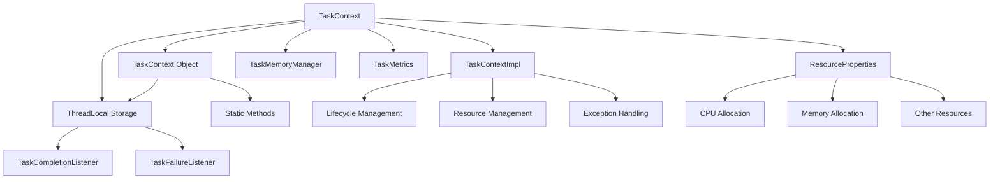

# TaskContext 源码分析

## 类的概述和定义

`TaskContext` 是 Apache Spark 中负责任务执行上下文管理的核心抽象类，它为任务执行提供了完整的上下文环境，包括任务标识、资源分配、生命周期管理和监听器机制。作为任务执行的基础设施，它确保任务能够安全、高效地在分布式环境中运行。

### 组件定位

- **功能定位**：Spark 任务执行上下文管理器
- **设计目标**：提供统一的任务执行环境接口
- **应用场景**：所有 Spark 任务的执行上下文管理

## 整体架构设计

### 核心组件关系图



### 层次结构设计

#### 抽象层（TaskContext）
- 定义统一的接口规范
- 提供基础的方法签名
- 确保实现类的一致性

#### 实现层（TaskContextImpl）
- 具体的上下文实现
- 线程本地存储管理
- 资源分配和监控

#### 工具层（TaskContext Object）
- 静态访问方法
- 线程本地存储管理
- 空上下文创建

## 构造函数参数说明

### TaskContext 抽象类
```scala
abstract class TaskContext extends Serializable
```

**设计特点**：
- **可序列化**：支持任务上下文在集群间传输
- **抽象接口**：定义统一的行为规范
- **无显式构造函数**：由具体实现类提供构造逻辑

### TaskContext 伴生对象
```scala
object TaskContext
```

**静态方法**：
- 提供全局访问接口
- 管理线程本地存储
- 支持空上下文创建

## 核心属性分析

### 线程本地存储机制

#### taskContext ThreadLocal
```scala
private[this] val taskContext: ThreadLocal[TaskContext] = new ThreadLocal[TaskContext]
```

**设计原理**：
- **线程隔离**：每个线程独立的任务上下文
- **生命周期管理**：与任务执行周期同步
- **性能优化**：避免线程间竞争

#### 访问方法
```scala
def get(): TaskContext = taskContext.get()
def setTaskContext(tc: TaskContext): Unit = taskContext.set(tc)
def unset(): Unit = taskContext.remove()
```

**访问控制**：
- **安全访问**：通过静态方法确保线程安全
- **权限控制**：protected[spark]限制内部使用
- **清理机制**：任务完成后自动清理

### 空上下文工厂
```scala
def empty(): TaskContextImpl
```

**测试用途**：
- 单元测试环境
- 本地执行模式
- 上下文模拟测试

## 主要方法分类和说明

### 状态查询方法

#### 任务状态检查
```scala
def isCompleted(): Boolean
def isInterrupted(): Boolean
```

**状态管理**：
- **完成状态**：任务是否执行完毕
- **中断状态**：任务是否被取消或终止
- **原子操作**：确保状态查询的线程安全

#### 任务标识信息
```scala
def stageId(): Int                    // 阶段ID
def stageAttemptNumber(): Int         // 阶段尝试次数
def partitionId(): Int                 // 分区ID
def numPartitions(): Int              // 总分区数
def attemptNumber(): Int               // 任务尝试次数
def taskAttemptId(): Long             // 任务尝试唯一ID
```

**标识体系**：
- **层次结构**：阶段->分区->任务的多级标识
- **唯一性保证**：taskAttemptId确保全局唯一
- **重试支持**：attemptNumber记录重试次数

### 监听器管理方法

#### 任务完成监听器
```scala
def addTaskCompletionListener(listener: TaskCompletionListener): TaskContext
def addTaskCompletionListener[U](f: (TaskContext) => U): TaskContext
```

**监听器特性**：
- **全面触发**：成功、失败、取消都会触发
- **顺序执行**：同一线程内按注册顺序逆序执行
- **异常处理**：监听器异常会导致任务失败

#### 任务失败监听器
```scala
def addTaskFailureListener(listener: TaskFailureListener): TaskContext
def addTaskFailureListener(f: (TaskContext, Throwable) => Unit): TaskContext
```

**失败处理**：
- **错误上下文**：提供异常信息和任务上下文
- **异步通知**：支持异步错误处理
- **版本兼容**：Spark 3.4.0+扩展了触发条件

#### 监听器执行框架
```scala
private[spark] def runTaskWithListeners[T](task: Task[T]): T
```

**执行流程**：
1. **任务执行**：调用task.runTask(this)
2. **异常捕获**：捕获所有Throwable异常
3. **失败标记**：调用markTaskFailed记录失败
4. **完成标记**：调用markTaskCompleted触发监听器
5. **资源清理**：finally块确保清理执行

### 资源管理方法

#### CPU资源分配
```scala
@Since("3.3.0") def cpus(): Int
```

**资源分配**：
- **版本特性**：Spark 3.3.0引入的API
- **动态分配**：支持任务级CPU分配
- **调度优化**：为任务调度提供资源信息

#### 通用资源管理
```scala
def resources(): Map[String, ResourceInformation]
def resourcesJMap(): java.util.Map[String, ResourceInformation]
```

**资源类型**：
- **GPU资源**：支持GPU加速计算
- **自定义资源**：扩展其他硬件资源
- **Java兼容**：提供Java接口版本

#### 内存管理
```scala
private[spark] def taskMemoryManager(): TaskMemoryManager
```

**内存控制**：
- **统一内存管理**：集成UnifiedMemoryManager
- **执行内存分配**：管理任务执行内存
- **溢出处理**：支持内存不足时的磁盘溢出

### 配置和属性方法

#### 本地属性访问
```scala
def getLocalProperty(key: String): String
private[spark] def getLocalProperties: Properties
```

**属性传递**：
- **Driver到Executor**：支持配置参数传递
- **线程安全**：线程本地属性存储
- **调试支持**：便于任务调试和监控

#### 度量系统集成
```scala
@DeveloperApi def taskMetrics(): TaskMetrics
@DeveloperApi def getMetricsSources(sourceName: String): Seq[Source]
```

**性能监控**：
- **任务度量**：收集执行时间、数据量等指标
- **度量源管理**：支持自定义度量收集
- **开发者API**：面向框架扩展者

### 中断和异常处理

#### 任务中断控制
```scala
private[spark] def killTaskIfInterrupted(): Unit
private[spark] def getKillReason(): Option[String]
private[spark] def markInterrupted(reason: String): Unit
```

**中断机制**：
- **主动检查**：killTaskIfInterrupted检查中断状态
- **原因记录**：getKillReason获取中断原因
- **状态标记**：markInterrupted设置中断状态

#### 异常处理
```scala
private[spark] def markTaskFailed(error: Throwable): Unit
private[spark] def markTaskCompleted(error: Option[Throwable]): Unit
```

**错误处理**：
- **失败标记**：markTaskFailed记录任务失败
- **完成通知**：markTaskCompleted触发完成监听器
- **异常传播**：支持异常链传递

#### Fetch失败处理
```scala
private[spark] def setFetchFailed(fetchFailed: FetchFailedException): Unit
private[spark] def fetchFailed: Option[FetchFailedException]
```

**Shuffle故障**：
- **远程获取失败**：处理Shuffle数据获取失败
- **驱动程序通知**：允许驱动程序处理Fetch失败
- **重试机制**：支持任务级重试

### 累加器管理
```scala
private[spark] def registerAccumulator(a: AccumulatorV2[_, _]): Unit
```

**累加器支持**：
- **动态注册**：任务执行时注册累加器
- **序列化支持**：确保累加器正确序列化
- **结果聚合**：支持分布式累加器操作

## 设计特点总结

### 1. 线程安全设计

#### 线程本地存储
```scala
private[this] val taskContext: ThreadLocal[TaskContext]
```

**安全特性**：
- **隔离性**：每个线程独立上下文，避免竞争
- **性能优化**：无锁访问，高性能
- **生命周期**：与线程生命周期绑定

#### 原子操作
- 状态查询原子性
- 监听器注册线程安全
- 资源分配一致性

### 2. 生命周期管理

#### 任务执行周期
```scala
def runTaskWithListeners[T](task: Task[T]): T
```

**阶段管理**：
1. **准备阶段**：设置线程本地上下文
2. **执行阶段**：运行任务主体
3. **完成阶段**：触发监听器和清理
4. **异常处理**：统一错误处理流程

#### 资源生命周期
- 内存分配与释放
- 文件句柄管理
- 网络连接清理

### 3. 监听器模式

#### 事件驱动架构
```scala
trait TaskCompletionListener {
  def onTaskCompletion(context: TaskContext): Unit
}
```

**设计优势**：
- **解耦合**：任务执行与后续处理分离
- **可扩展**：支持多种监听器类型
- **顺序保证**：监听器执行顺序可控

#### 监听器类型
- **完成监听器**：任务结束触发
- **失败监听器**：任务失败触发
- **自定义监听器**：用户定义扩展

### 4. 资源管理

#### 统一资源接口
```scala
def resources(): Map[String, ResourceInformation]
```

**资源抽象**：
- **硬件无关**：统一资源表示格式
- **动态分配**：支持运行时资源调整
- **配额管理**：确保资源公平分配

#### 内存管理集成
- 任务级内存池
- 执行内存监控
- 溢出机制支持

### 5. 错误恢复机制

#### 容错设计
```scala
private[spark] def setFetchFailed(fetchFailed: FetchFailedException): Unit
```

**故障处理**：
- **Fetch失败检测**：Shuffle数据获取失败
- **重试策略**：支持任务级重试
- **错误传播**：向驱动程序报告错误

#### 异常链管理
- 原始异常保留
- 错误上下文记录
- 监听器异常处理

## 使用场景分析

### 1. 常规任务执行

#### 基本使用模式
```scala
val context = TaskContext.get()
val partitionId = context.partitionId()
val attemptNumber = context.attemptNumber()
```

**典型场景**：
- 数据分区处理
- 任务重试逻辑
- 性能指标收集

#### 资源感知任务
```scala
val cpus = context.cpus()
val resources = context.resources()
val memoryManager = context.taskMemoryManager()
```

**资源优化**：
- CPU密集型任务优化
- GPU加速计算
- 内存敏感操作

### 2. 监听器应用

#### 资源清理监听器
```scala
context.addTaskCompletionListener { ctx =>
  // 清理临时文件
  // 关闭网络连接
  // 释放内存资源
}
```

**资源管理**：
- 自动资源释放
- 异常安全保证
- 性能优化

#### 监控和日志
```scala
context.addTaskCompletionListener { ctx =>
  val metrics = ctx.taskMetrics()
  logInfo(s"Task completed: ${metrics.executorRunTime}ms")
}
```

**监控集成**：
- 性能指标记录
- 执行时间统计
- 错误率监控

### 3. 错误处理场景

#### 自定义错误处理
```scala
try {
  // 任务执行逻辑
} catch {
  case e: Exception =>
    context.markTaskFailed(e)
    throw e
}
```

**错误管理**：
- 统一错误处理
- 错误信息丰富化
- 调试支持

#### Fetch失败处理
```scala
context.addTaskFailureListener { (ctx, error) =>
  error match {
    case fetchFailed: FetchFailedException =>
      // 处理Shuffle失败
    case _ => // 其他错误
  }
}
```

**Shuffle容错**：
- 数据重分布
- 执行器故障恢复
- 网络问题处理

## 性能优化策略

### 1. 线程本地存储优化

#### 访问模式优化
```scala
// 优化前：多次调用get()
val stageId = TaskContext.get().stageId()
val partitionId = TaskContext.get().partitionId()

// 优化后：单次获取引用
val context = TaskContext.get()
val stageId = context.stageId()
val partitionId = context.partitionId()
```

**性能提升**：
- 减少ThreadLocal访问次数
- 缓存上下文引用
- 避免重复查找

### 2. 监听器管理优化

#### 监听器数量控制
```scala
// 避免过多监听器
class CompositeListener extends TaskCompletionListener {
  def onTaskCompletion(context: TaskContext): Unit = {
    // 合并多个清理操作
  }
}
```

**优化策略**：
- 合并相关监听器
- 懒加载监听器
- 选择性注册

### 3. 资源使用优化

#### 内存访问模式
```scala
val memoryManager = TaskContext.get().taskMemoryManager()
// 批量内存操作
memoryManager.acquireExecutionMemory(required, attempted, evictedBlocks)
```

**内存优化**：
- 批量内存分配
- 避免频繁小内存申请
- 及时释放不再使用的内存

## 错误处理和调试

### 1. 常见问题处理

#### 上下文丢失问题
**症状**：TaskContext.get()返回null
**原因**：在非任务线程中访问
**解决**：确保在任务执行线程中访问上下文

#### 监听器异常
**症状**：任务因监听器异常而失败
**原因**：监听器代码抛出异常
**解决**：在监听器中添加异常捕获

#### 内存泄漏
**症状**：任务完成后内存未释放
**原因**：监听器未正确清理资源
**解决**：确保监听器正确释放资源

### 2. 调试技巧

#### 上下文信息记录
```scala
val context = TaskContext.get()
logDebug(s"Task context: stage=${context.stageId()}, " +
  s"partition=${context.partitionId()}, attempt=${context.attemptNumber()}")
```

**调试信息**：
- 任务标识信息
- 资源分配情况
- 执行状态跟踪

#### 监听器调试
```scala
context.addTaskCompletionListener { ctx =>
  logDebug("Task completion listener executed")
  // 添加调试逻辑
}
```

**监听器跟踪**：
- 执行顺序验证
- 异常捕获调试
- 性能分析

## 最佳实践指南

### 1. 上下文使用规范

#### 正确访问模式
```scala
// 推荐：在任务开始时获取上下文
class MyTask extends Task[Int] {
  override def runTask(context: TaskContext): Int = {
    // 使用传入的context参数
    val partitionId = context.partitionId()
    // 任务逻辑
  }
}

// 不推荐：在闭包中直接访问
rdd.map { data =>
  // 可能在不同线程中执行
  val context = TaskContext.get() // 可能为null
}
```

### 2. 监听器设计原则

#### 职责单一原则
```scala
// 好的设计：每个监听器专注一个功能
class FileCleanupListener extends TaskCompletionListener {
  def onTaskCompletion(context: TaskContext): Unit = {
    // 只负责文件清理
  }
}

class MetricsRecorder extends TaskCompletionListener {
  def onTaskCompletion(context: TaskContext): Unit = {
    // 只负责指标记录
  }
}
```

#### 异常安全设计
```scala
context.addTaskCompletionListener { ctx =>
  try {
    // 监听器逻辑
  } catch {
    case e: Exception =>
      logError("Listener error", e)
      // 不抛出异常，避免影响其他监听器
  }
}
```

### 3. 资源管理最佳实践

#### 及时资源释放
```scala
context.addTaskCompletionListener { ctx =>
  // 确保资源释放
  temporaryFiles.foreach(_.delete())
  databaseConnections.foreach(_.close())
  memoryBuffers.foreach(_.release())
}
```

#### 内存使用优化
```scala
val memoryManager = context.taskMemoryManager()
// 预估内存需求，避免频繁调整
val memory = memoryManager.acquireExecutionMemory(
  estimatedSize, attempted, evictedBlocks)
```

## 扩展和自定义

### 1. 自定义监听器

#### 实现自定义监听器
```scala
class CustomMetricsListener extends TaskCompletionListener {
  override def onTaskCompletion(context: TaskContext): Unit = {
    // 自定义指标收集逻辑
    val metrics = customMetricCollector.collect()
    metricsReporter.report(metrics)
  }
}
```

#### 注册自定义监听器
```scala
val context = TaskContext.get()
context.addTaskCompletionListener(new CustomMetricsListener)
```

### 2. 上下文扩展

#### 添加自定义属性
```scala
trait ExtendedTaskContext extends TaskContext {
  def getCustomAttribute(key: String): Any
  def setCustomAttribute(key: String, value: Any): Unit
}
```

#### 实现扩展上下文
```scala
class ExtendedTaskContextImpl extends TaskContextImpl with ExtendedTaskContext {
  private val customAttributes = new mutable.HashMap[String, Any]
  
  override def getCustomAttribute(key: String): Any = customAttributes.get(key)
  override def setCustomAttribute(key: String, value: Any): Unit = 
    customAttributes.put(key, value)
}
```

## 总结

`TaskContext` 是Spark任务执行环境的核心组件，通过精心的设计实现了：

1. **统一性**：提供一致的任务执行环境接口
2. **安全性**：线程安全的上下文访问机制
3. **可扩展性**：灵活的监听器和资源管理框架
4. **容错性**：完善的错误处理和恢复机制
5. **性能优化**：高效的内存和资源管理

该组件的设计体现了Spark在分布式任务执行方面的成熟考虑，是学习分布式系统任务管理的优秀案例。