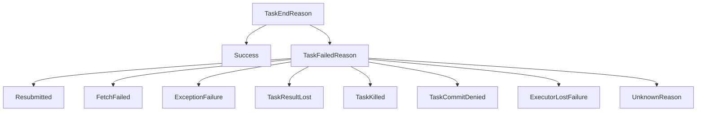

# TaskEndReason.scala 源码分析

## 类的概述和定义

`TaskEndReason.scala` 是Apache Spark核心模块中定义任务结束原因体系的关键文件。它通过密封特质（sealed trait）和case类/对象构建了一个完整的任务状态分类系统，为Spark任务调度和错误处理提供标准化的状态表示。

文件位置：`org.apache.spark.TaskEndReason`
设计模式：密封特质 + case类/对象模式

## 整体架构设计

### 层次结构图



### 设计原则

1. **密封特质设计**：`TaskEndReason` 被声明为密封特质，确保所有子类都在同一文件中定义
2. **开发者API标注**：所有公开类都使用 `@DeveloperApi` 注解，表明这是面向开发者的扩展接口
3. **序列化要求**：文件顶部明确要求新任务结束原因必须伴随序列化逻辑

## 核心特质分析

### TaskEndReason 特质

```scala
@DeveloperApi
sealed trait TaskEndReason
```

- **作用**：所有任务结束原因的基类
- **设计特点**：
  - 密封特质确保类型安全
  - 空特质，仅作为类型标记
  - 支持模式匹配的完整性检查

### TaskFailedReason 特质

```scala
@DeveloperApi
sealed trait TaskFailedReason extends TaskEndReason {
  def toErrorString: String
  def countTowardsTaskFailures: Boolean = true
}
```

#### 方法分析

1. **`toErrorString: String`**
   - **功能**：生成错误信息字符串用于Web UI显示
   - **设计意图**：统一错误信息格式，便于用户理解

2. **`countTowardsTaskFailures: Boolean`**
   - **功能**：决定该失败是否计入任务失败次数统计
   - **默认值**：true，表示大多数失败都应计入统计
   - **设计意义**：区分"临时性失败"和"需要重新提交阶段的失败"

## 具体任务结束原因分析

### 1. Success - 任务成功

```scala
@DeveloperApi
case object Success extends TaskEndReason
```

- **语义**：任务正常执行完成
- **设计特点**：使用case object表示单例模式
- **使用场景**：所有成功完成的任务

### 2. Resubmitted - 任务重新提交

```scala
@DeveloperApi
case object Resubmitted extends TaskFailedReason {
  override def toErrorString: String = "Resubmitted (resubmitted due to lost executor)"
}
```

- **触发条件**：ShuffleMapTask成功完成但执行器丢失
- **处理逻辑**：需要重新调度任务到其他执行器
- **失败计数**：默认计入失败统计（继承父类默认值）

### 3. FetchFailed - 获取数据失败

```scala
@DeveloperApi
case class FetchFailed(
    bmAddress: BlockManagerId,
    shuffleId: Int,
    mapId: Long,
    mapIndex: Int,
    reduceId: Int,
    message: String) extends TaskFailedReason
```

#### 参数详细说明

| 参数名 | 类型 | 说明 |
|--------|------|------|
| bmAddress | BlockManagerId | 数据所在的块管理器地址（可为null） |
| shuffleId | Int | Shuffle操作的唯一标识符 |
| mapId | Long | Map任务的唯一标识符 |
| mapIndex | Int | Map任务的索引位置 |
| reduceId | Int | Reduce任务的标识符 |
| message | String | 详细的错误消息 |

#### 特殊处理逻辑

```scala
override def countTowardsTaskFailures: Boolean = false
```

- **设计理由**：Fetch失败通常不是当前任务的错误
- **处理策略**：
  1. 不中止阶段，而是重新生成缺失数据
  2. 不计算被排除执行器的Fetch失败
  3. 防止单个坏节点导致集群级联失败

### 4. ExceptionFailure - 运行时异常

```scala
@DeveloperApi
case class ExceptionFailure(
    className: String,
    description: String,
    stackTrace: Array[StackTraceElement],
    fullStackTrace: String,
    private val exceptionWrapper: Option[ThrowableSerializationWrapper],
    accumUpdates: Seq[AccumulableInfo] = Seq.empty,
    private[spark] var accums: Seq[AccumulatorV2[_, _]] = Nil,
    private[spark] var metricPeaks: Seq[Long] = Seq.empty) extends TaskFailedReason
```

#### 参数复杂性分析

**异常信息参数**：
- `className`、`description`：基本异常信息
- `stackTrace`、`fullStackTrace`：堆栈跟踪信息（支持向后兼容）
- `exceptionWrapper`：异常序列化包装器

**累加器参数**：
- `accumUpdates`：累加器更新信息
- `accums`：累加器实例（私有字段）
- `metricPeaks`：指标峰值数据

#### 构造函数重载

```scala
private[spark] def this(e: Throwable, accumUpdates: Seq[AccumulableInfo], preserveCause: Boolean)
private[spark] def this(e: Throwable, accumUpdates: Seq[AccumulableInfo])
```

- **设计目的**：提供多种构造方式适应不同场景
- `preserveCause` 参数：控制是否保留异常原因用于序列化

#### 辅助方法

```scala
def exception: Option[Throwable] = exceptionWrapper.flatMap(w => Option(w.exception))
```

- **功能**：安全获取异常实例
- **设计考虑**：处理异常可能为null的情况

### 5. TaskResultLost - 任务结果丢失

```scala
@DeveloperApi
case object TaskResultLost extends TaskFailedReason {
  override def toErrorString: String = "TaskResultLost (result lost from block manager)"
}
```

- **触发条件**：任务成功但结果在执行器的块管理器中丢失
- **语义**：任务执行成功但结果存储失败

### 6. TaskKilled - 任务被杀死

```scala
@DeveloperApi
case class TaskKilled(
    reason: String,
    accumUpdates: Seq[AccumulableInfo] = Seq.empty,
    private[spark] val accums: Seq[AccumulatorV2[_, _]] = Nil,
    metricPeaks: Seq[Long] = Seq.empty) extends TaskFailedReason
```

#### 特殊处理

```scala
override def countTowardsTaskFailures: Boolean = false
```

- **设计理由**：任务被杀死是主动行为，不应计入失败统计
- **使用场景**：用户主动取消任务、资源回收等

### 7. TaskCommitDenied - 任务提交被拒绝

```scala
@DeveloperApi
case class TaskCommitDenied(
    jobID: Int,
    partitionID: Int,
    attemptNumber: Int) extends TaskFailedReason
```

#### 特殊处理逻辑

```scala
override def countTowardsTaskFailures: Boolean = false
```

- **设计目的**：防止推测执行任务导致的虚假阶段失败
- **使用场景**：多个推测任务同时尝试提交时

### 8. ExecutorLostFailure - 执行器丢失

```scala
@DeveloperApi
case class ExecutorLostFailure(
    execId: String,
    exitCausedByApp: Boolean = true,
    reason: Option[String]) extends TaskFailedReason
```

#### 条件判断逻辑

```scala
override def countTowardsTaskFailures: Boolean = exitCausedByApp
```

- **智能判断**：只有当执行器退出由应用程序引起时才计入失败
- **区分场景**：区分应用程序错误和外部因素导致的执行器丢失

### 9. UnknownReason - 未知原因

```scala
@DeveloperApi
case object UnknownReason extends TaskFailedReason {
  override def toErrorString: String = "UnknownReason"
}
```

- **兜底机制**：处理无法识别的失败原因
- **设计考虑**：确保系统在未知情况下仍能继续运行

## 辅助类分析

### ThrowableSerializationWrapper 类

```scala
private[spark] class ThrowableSerializationWrapper(var exception: Throwable) extends
    Serializable with Logging
```

#### 设计目的
- **异常序列化**：解决Throwable序列化问题
- **容错处理**：当异常无法反序列化时提供降级方案
- **日志记录**：记录序列化失败信息便于调试

#### 序列化实现

```scala
private def writeObject(out: ObjectOutputStream): Unit
private def readObject(in: ObjectInputStream): Unit
```

- **自定义序列化**：提供精确的序列化控制
- **异常处理**：捕获反序列化异常并记录警告

## 设计模式总结

### 1. 密封特质模式
- **类型安全**：编译器可以检查模式匹配的完整性
- **扩展控制**：所有子类在同一文件中定义，便于管理
- **模式匹配优化**：编译器可以进行优化

### 2. Case类/对象模式
- **不可变性**：所有状态都是不可变的
- **模式匹配友好**：天然支持模式匹配
- **值语义**：基于值的比较而非引用

### 3. 策略模式
- **失败处理策略**：不同的失败原因对应不同的处理策略
- **可配置性**：通过 `countTowardsTaskFailures` 控制失败计数行为

### 4. 工厂方法模式
- **构造函数重载**：提供多种构造方式
- **向后兼容**：支持新旧版本的数据格式

## 错误处理机制分析

### 失败分类策略

#### 不计入失败的场景
1. **FetchFailed**：数据获取失败，通常不是当前任务的问题
2. **TaskKilled**：任务被主动杀死
3. **TaskCommitDenied**：提交被拒绝（推测执行场景）
4. **ExecutorLostFailure**（部分情况）：非应用程序导致的执行器丢失

#### 计入失败的场景
1. **Resubmitted**：需要重新提交的任务
2. **ExceptionFailure**：运行时异常
3. **TaskResultLost**：结果丢失
4. **UnknownReason**：未知原因

### 错误信息标准化

每个失败原因都实现 `toErrorString` 方法，确保：
- **一致性**：统一的错误信息格式
- **可读性**：用户友好的错误描述
- **可搜索性**：便于日志分析和监控

## 序列化要求

文件顶部的重要注释：
```scala
// NOTE: new task end reasons MUST be accompanied with serialization logic in util.JsonProtocol!
```

### 序列化设计考虑
1. **网络传输**：任务结束原因需要在驱动器和执行器之间传输
2. **持久化存储**：支持任务历史记录的保存
3. **版本兼容**：确保新旧版本间的数据兼容性

## 使用场景分析

### 1. 任务调度器
- **重试决策**：根据失败原因决定是否重试任务
- **阶段管理**：判断是否需要重新提交整个阶段

### 2. Web UI显示
- **状态展示**：在Web界面显示任务结束状态
- **错误诊断**：提供详细的错误信息帮助用户诊断问题

### 3. 监控系统
- **指标收集**：统计不同类型的任务失败
- **性能分析**：分析失败原因对性能的影响

### 4. 开发者扩展
- **自定义失败原因**：开发者可以基于此体系扩展新的失败类型
- **错误处理策略**：实现自定义的错误处理逻辑

## 扩展性设计

### 当前设计优势
- **模块化**：每个失败原因独立定义，职责清晰
- **可扩展**：新的失败原因可以轻松添加
- **类型安全**：编译时检查确保完整性

### 扩展指南
1. **添加新原因**：继承 `TaskFailedReason` 并实现必要方法
2. **序列化支持**：在 `util.JsonProtocol` 中添加序列化逻辑
3. **处理逻辑**：在任务调度器中添加相应的处理策略

## 总结

`TaskEndReason.scala` 通过精心的类型系统设计，为Spark任务执行提供了完整的状态描述体系。其密封特质+case类的设计模式确保了类型安全和扩展性，而丰富的失败原因分类为复杂的分布式环境提供了精确的错误处理能力。这个设计体现了Spark框架对可靠性和可维护性的深度思考。