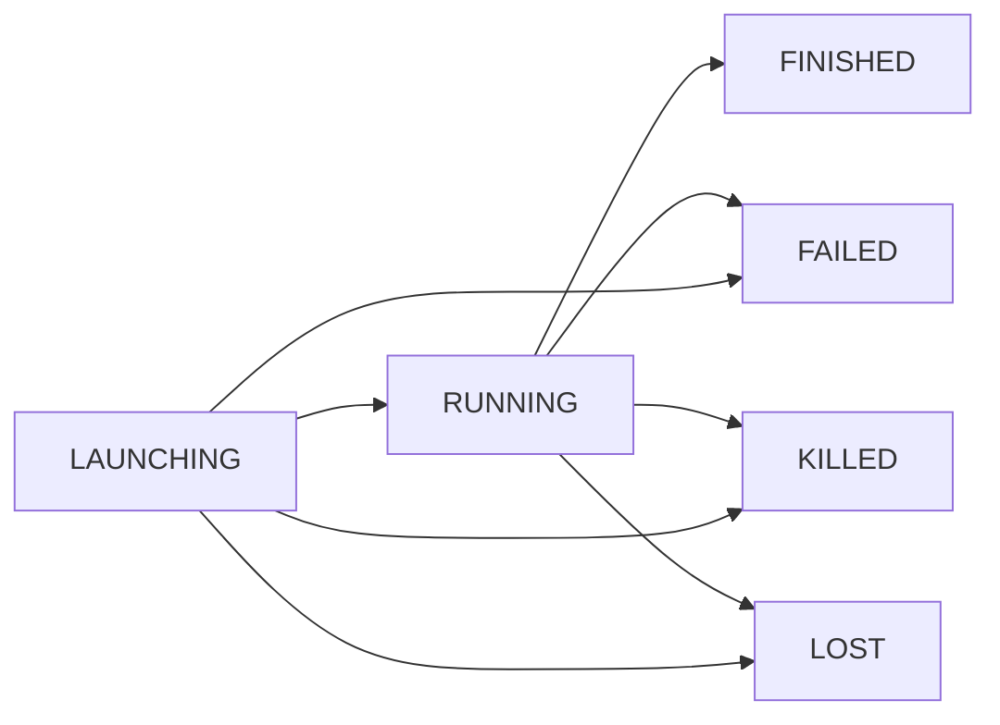

# TaskState 枚举分析

## 枚举概述和定义

`TaskState` 是Spark框架中**任务状态管理的核心枚举**，定义了任务在整个生命周期中可能处于的各种状态。作为Spark任务调度和执行监控的基础，它为标准化的状态管理提供了统一的定义。

**枚举定义：**
```scala
private[spark] object TaskState extends Enumeration
```

- **枚举类型**：Scala的`Enumeration`对象
- **可见性**：`private[spark]`，Spark内部使用
- **设计目的**：统一任务状态定义，提供状态判断工具

## 状态值定义分析

### 6种核心任务状态

**状态定义代码：**
```scala
val LAUNCHING, RUNNING, FINISHED, FAILED, KILLED, LOST = Value
```

**状态详细说明：**

| 状态值 | 含义 | 生命周期阶段 | 描述 |
|--------|------|-------------|------|
| `LAUNCHING` | 启动中 | 初始阶段 | 任务正在被调度和启动，尚未开始执行 |
| `RUNNING` | 运行中 | 执行阶段 | 任务正在Executor上正常执行 |
| `FINISHED` | 已完成 | 完成阶段 | 任务成功执行完成 |
| `FAILED` | 失败 | 异常终止 | 任务执行过程中发生错误而失败 |
| `KILLED` | 被杀死 | 主动终止 | 任务被用户或系统主动终止 |
| `LOST` | 丢失 | 异常终止 | 任务因Executor异常等原因丢失 |

### 状态类型别名

**定义：**
```scala
type TaskState = Value
```

**作用：**
- 提供类型别名，简化代码中的类型声明
- 提高代码可读性和类型安全性
- 便于方法参数和返回值的类型标注

## 核心工具方法分析

### 1. 完成状态集合 (`FINISHED_STATES`)

**定义：**
```scala
private val FINISHED_STATES = Set(FINISHED, FAILED, KILLED, LOST)
```

**设计分析：**
- **私有常量**：内部使用，不对外暴露
- **集合定义**：包含所有"结束"状态的任务
- **性能优化**：预计算集合，避免重复创建

### 2. `isFailed(state: TaskState): Boolean` 方法

**方法实现：**
```scala
def isFailed(state: TaskState): Boolean = (LOST == state) || (FAILED == state)
```

**功能分析：**
- **失败判断**：检查状态是否为失败或丢失
- **逻辑清晰**：使用明确的逻辑或运算
- **使用场景**：用于监控告警、错误处理等

**状态包含：**
- `FAILED`：执行失败
- `LOST`：任务丢失

### 3. `isFinished(state: TaskState): Boolean` 方法

**方法实现：**
```scala
def isFinished(state: TaskState): Boolean = FINISHED_STATES.contains(state)
```

**功能分析：**
- **完成判断**：检查任务是否已结束（无论成功或失败）
- **集合查询**：利用预计算的完成状态集合
- **性能优化**：Set.contains操作时间复杂度为O(1)

**状态包含：**
- `FINISHED`：成功完成
- `FAILED`：执行失败  
- `KILLED`：被杀死
- `LOST`：任务丢失

## 设计特点总结

### 1. 状态完整性
- **覆盖全面**：涵盖任务生命周期的所有关键状态
- **语义明确**：每个状态都有清晰的业务含义
- **无重叠**：状态之间互斥，避免歧义

### 2. 工具方法设计
- **实用导向**：提供常用的状态判断方法
- **性能优化**：使用Set进行高效的状态检查
- **扩展友好**：方法设计便于添加新的状态判断逻辑

### 3. 内部使用策略
- **封装性**：主要状态集合定义为私有
- **接口简洁**：对外只暴露必要的判断方法
- **控制访问**：防止外部代码错误修改状态定义

## 状态转换和生命周期

### 任务状态转换图



### 状态转换规则

1. **正常流程**：LAUNCHING → RUNNING → FINISHED
2. **异常流程**：LAUNCHING/RUNNING → FAILED/LOST
3. **主动终止**：LAUNCHING/RUNNING → KILLED
4. **不可逆转换**：所有状态转换都是单向的

## 使用场景和最佳实践

### 主要应用场景

1. **任务调度监控**
   - 实时跟踪任务执行状态
   - 触发状态变更事件处理

2. **资源管理**
   - 根据任务状态释放或分配资源
   - 实现优雅的资源回收机制

3. **错误处理**
   - 识别失败任务并进行重试
   - 收集和分析任务失败原因

### 代码使用示例

**状态检查：**
```scala
// 检查任务是否结束
if (TaskState.isFinished(currentState)) {
    // 执行结束处理逻辑
}

// 检查任务是否失败
if (TaskState.isFailed(currentState)) {
    // 执行失败处理逻辑
}
```

**状态跟踪：**
```scala
// 状态变更监听
def onStateChange(oldState: TaskState, newState: TaskState): Unit = {
    if (TaskState.isFinished(newState)) {
        cleanupResources()
    }
}
```

## 相关类和接口

### 核心关联组件

1. **Task（任务）**
   - 包含TaskState状态属性
   - 实现状态转换逻辑

2. **TaskScheduler（任务调度器）**
   - 管理任务状态变更
   - 根据状态进行调度决策

3. **TaskSetManager（任务集管理器）**
   - 跟踪任务集中所有任务的状态
   - 实现任务重试和容错机制

### 状态监控体系

- **Spark UI**：可视化展示任务状态
- **事件总线**：发布状态变更事件
- **度量系统**：统计各种状态的任务数量

## 设计模式应用

### 枚举模式（Enumeration Pattern）
- **类型安全**：编译时检查状态值有效性
- **单例保证**：枚举值全局唯一
- **可序列化**：支持网络传输和持久化

### 工具类模式（Utility Class Pattern）
- **静态方法**：提供状态判断工具方法
- **无状态**：类本身不维护状态
- **功能集中**：相关功能集中在一个类中

## 性能考虑

### 状态判断优化
- **Set查询**：isFinished使用HashSet，O(1)时间复杂度
- **直接比较**：isFailed使用直接比较，避免方法调用开销
- **缓存友好**：枚举值在JVM中缓存，快速访问

### 内存占用
- **轻量级**：枚举对象占用内存极小
- **共享实例**：枚举值在JVM中共享，避免重复创建
- **无堆分配**：基本操作不产生堆内存分配

## 扩展性和演进

### 状态扩展
如需添加新状态，可以：
1. 在枚举定义中添加新的val
2. 更新FINISHED_STATES集合（如需要）
3. 添加相应的判断方法

### 兼容性考虑
- **向后兼容**：新增状态不影响现有逻辑
- **渐进升级**：可以逐步支持新状态
- **默认处理**：未识别状态可以按未知状态处理

## 实际应用示例

### 在Spark源码中的使用

**任务状态跟踪：**
```scala
// 在TaskSetManager中跟踪任务状态
class TaskSetManager {
    private val taskInfos = new HashMap[Long, TaskInfo]()
    
    def updateTaskState(taskId: Long, state: TaskState): Unit = {
        taskInfos.get(taskId).foreach { info =>
            info.state = state
            if (TaskState.isFinished(state)) {
                handleTaskFinished(taskId)
            }
        }
    }
}
```

**资源清理：**
```scala
// 根据任务状态清理资源
def cleanupTaskResources(state: TaskState): Unit = {
    if (TaskState.isFinished(state)) {
        // 释放任务占用的所有资源
        releaseMemory()
        closeConnections()
    }
}
```

## 总结

`TaskState` 枚举是Spark任务管理体系的**状态标准化核心**，通过简洁而完整的状态定义，为整个任务生命周期管理提供了统一的语言和工具。其精心设计的工具方法和状态分类，使得任务状态的处理变得高效而可靠。

作为Spark内部基础设施的重要组成部分，`TaskState` 的成功设计体现了**枚举模式**和**工具类模式**的最佳实践，通过类型安全的状态管理和高效的状态判断，为Spark的稳定运行和高效调度提供了坚实基础。其扩展友好的设计也为未来的功能演进留出了充分的空间。