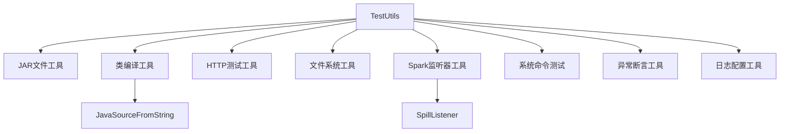

# TestUtils.scala 源码分析

## 类的概述和定义

`TestUtils.scala` 是Apache Spark核心模块中定义测试工具类的关键文件。该文件提供了丰富的测试基础设施，支持Spark框架的单元测试、集成测试和功能测试。由于被多个项目共享使用，该工具类被包含在主代码库中。

文件位置：`org.apache.spark.TestUtils`
设计模式：工具类对象 + 辅助类
访问修饰符：`private[spark]`

## 整体架构设计

### 主要组件结构



### 设计原则

1. **跨项目共享**：被多个Spark子项目共享使用
2. **功能全面**：覆盖测试的各个方面需求
3. **易于使用**：提供简洁的API接口
4. **平台兼容**：支持Windows和Unix-like系统

## 核心功能分类分析

### 1. JAR文件创建工具

#### createJarWithClasses 方法

```scala
def createJarWithClasses(
    classNames: Seq[String],
    toStringValue: String = "",
    classNamesWithBase: Seq[(String, String)] = Seq.empty,
    classpathUrls: Seq[URL] = Seq.empty): URL
```

**功能说明：**
- 创建包含指定类的JAR文件
- 支持继承关系和类路径配置
- 返回JAR文件的URL用于类加载

**使用场景：**
- 动态类加载测试
- 类路径隔离测试
- 依赖管理测试

#### createJarWithFiles 方法

```scala
def createJarWithFiles(files: Map[String, String], dir: File = null): URL
```

**功能特点：**
- 从文件内容映射创建JAR
- 支持自定义临时目录
- 内存到JAR的直接转换

#### createJar 方法

```scala
def createJar(
    files: Seq[File],
    jarFile: File,
    directoryPrefix: Option[String] = None,
    mainClass: Option[String] = None): URL
```

**高级功能：**
- 支持目录前缀和主类配置
- 完整的Manifest配置支持
- 灵活的文件组织结构

### 2. 类编译工具

#### JavaSourceFromString 类

```scala
private[spark] class JavaSourceFromString(val name: String, val code: String)
  extends SimpleJavaFileObject(createURI(name), SOURCE)
```

**设计模式：** 适配器模式

**功能：**
- 将字符串适配为Java源文件对象
- 支持Java编译器的内存编译
- 提供字符内容访问接口

#### createCompiledClass 方法

```scala
def createCompiledClass(
    className: String,
    destDir: File,
    toStringValue: String = "",
    baseClass: String = null,
    classpathUrls: Seq[URL] = Seq.empty,
    implementsClasses: Seq[String] = Seq.empty,
    extraCodeBody: String = ""): File
```

**编译流程：**
1. **源文件生成**：根据参数动态生成Java源代码
2. **编译器调用**：使用系统Java编译器进行编译
3. **文件管理**：处理编译输出文件的移动和重命名
4. **类路径支持**：支持外部类路径依赖

**代码生成模板：**
```java
public class {className} extends {baseClass} implements {implementsClasses}, Serializable {
  @Override public String toString() { return "{toStringValue}"; }
  {extraCodeBody}
}
```

### 3. Spark内存溢出检测工具

#### SpillListener 类

```scala
private class SpillListener extends SparkListener
```

**监听器设计：**

**状态管理：**
```scala
private val stageIdToTaskMetrics = new mutable.HashMap[Int, ArrayBuffer[TaskMetrics]]
private val spilledStageIds = new mutable.HashSet[Int]
```

**事件处理：**
```scala
override def onTaskEnd(taskEnd: SparkListenerTaskEnd): Unit
override def onStageCompleted(stageComplete: SparkListenerStageCompleted): Unit
```

**溢出检测逻辑：**
```scala
val spilled = metrics.map(_.memoryBytesSpilled).sum > 0
```

#### assertSpilled 和 assertNotSpilled 方法

```scala
def assertSpilled(sc: SparkContext, identifier: String)(body: => Unit): Unit
def assertNotSpilled(sc: SparkContext, identifier: String)(body: => Unit): Unit
```

**测试模式：**
- **监听器安装**：临时安装SpillListener
- **代码执行**：执行测试代码体
- **结果验证**：检查是否发生内存溢出
- **资源清理**：移除监听器

### 4. HTTP测试工具

#### HTTP连接管理

```scala
def withHttpConnection[T](
    url: URL,
    method: String = "GET",
    headers: Seq[(String, String)] = Nil)
    (fn: HttpURLConnection => T): T
```

**安全特性：**
- **HTTPS支持**：自动禁用证书和主机名验证
- **自定义信任管理器**：接受所有证书
- **连接管理**：确保连接正确关闭

#### HTTP服务器工具

```scala
def withHttpServer(resBaseDir: String = ".")(body: URL => Unit): Unit
```

**服务器特性：**
- **Jetty集成**：使用Jetty作为嵌入式服务器
- **随机端口**：自动选择可用端口
- **资源服务**：提供静态文件服务
- **生命周期管理**：自动启动和停止服务器

### 5. 文件系统工具

#### 目录遍历工具

```scala
def recursiveList(f: File): Array[File]
def listDirectory(path: File): Array[String]
```

**功能区别：**
- `recursiveList`：递归列出所有文件
- `listDirectory`：跳过隐藏文件（以`.`或`_`开头）

#### 临时文件创建

```scala
def createTempJsonFile(dir: File, prefix: String, jsonValue: JValue): String
def createTempScriptWithExpectedOutput(dir: File, prefix: String, output: String): String
```

**特殊处理：**
- **JSON文件**：自动序列化JSON值
- **Shell脚本**：设置执行权限和预期输出

### 6. 系统命令测试工具

#### 命令可用性检查

```scala
def testCommandAvailable(command: String): Boolean
```

**平台适配：**
- **Windows**：使用`where`命令
- **Unix-like**：使用`command -v`命令
- **进程执行**：通过退出码判断可用性

#### Python版本检查

```scala
def isPythonVersionAvailable: Boolean
private def isPythonVersionAtLeast(major: Int, minor: Int, reversion: Int): Boolean
```

**版本管理：**
- **最小版本**：`minimumPythonSupportedVersion = "3.7.0"`
- **动态检查**：通过Python解释器检查版本
- **跨平台支持**：适配不同系统的命令执行

### 7. 异常断言工具

#### assertExceptionMsg 方法

```scala
def assertExceptionMsg[E <: Throwable : ClassTag](
    exception: Throwable,
    msg: String,
    ignoreCase: Boolean = false): Unit
```

**断言特性：**
- **类型检查**：通过ClassTag验证异常类型
- **消息匹配**：支持大小写敏感和忽略大小写
- **异常链遍历**：检查整个异常链中的消息
- **详细错误信息**：提供清晰的断言失败信息

### 8. Spark监听器管理

#### withListener 方法

```scala
def withListener[L <: SparkListener](sc: SparkContext, listener: L)(body: L => Unit): Unit
```

**生命周期管理：**
1. **安装监听器**：`sc.addSparkListener(listener)`
2. **执行测试**：`body(listener)`
3. **等待处理**：`sc.listenerBus.waitUntilEmpty()`
4. **移除监听器**：`sc.listenerBus.removeListener(listener)`

### 9. 执行器等待工具

#### waitUntilExecutorsUp 方法

```scala
private[spark] def waitUntilExecutorsUp(
    sc: SparkContext,
    numExecutors: Int,
    timeout: Long): Unit
```

**等待策略：**
- **轮询检查**：定期检查执行器数量
- **超时控制**：支持超时异常抛出
- **资源优化**：使用睡眠而非等待通知

### 10. 日志配置工具

#### configTestLog4j2 方法

```scala
def configTestLog4j2(level: String): Unit
```

**配置特性：**
- **程序化配置**：通过代码配置Log4j2
- **控制台输出**：配置SYSTEM_ERR目标
- **模式布局**：定义标准的日志格式

## 设计模式分析

### 1. 工具类模式 (Utility Class Pattern)

**实现方式：**
- **对象单例**：使用`object`关键字创建单例
- **静态方法**：所有方法都是静态可访问
- **无状态**：不维护实例状态，纯函数式设计

### 2. 资源管理模式 (Resource Management Pattern)

**模式应用：**
```scala
// withXXX 模式
def withHttpServer(...)(body: URL => Unit): Unit
def withListener(...)(body: L => Unit): Unit
def withHttpConnection(...)(fn: HttpURLConnection => T): T
```

**设计优势：**
- **自动清理**：确保资源正确释放
- **异常安全**：在finally块中执行清理
- **使用简洁**：提供清晰的资源使用范围

### 3. 建造者模式 (Builder Pattern)

**在日志配置中的应用：**
```scala
val builder = ConfigurationBuilderFactory.newConfigurationBuilder()
val appenderBuilder = builder.newAppender(...)
appenderBuilder.add(...)
builder.add(appenderBuilder)
```

### 4. 适配器模式 (Adapter Pattern)

**JavaSourceFromString 类：**
- **适配目标**：将字符串适配为JavaFileObject
- **接口转换**：实现SimpleJavaFileObject接口
- **功能扩展**：提供内存中的源文件表示

### 5. 模板方法模式 (Template Method Pattern)

**编译流程：**
1. **模板定义**：固定的编译流程
2. **可变部分**：源文件内容和类路径可配置
3. **扩展点**：支持不同的编译参数和选项

## 平台兼容性设计

### Windows系统适配

**命令执行差异：**
```scala
val attempt = if (Utils.isWindows) {
    Try(Process(Seq("cmd.exe", "/C", s"where $command")).run(...).exitValue())
} else {
    Try(Process(Seq("sh", "-c", s"command -v $command")).run(...).exitValue())
}
```

**文件路径处理：**
- **路径分隔符**：使用`File.separator`
- **可执行文件扩展名**：Windows添加`.exe`后缀
- **环境变量处理**：正确处理PATH环境变量

### 跨平台文件权限

**Shell脚本权限设置：**
```scala
JavaFiles.setPosixFilePermissions(file.toPath,
    EnumSet.of(OWNER_READ, OWNER_EXECUTE, OWNER_WRITE))
```

## 性能优化考虑

### 1. 编译优化

**类文件管理：**
- **临时目录**：使用临时目录避免文件冲突
- **文件移动**：使用Google的Files.move处理跨文件系统
- **编译缓存**：避免重复编译相同类

### 2. 资源使用优化

**连接管理：**
- **连接池**：HTTP连接的正确关闭
- **服务器生命周期**：Jetty服务器的及时停止
- **内存管理**：监听器的及时清理

### 3. 等待策略优化

**执行器等待：**
```scala
// 使用睡眠而非等待通知
Thread.sleep(10)  // 减少上下文切换开销
```

## 安全考虑

### 1. 测试环境安全

**HTTPS测试：**
- **证书验证禁用**：测试环境不需要严格证书验证
- **主机名验证禁用**：简化测试配置
- **安全隔离**：仅在测试环境中使用

### 2. 文件系统安全

**临时文件：**
- **自动清理**：临时目录和文件的自动管理
- **权限控制**：Shell脚本的适当权限设置
- **路径安全**：避免路径遍历攻击

## 扩展性设计

### 1. 参数化设计

**灵活的参数配置：**
- **默认参数**：提供合理的默认值
- **可选参数**：支持多种使用场景
- **参数组合**：支持复杂的配置组合

### 2. 类型安全

**泛型支持：**
```scala
def withListener[L <: SparkListener](...)(body: L => Unit): Unit
def assertExceptionMsg[E <: Throwable : ClassTag](...): Unit
```

### 3. 模块化设计

**功能分离：**
- **独立工具方法**：每个方法职责单一
- **组合使用**：工具方法可以组合使用
- **渐进式扩展**：新功能可以逐步添加

## 使用场景分析

### 1. 单元测试场景

**类加载测试：**
```scala
// 测试动态类加载
val jarUrl = TestUtils.createJarWithClasses(Seq("TestClass"))
val classLoader = new URLClassLoader(Array(jarUrl))
val testClass = classLoader.loadClass("TestClass")
```

**内存管理测试：**
```scala
// 测试内存溢出行为
TestUtils.assertSpilled(sc, "memory intensive operation") {
    // 执行可能溢出的操作
    heavyComputation()
}
```

### 2. 集成测试场景

**HTTP服务测试：**
```scala
// 测试HTTP客户端
TestUtils.withHttpServer("test-resources") { serverUrl =>
    val response = TestUtils.httpResponseMessage(serverUrl)
    assert(response.contains("expected content"))
}
```

**Spark集群测试：**
```scala
// 测试执行器管理
TestUtils.waitUntilExecutorsUp(sc, 2, 30000)  // 等待2个执行器启动
```

### 3. 功能测试场景

**命令可用性测试：**
```scala
// 检查系统命令可用性
assume(TestUtils.testCommandAvailable("python3"), "Python3 is required")
assume(TestUtils.isPythonVersionAvailable, "Python version 3.7.0+ required")
```

**异常处理测试：**
```scala
// 验证异常消息
try {
    problematicOperation()
} catch {
    case e: SpecificException =>
        TestUtils.assertExceptionMsg[SpecificException](e, "expected error message")
}
```

## 最佳实践指南

### 1. 测试工具选择

**根据测试类型选择工具：**
- **单元测试**：使用类编译和JAR创建工具
- **集成测试**：使用HTTP服务器和Spark监听器工具
- **系统测试**：使用命令检查和文件系统工具

### 2. 资源管理实践

**正确使用with模式：**
```scala
// 正确：使用with模式确保资源清理
TestUtils.withHttpServer("resources") { url =>
    // 使用服务器资源
}

// 避免：手动管理资源生命周期
val server = // 手动创建
// 可能忘记清理资源
```

### 3. 平台适配实践

**跨平台代码编写：**
```scala
// 使用平台无关的路径处理
val path = TestUtils.getAbsolutePathFromExecutable("python")

// 避免硬编码平台特定路径
// val path = "/usr/bin/python"  // 不跨平台
```

## 总结

`TestUtils.scala` 是Spark测试基础设施的核心组件，通过精心设计提供了全面、灵活且可靠的测试工具集。其设计体现了以下几个核心价值：

### 设计价值
1. **全面性**：覆盖测试的各个方面需求
2. **可靠性**：完善的资源管理和错误处理
3. **灵活性**：支持多种使用场景和配置选项
4. **跨平台**：良好的Windows和Unix-like系统兼容性

### 工程意义
作为Spark框架的测试基石，`TestUtils`：
- **加速开发**：提供现成的测试工具，减少重复代码
- **提高质量**：确保测试的可靠性和一致性
- **促进协作**：统一的测试工具促进团队协作
- **支持演进**：灵活的架构支持框架的持续演进

### 技术贡献
通过组合多种设计模式和工程实践，`TestUtils`展示了：
- **软件工程最佳实践**：资源管理、错误处理、模块化设计
- **测试驱动开发支持**：为TDD和BDD提供强大基础设施
- **分布式系统测试创新**：针对Spark特性的专用测试工具

该工具类的设计体现了Spark团队对软件质量和测试重要性的深刻理解，是大型开源项目测试基础设施设计的优秀范例。