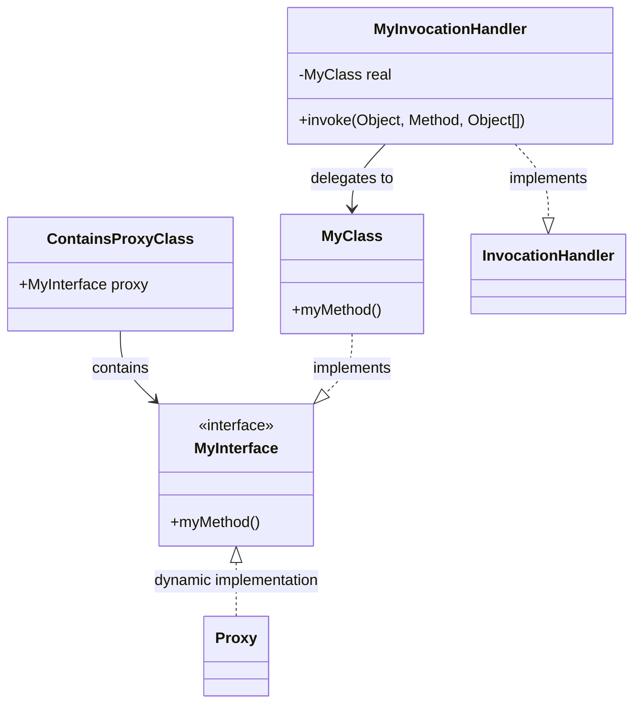

# ContainsProxyClass 序列化测试类分析文档

## 类的概述和定义

`ContainsProxyClass` 是 Apache Spark Serializer 模块中的一个测试类，专门用于验证 Java 序列化机制对动态代理类的处理能力。该类通过创建包含动态代理对象的可序列化实例，测试序列化框架在处理复杂对象图时的正确性。

**主要功能定位：**
- 测试包含动态代理对象的序列化功能
- 验证代理接口和调用处理器的序列化兼容性
- 确保序列化框架能够正确处理反射和代理机制
- 为 Spark 序列化模块提供代理类处理的测试用例

**设计模式：** 代理模式 + 序列化模式，结合动态代理和Java序列化机制。

## 类的整体结构

```java
class ContainsProxyClass implements Serializable {
    final MyInterface proxy = ...
    
    public interface MyInterface { ... }
    
    static class MyClass implements MyInterface, Serializable { ... }
    
    class MyInvocationHandler implements InvocationHandler, Serializable { ... }
}
```

### 类关系图


## 核心属性分析

### `proxy` 属性

**定义：**
```java
final MyInterface proxy = (MyInterface) Proxy.newProxyInstance(
    MyInterface.class.getClassLoader(),
    new Class[]{MyInterface.class},
    new MyInvocationHandler()
);
```

**功能说明：**
- 使用 `Proxy.newProxyInstance()` 创建动态代理对象
- 代理对象实现了 `MyInterface` 接口
- 使用 `MyInvocationHandler` 作为调用处理器
- 标记为 `final` 确保序列化时的对象一致性

**设计意图：**
- 测试序列化框架对动态代理对象的处理
- 验证代理对象的类加载器兼容性
- 确保序列化后代理功能仍然正常工作

## 接口和内部类分析

### `MyInterface` 接口

**定义特点：**
```java
public interface MyInterface {
    void myMethod();
}
```

**关键设计：**
- 必须声明为 `public` 接口
- 原因：`ObjectInputStream#resolveProxyClass` 要求接口必须是公共的
- 避免类加载器不匹配导致的序列化失败

**序列化要求：**
- 代理接口必须是公共的，以便在反序列化时能够正确解析
- 接口定义必须对所有类加载器可见

### `MyClass` 静态内部类

**定义：**
```java
static class MyClass implements MyInterface, Serializable {
    @Override
    public void myMethod() {}
}
```

**功能角色：**
- 实现 `MyInterface` 接口的具体类
- 同时实现 `Serializable` 接口，支持序列化
- 作为代理调用的实际目标对象

**设计考虑：**
- 使用静态内部类避免对外部类的依赖
- 实现 `Serializable` 确保可以独立序列化
- 提供简单的空方法实现用于测试

### `MyInvocationHandler` 内部类

**定义：**
```java
class MyInvocationHandler implements InvocationHandler, Serializable {
    private final MyClass real = new MyClass();

    @Override
    public Object invoke(Object proxy, Method method, Object[] args) throws Throwable {
        return method.invoke(real, args);
    }
}
```

**功能说明：**
- 实现 `InvocationHandler` 接口，处理代理方法调用
- 实现 `Serializable` 接口，支持序列化
- 使用委托模式将调用转发给实际的 `MyClass` 实例

**序列化关键点：**
- 调用处理器也必须实现 `Serializable`
- 确保序列化后调用逻辑仍然有效
- 处理目标对象的序列化兼容性

## 序列化机制分析

### Java 动态代理序列化原理

#### `Proxy.newProxyInstance()` 创建的代理对象特性：
- 代理对象本身实现了指定的接口
- 代理对象包含对调用处理器的引用
- 序列化时需要保存接口定义和处理器状态

#### 序列化过程：
1. **代理对象序列化**：保存接口信息和处理器引用
2. **接口解析**：使用 `resolveProxyClass` 方法重建代理类
3. **处理器恢复**：反序列化调用处理器及其状态
4. **代理重建**：基于接口和处理器重新创建代理对象

### 关键序列化方法

#### `ObjectInputStream.resolveProxyClass()`
- 在反序列化时负责解析代理类
- 要求接口必须是公共的且对所有类加载器可见
- 处理类加载器匹配问题

#### 序列化兼容性要求
- 接口定义必须保持一致
- 调用处理器必须可序列化
- 目标对象必须可序列化（如果被引用）

## 测试场景和用例

### 主要测试目标

#### 1. 代理对象序列化测试
- 验证动态代理对象可以被正确序列化
- 测试序列化后的代理功能是否正常
- 确保接口定义在反序列化时可用

#### 2. 调用处理器序列化测试
- 验证 `InvocationHandler` 的序列化兼容性
- 测试处理器状态在序列化后的保持
- 确保委托关系在反序列化后仍然有效

#### 3. 类加载器兼容性测试
- 验证不同类加载器环境下的序列化
- 测试接口可见性要求
- 确保跨类加载器的代理功能

### 预期测试行为

#### 序列化过程：
```java
// 序列化前
ContainsProxyClass original = new ContainsProxyClass();
original.proxy.myMethod(); // 正常工作

// 序列化后反序列化
ContainsProxyClass deserialized = deserialize(serialize(original));
deserialized.proxy.myMethod(); // 应该仍然正常工作
```

#### 成功标准：
- 序列化/反序列化过程不抛出异常
- 反序列化后的代理对象功能正常
- 调用处理器委托关系保持正确

## 设计特点总结

### 1. 复杂性设计
- 创建了多层嵌套的类结构
- 结合了动态代理和序列化机制
- 测试了复杂的对象图序列化

### 2. 边界条件测试
- 测试了代理接口的可见性要求
- 验证了调用处理器的序列化兼容性
- 覆盖了类加载器匹配的边缘情况

### 3. 实际应用场景
- Spark 中可能使用动态代理进行功能扩展
- 序列化框架需要支持代理对象的传输
- 分布式计算中代理对象的序列化需求

### 4. 错误预防设计
- 明确注释说明接口必须为 public 的原因
- 使用 final 字段确保对象一致性
- 静态内部类避免序列化依赖问题

## 技术细节分析

### 动态代理机制

#### 代理创建过程：
```java
Proxy.newProxyInstance(ClassLoader, Class[], InvocationHandler)
```

**参数说明：**
- `ClassLoader`: 定义代理类的类加载器
- `Class[]`: 代理类要实现的接口列表
- `InvocationHandler`: 方法调用的处理逻辑

#### 生成的代理类特性：
- 继承 `java.lang.reflect.Proxy`
- 实现指定的接口列表
- 包含对调用处理器的引用

### 序列化特殊处理

#### 代理对象的序列化格式：
- 保存接口名称列表
- 保存调用处理器的序列化数据
- 不保存代理类的字节码

#### 反序列化重建过程：
1. 读取接口名称列表
2. 解析接口类定义
3. 反序列化调用处理器
4. 使用 `Proxy.newProxyInstance()` 重建代理对象

## 潜在问题和解决方案

### 类加载器不匹配问题

**问题描述：**
- 序列化和反序列化环境使用不同的类加载器
- 接口类在不同类加载器中可能被视为不同的类

**解决方案：**
- 确保接口是公共的且对所有类加载器可见
- 使用系统类加载器或公共类加载器

### 接口版本兼容性问题

**问题描述：**
- 序列化后接口定义发生变化
- 方法签名不匹配导致调用失败

**解决方案：**
- 使用稳定的接口定义
- 考虑接口版本控制机制

### 调用处理器状态管理

**问题描述：**
- 调用处理器包含不可序列化的状态
- 序列化后状态丢失导致功能异常

**解决方案：**
- 确保所有状态都是可序列化的
- 使用 transient 字段标记不需要序列化的状态

## 在 Spark 中的应用场景

### 1. 远程方法调用（RPC）
- Spark 的分布式计算需要远程方法调用
- 动态代理可以简化远程调用的客户端代码
- 序列化确保代理对象可以在网络中传输

### 2. 功能扩展机制
- 使用代理模式实现功能增强
- AOP 风格的横切关注点处理
- 序列化支持分布式环境下的功能扩展

### 3. 测试框架支持
- 为序列化框架提供边界测试用例
- 验证复杂对象图的序列化能力
- 确保分布式计算中的对象传输可靠性

## 最佳实践建议

### 1. 接口设计规范
- 代理接口必须声明为 public
- 接口方法应该保持稳定
- 避免在接口中使用不可序列化的类型

### 2. 调用处理器实现
- 调用处理器必须实现 Serializable
- 确保所有引用的对象都是可序列化的
- 使用 transient 字段标记不需要序列化的状态

### 3. 序列化配置
- 使用合适的序列化框架
- 配置正确的类加载器策略
- 测试跨环境的序列化兼容性

### 4. 错误处理
- 处理序列化失败的情况
- 提供适当的回退机制
- 记录详细的错误信息用于调试

## 扩展性和维护性

### 扩展建议
- 可以添加更多复杂的代理场景测试
- 扩展支持多个接口的代理测试
- 增加异常处理逻辑的测试用例

### 维护注意事项
- 保持与 Java 序列化规范的兼容性
- 关注 Java 版本升级对代理机制的影响
- 定期验证跨版本序列化的兼容性

## 总结

`ContainsProxyClass` 虽然代码量不大，但设计精巧，全面测试了 Java 序列化框架对动态代理对象的处理能力。通过多层嵌套的类结构和精心的接口设计，确保了测试用例能够覆盖序列化中的复杂场景。

这个测试类为 Spark 序列化模块提供了重要的边界测试保障，确保了在分布式计算环境中动态代理对象的可靠传输和功能保持。其设计体现了对 Java 序列化机制深入理解和对实际应用场景的充分考虑。