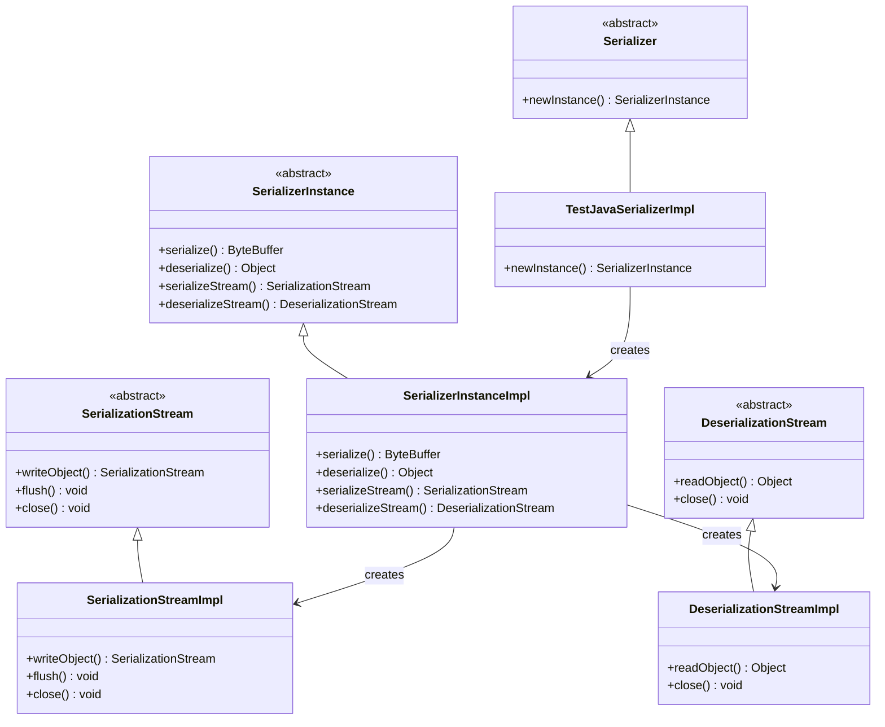

# TestJavaSerializerImpl 序列化API测试类分析文档

## 类的概述和定义

`TestJavaSerializerImpl` 是 Apache Spark Serializer 模块中的一个测试实现类，专门用于验证 Spark 序列化 API 的 Java 友好性。该类通过实现完整的序列化接口层次结构，确保 Java 开发者能够方便地使用 Spark 序列化框架。

**主要功能定位：**
- 验证序列化 API 的 Java 语言兼容性
- 提供序列化接口的完整实现模板
- 测试序列化框架的扩展性和可定制性
- 确保 Java 开发者能够正确实现自定义序列化器

**设计模式：** 模板方法模式 + 适配器模式，提供完整的接口实现框架。

## 类的整体结构

```java
class TestJavaSerializerImpl extends Serializer {
    @Override
    public SerializerInstance newInstance() { return null; }
    
    static class SerializerInstanceImpl extends SerializerInstance { ... }
    
    static class SerializationStreamImpl extends SerializationStream { ... }
    
    static class DeserializationStreamImpl extends DeserializationStream { ... }
}
```

### 类继承关系图


## 核心类分析

### `TestJavaSerializerImpl` 主类

**定义：**
```java
class TestJavaSerializerImpl extends Serializer {
    @Override
    public SerializerInstance newInstance() {
        return null;
    }
}
```

**功能说明：**
- 继承自 `Serializer` 抽象类
- 实现 `newInstance()` 方法，返回 `null`
- 作为序列化器的入口点，负责创建序列化实例

**设计意图：**
- 验证 `Serializer` 接口的 Java 实现可行性
- 提供序列化器创建方法的模板
- 测试序列化器实例化机制

### `SerializerInstanceImpl` 内部类

**定义特点：**
```java
static class SerializerInstanceImpl extends SerializerInstance {
    @Override
    public <T> ByteBuffer serialize(T t, ClassTag<T> evidence$1) { return null; }
    
    @Override
    public <T> T deserialize(ByteBuffer bytes, ClassLoader loader, ClassTag<T> evidence$1) { return null; }
    
    @Override
    public <T> T deserialize(ByteBuffer bytes, ClassTag<T> evidence$1) { return null; }
    
    @Override
    public SerializationStream serializeStream(OutputStream s) { return null; }
    
    @Override
    public DeserializationStream deserializeStream(InputStream s) { return null; }
}
```

**方法覆盖说明：**

#### `serialize()` 方法
- **功能：** 将对象序列化为 `ByteBuffer`
- **参数：** 泛型对象 `T` 和对应的 `ClassTag`
- **返回值：** 序列化后的字节缓冲区

#### `deserialize()` 方法（两个重载版本）
- **功能：** 从 `ByteBuffer` 反序列化对象
- **参数差异：**
  - 版本1：字节缓冲区 + 类加载器 + ClassTag
  - 版本2：字节缓冲区 + ClassTag（使用默认类加载器）

#### `serializeStream()` 方法
- **功能：** 创建序列化流用于流式序列化
- **参数：** 输出流 `OutputStream`
- **返回值：** `SerializationStream` 实例

#### `deserializeStream()` 方法
- **功能：** 创建反序列化流用于流式反序列化
- **参数：** 输入流 `InputStream`
- **返回值：** `DeserializationStream` 实例

### `SerializationStreamImpl` 内部类

**定义：**
```java
static class SerializationStreamImpl extends SerializationStream {
    @Override
    public <T> SerializationStream writeObject(T t, ClassTag<T> evidence$1) { return this; }
    
    @Override
    public void flush() { }
    
    @Override
    public void close() { }
}
```

**方法说明：**

#### `writeObject()` 方法
- **功能：** 将对象写入序列化流
- **参数：** 泛型对象 `T` 和对应的 `ClassTag`
- **返回值：** 返回当前流实例，支持链式调用

#### `flush()` 方法
- **功能：** 刷新输出缓冲区
- **设计：** 空实现，表示缓冲区立即刷新

#### `close()` 方法
- **功能：** 关闭序列化流并释放资源
- **设计：** 空实现，表示无资源需要释放

### `DeserializationStreamImpl` 内部类

**定义：**
```java
static class DeserializationStreamImpl extends DeserializationStream {
    @Override
    public <T> T readObject(ClassTag<T> evidence$1) { return null; }
    
    @Override
    public void close() { }
}
```

**方法说明：**

#### `readObject()` 方法
- **功能：** 从反序列化流中读取对象
- **参数：** 目标类型的 `ClassTag`
- **返回值：** 反序列化后的对象（返回 `null`）

#### `close()` 方法
- **功能：** 关闭反序列化流并释放资源
- **设计：** 空实现，表示无资源需要释放

## API 友好性设计分析

### Java 语言特性支持

#### 泛型支持
- 所有方法都使用 Java 泛型语法
- 通过 `ClassTag<T>` 提供运行时类型信息
- 支持类型安全的序列化操作

#### 方法重载
- `deserialize()` 方法提供两个重载版本
- 支持不同的类加载器策略
- 提供默认参数值的替代方案

#### 静态内部类
- 使用 `static` 内部类避免对外部类的依赖
- 支持独立的实例化和序列化
- 符合 Java 最佳实践

### 流式API设计

#### 链式调用支持
```java
// 支持链式调用的设计
serializationStream
    .writeObject(obj1, classTag1)
    .writeObject(obj2, classTag2)
    .flush()
    .close();
```

#### 资源管理
- 提供 `close()` 方法用于资源清理
- 支持 try-with-resources 语法
- 符合 Java 资源管理规范

### 类型安全机制

#### ClassTag 的使用
- 提供运行时类型信息
- 避免类型擦除问题
- 支持泛型类型的正确序列化

#### 方法签名设计
- 清晰的参数和返回类型
- 合理的异常声明（虽然没有显式声明）
- 符合 Java 方法设计规范

## 测试场景和用例

### 主要测试目标

#### 1. API 兼容性测试
- 验证所有接口方法都可以在 Java 中正确实现
- 测试泛型参数和返回类型的兼容性
- 确保方法签名符合 Java 语言规范

#### 2. 继承关系测试
- 测试多层继承结构的正确性
- 验证抽象方法的实现要求
- 确保接口契约的完整性

#### 3. 扩展性测试
- 验证自定义序列化器的实现可行性
- 测试序列化框架的可扩展性
- 确保第三方开发者能够正确扩展

### 预期测试行为

#### 编译测试
```java
// 应该能够正常编译
Serializer serializer = new TestJavaSerializerImpl();
SerializerInstance instance = serializer.newInstance();
```

#### 方法调用测试
```java
// 所有方法调用应该语法正确
ByteBuffer buffer = instance.serialize(obj, classTag);
Object result = instance.deserialize(buffer, classTag);
```

#### 类型安全测试
```java
// 泛型类型应该正确推断
String str = instance.deserialize(buffer, ClassTag$.MODULE$.apply(String.class));
```

## 设计模式分析

### 模板方法模式

#### 在序列化框架中的应用
- `Serializer` 定义序列化器的创建模板
- `SerializerInstance` 定义序列化操作的模板
- `SerializationStream` 和 `DeserializationStream` 定义流操作的模板

#### 实现要点
- 抽象类定义算法骨架
- 具体类实现特定步骤
- 支持算法步骤的定制化

### 适配器模式

#### 流适配器设计
- `SerializationStream` 适配 `OutputStream`
- `DeserializationStream` 适配 `InputStream`
- 提供统一的序列化流接口

### 工厂方法模式

#### 序列化器创建
- `newInstance()` 方法作为工厂方法
- 创建具体的序列化实例
- 支持不同的序列化策略

## 技术细节分析

### 泛型类型处理

#### ClassTag 的作用
- 解决 Java 泛型类型擦除问题
- 在运行时保留类型信息
- 支持类型安全的序列化操作

#### 证据参数（evidence$1）
- Scala 编译器的命名约定
- 表示类型证据参数
- 确保泛型类型的正确推断

### 字节缓冲区序列化

#### ByteBuffer 的优势
- 支持堆内和堆外内存分配
- 提供高效的字节操作
- 支持内存映射文件操作

#### 序列化流程
1. 对象序列化为字节数组
2. 字节数组包装为 ByteBuffer
3. ByteBuffer 可以直接用于网络传输或存储

### 流式序列化机制

#### 输出流序列化
```java
// 序列化到输出流
SerializationStream stream = instance.serializeStream(outputStream);
stream.writeObject(obj1, classTag1);
stream.writeObject(obj2, classTag2);
stream.close();
```

#### 输入流反序列化
```java
// 从输入流反序列化
DeserializationStream stream = instance.deserializeStream(inputStream);
Object obj1 = stream.readObject(classTag1);
Object obj2 = stream.readObject(classTag2);
stream.close();
```

## 在 Spark 中的应用场景

### 1. 自定义序列化器开发
- 为特定数据类型提供优化序列化
- 实现自定义的序列化算法
- 支持特殊的数据格式要求

### 2. 第三方库集成
- 允许第三方库提供序列化实现
- 支持不同数据格式的序列化
- 实现跨库的数据交换

### 3. 性能优化
- 为热点数据类型提供高效序列化
- 减少序列化过程中的内存分配
- 优化网络传输性能

### 4. 测试框架支持
- 为序列化测试提供基础框架
- 验证序列化器的正确性
- 性能基准测试

## 最佳实践建议

### 1. 实现规范

#### 方法实现要求
- 所有抽象方法必须实现
- 返回值类型必须匹配接口定义
- 异常处理要符合接口契约

#### 资源管理
- 正确实现 `close()` 方法
- 确保资源及时释放
- 支持异常安全的资源清理

### 2. 性能优化

#### 内存管理
- 重用 ByteBuffer 减少内存分配
- 使用对象池减少GC压力
- 优化序列化缓冲区大小

#### 流操作优化
- 使用缓冲流提高IO效率
- 批量处理减少方法调用开销
- 异步序列化提高并发性能

### 3. 错误处理

#### 异常处理策略
- 明确区分可恢复和不可恢复错误
- 提供详细的错误信息
- 支持错误恢复机制

#### 边界条件处理
- 处理空值和边界情况
- 验证输入参数的合法性
- 提供合理的默认行为

## 扩展性和维护性

### 扩展建议

#### 功能扩展
- 添加压缩序列化支持
- 支持加密序列化
- 添加版本兼容性处理

#### 性能扩展
- 实现零拷贝序列化
- 支持内存映射序列化
- 添加异步序列化支持

### 维护注意事项

#### API 兼容性
- 保持向后兼容的API设计
- 谨慎修改方法签名
- 提供迁移路径

#### 版本管理
- 管理序列化格式版本
- 支持多版本兼容
- 提供版本升级工具

## 总结

`TestJavaSerializerImpl` 虽然是一个简单的测试实现类，但它完整地展示了 Spark 序列化 API 的 Java 友好性设计。通过实现完整的序列化接口层次结构，验证了 Java 开发者能够方便地使用和扩展 Spark 序列化框架。

该类体现了以下设计原则：

### 1. 接口完整性
- 覆盖了序列化框架的所有关键接口
- 提供了完整的实现模板
- 确保 API 的可用性和一致性

### 2. Java 友好性
- 使用标准的 Java 语法和规范
- 支持泛型和类型安全
- 符合 Java 开发者的习惯

### 3. 扩展性设计
- 支持自定义序列化器实现
- 提供清晰的扩展点
- 支持不同的序列化策略

### 4. 测试驱动设计
- 为序列化测试提供基础框架
- 验证 API 的正确性和可用性
- 支持性能基准测试

这个测试类为 Spark 序列化模块的 Java 兼容性提供了重要保障，确保了 Java 开发者能够顺利使用和扩展 Spark 的序列化功能。