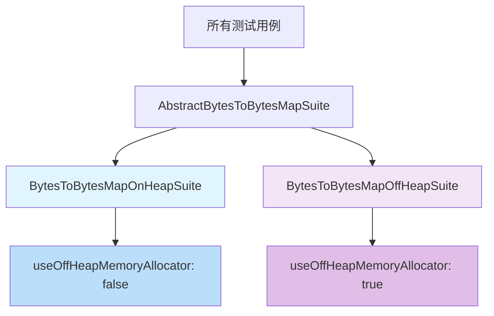

# BytesToBytesMapOnHeapSuite 测试套件分析文档

## 类的概述和定义

`BytesToBytesMapOnHeapSuite` 是 Apache Spark Unsafe 模块中专门用于测试 BytesToBytesMap 在堆内存（On-Heap Memory）模式下功能的测试套件类。该类继承自 `AbstractBytesToBytesMapSuite`，通过重写关键方法来实现堆内存的测试配置。

**主要功能定位：**
- 专门测试 BytesToBytesMap 在堆内存模式下的功能
- 继承并复用抽象测试套件的所有测试用例
- 验证堆内存分配器的正确性和性能
- 确保堆内存模式与堆外内存模式的功能一致性

**设计模式：** 继承模式 + 模板方法模式，通过重写抽象方法改变测试行为。

## 类的定义和继承关系

```java
public class BytesToBytesMapOnHeapSuite extends AbstractBytesToBytesMapSuite {
    @Override
    protected boolean useOffHeapMemoryAllocator() {
        return false;
    }
}
```

### 继承关系分析
- **父类**: `AbstractBytesToBytesMapSuite` - 提供完整的测试框架和测试用例
- **当前类**: `BytesToBytesMapOnHeapSuite` - 专门针对堆内存的测试实现

## 核心方法说明

### `useOffHeapMemoryAllocator()` 方法

**方法签名：**
```java
@Override
protected boolean useOffHeapMemoryAllocator()
```

**功能说明：**
- 这是从父类继承的抽象方法的具体实现
- 返回 `false` 表示使用堆内存分配器
- 该方法决定了测试套件运行时的内存分配模式

**执行逻辑：**
1. 在测试初始化阶段被调用
2. 配置内存管理器使用堆内存模式
3. 影响所有继承的测试用例的执行环境

## 设计特点总结

### 1. 简洁性设计
- 类结构极其简单，只包含一个重写方法
- 充分利用继承机制，避免代码重复
- 最小化实现，专注于核心功能配置

### 2. 配置驱动测试
- 通过布尔返回值控制测试环境
- 实现测试套件的参数化配置
- 支持不同内存模式的对比测试

### 3. 继承复用机制
- 复用父类的所有测试用例
- 保持测试逻辑的一致性
- 减少维护成本

## 与相关类的对比分析

### BytesToBytesMapOffHeapSuite 对比
| 特性 | BytesToBytesMapOnHeapSuite | BytesToBytesMapOffHeapSuite |
|------|-----------------------------|-----------------------------|
| 内存模式 | 堆内存（On-Heap） | 堆外内存（Off-Heap） |
| useOffHeapMemoryAllocator() | 返回 false | 返回 true |
| 测试重点 | 堆内存分配和管理 | 堆外内存分配和管理 |
| 性能特点 | 受GC影响，JVM堆内操作 | 避免GC压力，直接内存访问 |
| 内存限制 | 受JVM堆大小限制 | 支持更大内存分配 |

### 三套件关系图


## 测试覆盖范围

### 继承的测试用例
通过继承 `AbstractBytesToBytesMapSuite`，该类自动获得以下测试覆盖：

#### 基础功能测试
- `emptyMap()`: 空映射测试
- `setAndRetrieveAKey()`: 键值对设置和检索测试
- 各种迭代器功能测试

#### 性能压力测试
- `randomizedStressTest()`: 随机化压力测试
- `iteratingOverDataPagesWithWastedSpace()`: 空间浪费迭代测试
- 大数据量处理测试

#### 内存管理测试
- `failureToAllocateFirstPage()`: 内存分配失败测试
- `failureToGrow()`: 映射增长失败测试
- `spillInIterator()`: 迭代器溢出测试

#### 高级功能测试
- `multipleValuesForSameKey()`: 多值支持测试
- `testPeakMemoryUsed()`: 峰值内存使用测试
- `avoidDeadlock()`: 死锁避免测试

## 堆内存模式的特点

### 技术优势
1. **内存管理简单**: 由JVM自动管理内存分配和回收
2. **访问速度快**: 堆内操作通常比堆外操作更快
3. **调试方便**: 可以使用标准JVM工具进行调试和分析
4. **兼容性好**: 与现有Java生态兼容性更好

### 使用场景
- 中小规模数据处理任务
- 对GC停顿不敏感的应用
- 开发和调试阶段
- 内存需求不超过JVM堆大小的场景

### 配置要求
- 合理设置JVM堆大小参数（-Xmx, -Xms）
- 优化GC策略以减少停顿时间
- 监控堆内存使用情况

## 测试执行流程

### 1. 测试初始化
```java
// 在父类的 setup() 方法中
memoryManager = new TestMemoryManager(
    new SparkConf()
        .set(package$.MODULE$.MEMORY_OFFHEAP_ENABLED(), useOffHeapMemoryAllocator())
        .set(package$.MODULE$.MEMORY_OFFHEAP_SIZE(), 256 * 1024 * 1024L)
);
```

### 2. 测试执行
- 所有测试用例使用堆内存分配器
- BytesToBytesMap 在JVM堆内分配数据页面
- 测试验证堆内存模式下的功能正确性

### 3. 资源清理
- 测试结束后依赖GC进行内存回收
- 验证内存泄漏情况
- 清理临时文件和资源

## 性能考虑和最佳实践

### 性能优化点
1. **GC调优**: 选择合适的垃圾回收器（G1, CMS等）
2. **内存分配策略**: 优化对象分配模式减少GC压力
3. **缓存友好**: 利用JVM的缓存机制提高访问效率

### 最佳实践建议
1. **合理设置堆大小**: 避免频繁的Full GC
2. **监控GC行为**: 定期分析GC日志和性能指标
3. **对象复用**: 尽量重用对象减少内存分配
4. **避免内存泄漏**: 确保对象引用及时释放

## 垃圾回收影响分析

### GC对测试的影响
- **测试稳定性**: GC停顿可能影响测试执行时间
- **内存使用**: 需要监控GC对内存分配的影响
- **性能波动**: GC活动可能导致性能测试结果波动

### GC优化策略
- 使用低停顿GC算法（如G1）
- 合理设置新生代和老年代比例
- 避免创建过多短生命周期对象

## 异常处理机制

### 内存相关异常
- `OutOfMemoryError`: 堆内存不足时的异常
- 需要适当的错误处理和资源清理

### GC相关异常
- GC超时或停顿过长的处理
- 内存碎片化问题的应对

## 扩展性和维护性

### 扩展建议
- 可以添加GC行为相关的性能测试
- 增加不同堆大小配置的测试场景
- 扩展内存压力测试用例

### 维护注意事项
- 保持与父类测试用例的同步更新
- 关注JVM版本升级的影响
- 定期验证GC策略的适应性

## 测试策略对比分析

### 堆内存 vs 堆外内存测试策略

| 测试方面 | 堆内存策略 | 堆外内存策略 |
|---------|------------|-------------|
| **内存分配测试** | 关注GC影响和分配效率 | 关注直接内存分配性能 |
| **性能基准测试** | 包含GC停顿的影响 | 排除GC干扰的纯性能测试 |
| **稳定性测试** | 验证长时间运行的GC稳定性 | 验证大内存使用的稳定性 |
| **边界测试** | 测试堆大小限制下的行为 | 测试系统内存限制下的行为 |

### 互补性分析
两个测试套件共同构成了完整的BytesToBytesMap测试覆盖：
- **功能一致性**: 确保两种模式下功能行为一致
- **性能对比**: 提供不同场景下的性能参考
- **兼容性验证**: 验证与不同内存模式的兼容性

## 实际应用场景

### 开发阶段推荐
- **优先使用堆内存模式**: 便于调试和问题排查
- **快速验证功能**: 堆内存模式启动更快
- **内存使用可控**: 便于控制测试资源消耗

### 生产环境选择
- **小规模数据**: 推荐使用堆内存模式
- **大规模数据**: 考虑使用堆外内存模式
- **GC敏感应用**: 根据GC容忍度选择合适模式

## 总结

`BytesToBytesMapOnHeapSuite` 作为 BytesToBytesMap 堆内存模式的专用测试套件，虽然实现简单但功能重要。它确保了 BytesToBytesMap 在传统JVM堆内存环境下的稳定性和性能，为大多数应用场景提供了可靠的测试保障。

通过与 `BytesToBytesMapOffHeapSuite` 的对比测试，开发者可以根据具体应用需求选择最合适的内存管理模式，实现性能与资源使用的最佳平衡。